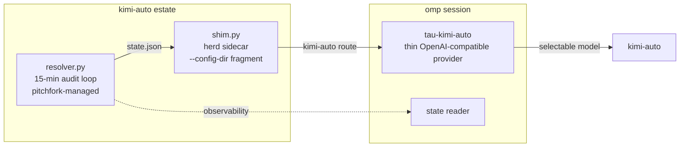

# tau-kimi-auto

   

> One model name in Tau, always the best healthy Kimi behind it — and never a silent non-Kimi substitution.

Part of [`toxicwind/tau-extensions`](https://github.com/toxicwind/tau-extensions). A Tau extension registering the `kimi-auto` virtual model. `kimi-auto` is a herd-side alias (see `toxicwind/kimi-auto`): the herd shim resolves it to the best available Kimi model on every request. It is Kimi-only by design — when no Kimi candidate is healthy the shim answers **503** instead of silently routing to a non-Kimi model. This extension makes that alias selectable as a first-class model inside Tau/`omp` sessions.



## Quick Start

```bash
cd tau-extensions/packages/tau-kimi-auto && bun install
bun run typecheck
omp plugin link .
```

Then select `kimi-auto` as the session model. The extension points at herd via `KIMI_AUTO_HERD` (default `http://127.0.0.1:25100`).

## How it works

- **Model selection** lives in `resolver.py` — a 15-minute audit loop (pitchfork-managed) that scores Kimi candidates and writes `state.json`.
- **Routing** lives in `shim.py` — a herd sidecar started via a `--config-dir` fragment, serving the `kimi-auto` route.
- **This extension** is a thin OpenAI-compatible provider pointing at herd's `kimi-auto` route, plus a state reader so the session can see which Kimi model is currently winning.

The 503-on-no-healthy-Kimi contract is enforced herd-side: the extension never sees a non-Kimi model, so a session on `kimi-auto` can't silently degrade to a different provider's model mid-conversation.

## Configuration

| Env var | Default | Purpose |
|---|---|---|
| `KIMI_AUTO_HERD` | `http://127.0.0.1:25100` | Herd base URL |
| `KIMI_AUTO_STATE` | `~/.local/share/kimi-auto/state.json` | Resolver state file (read by the state reader) |

## Development

```bash
bun install
bun run typecheck   # tsc --noEmit
bun test
```

Package metadata (name `@toxicwind/tau-kimi-auto`, Tau entry point, peer dep `@oh-my-pi/pi-coding-agent ^18.0.11`) lives in `package.json`.

## License and security

MIT — part of [`toxicwind/tau-extensions`](https://github.com/toxicwind/tau-extensions).

Security notes:

- The extension talks to herd over HTTP on localhost by default; if `KIMI_AUTO_HERD` points at a remote herd, use TLS — model traffic includes your prompts.
- `state.json` is read-only observability surface; the extension never writes resolver state.
