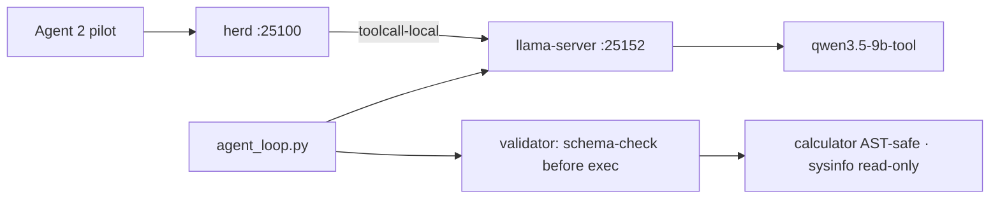

<div align="right">

[](https://github.com/toxicwind/sovereign-projects#license)
[](https://github.com/toxicwind/sovereign-projects)

</div>

# toolcall-agent

> Persistent tool-capable local LLM endpoint + validator-first harness — on the RTX 3090.

> **Why care? Cloud daemon keys were stale, the 1.2B `fast` model can't tool-call, and the pollinations gate was closed — the openfang Agent 2 pilot was stuck with no tool-capable model. This ships one: a local llama-server endpoint with a ReAct harness that schema-validates every tool call *before* executing it, closing the SLM↔large-model tool-call gap.**

- **Local endpoint — `llama-server` (llama.cpp b11059, CUDA, `-ngl 99`) on `:25152`, model alias `qwen3.5-9b-tool`**
- **Validator-first execution — tool name + args schema-checked before running; violations feed back for repair (max 2)**
- **Safe calculator — AST-whitelisted, no `eval()` of raw code; sysinfo is read-only**
- **Herd-routed — peer `toolcall-local` on `:25100`, addressable as `toolcall-local/qwen3.5-9b-tool`**
- **Verified live — GPU query → MiB→GiB conversion chained correctly in 3.6s; parallel tool calls in 3.4s**



## Quick start

```bash
cd /home/toxic/sovereign/projects/toolcall-agent
TOOLCALL_BASE=http://127.0.0.1:25152 python3 agent_loop.py "your prompt"
# or via herd: model=toolcall-local/qwen3.5-9b-tool on http://127.0.0.1:25100
```

## License & security

- **License:** [MIT](https://github.com/toxicwind/sovereign-projects#license)
- **Security:** Endpoint binds 127.0.0.1 only — reachable via herd or the local harness, never exposed directly. The calculator never `eval()`s raw model output (AST whitelist); `sysinfo` is read-only. Research grounding: arXiv:2510.03847 (SLM agentic survey), ToolSpec (arXiv:2604.13519), BFCL v4.

---

**Purpose:** unblock the openfang Agent 2 (Shingle) pilot, which was stuck because
no tool-capable model was available (cloud daemon keys stale, `fast`=1.2B can't
tool-call, pollinations gate closed).

## What shipped (2026-09-20)

- **Endpoint:** `http://127.0.0.1:25152` — `llama-server` (llama.cpp b11059,
  CUDA 13.3 build, RTX 3090, `-ngl 99`), model alias `qwen3.5-9b-tool`
  (Qwen3.5-9B-DeepSeek-V4-Flash, Q5_K_M, 32K ctx).
- **Pitchfork daemon:** `sovereign/toolcall-llm` (`pitchfork.toml`),
  `TOOLCALL_PORT=25152` (`config/ports.env`). Binary lives at
  `sovereign/engines/llama.cpp-b11059/llama-b11059/` (NOT the beellama fork —
  see note below). Auto-restarts via pitchfork.
- **Herd/llama-swap route:** peer `toolcall-local` in `config/herd.yaml`
  proxies to `:25152`; openfang can address it as
  `toolcall-local/qwen3.5-9b-tool` through the existing herd on `:25100`.
- **Harness:** `agent_loop.py` — ReAct-style loop with **validator-first
  execution** (schema-check tool name + args against declared JSON schema
  before running; on violation, feed the schema error back for a repair
  attempt, max 2). Calculator is AST-whitelisted (no `eval()` of raw code);
  sysinfo is read-only.

## Verified live (2026-09-20)

1. Direct: `agent_loop.py "What GPU...? convert MiB to GiB"` →
   `sysinfo(gpu)` → `24576 MiB` → `calculator(24576/1024)` → `24.0` →
   correct final answer. 3 rounds, 3.6s.
2. Through pitchfork daemon `:25152`: parallel `sysinfo(hostname)` +
   `sysinfo(cpu)` in one round, chained `calculator(16*7)` → `112`. 3.4s.
3. Through llama-swap `:25100` as `toolcall-local/qwen3.5-9b-tool`:
   `finish_reason=tool_calls`, `calculator{"expression": "1234 * 5678"}`.

## Usage for the Agent 2 pilot

```bash
cd /home/toxic/sovereign/projects/toolcall-agent
TOOLCALL_BASE=http://127.0.0.1:25152 python3 agent_loop.py "your prompt"
# or via herd: model=toolcall-local/qwen3.5-9b-tool on http://127.0.0.1:25100
```

## Notes

- The beellama fork (`engines/beellama.cpp`) has no built binary (herd-config
  worker's track is rebuilding it). This endpoint uses upstream llama.cpp
  prebuilt CUDA binaries instead — it does NOT block that track; when the
  beellama binary lands it can take over `${BEELLAMA_BIN}` duties.
- If `pitchfork status toolcall-llm` shows issues: `pitchfork restart toolcall-llm`,
  logs via `pitchfork logs toolcall-llm`.
- Research grounding: arXiv:2510.03847 (SLM agentic survey — validator-first
  execution closes the SLM↔large-model tool-call gap), ToolSpec
  (arXiv:2604.13519 — schema-aware constrained decoding for tool calls),
  BFCL v4 (Berkeley Function-Calling Leaderboard — single-turn schema-constrained
  calling is the solved regime at 7-9B scale).
