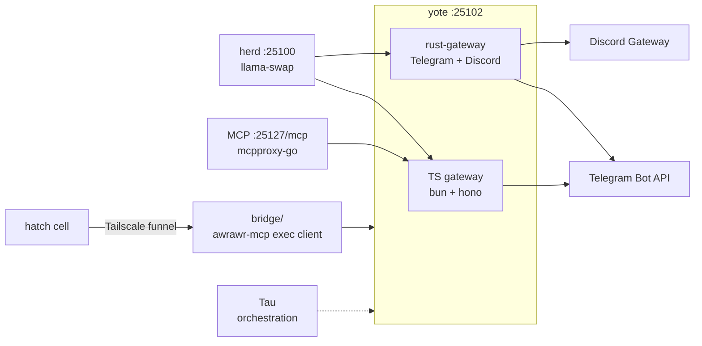

# Yote — Sovereign Lightweight Agent

<div align="right">


</div>

**Yote is two things with one name: Chris's CachyOS box (`awrawr-pc`) and the software that runs on it or talks to it.** As software, it's a minimal, embeddable agent runtime for the Sovereign ecosystem — light agent tasks, diffing, scaffolding, tool orchestration — wired into the estate's inference and tooling fabric instead of reinventing it. This directory is the canonical consolidation point for all Yote material (consolidated 2026-09-20; see `CONSOLIDATION.md` for the full merge manifest).

- **Port**: `:25102` (per ecosystem topology)
- **Inference**: routes through Herd (`:25100`) via llama-swap dynamic swap
- **MCP**: connects to `http://127.0.0.1:25127/mcp`
- **Orchestration**: Tau for agent and subagent coordination

## What's here

| Path | What it is | Source |
|---|---|---|
| `src/`, `lib/`, `scripts/`, `package.json` | **TS gateway** — Telegram gateway using OpenFang as an external HTTP service (bun + hono + telegram) | native to this dir (untouched by merge) |
| `SOUL.md`, `IDENTITY.md` | **Yote 🌵 persona** — desert-coyote trickster agent | native to this dir (untouched) |
| `rust-gateway/` | **Rust gateway** — unified messaging gateway (Telegram + Discord), extracted from OpenFang (`src/main.rs`, `src/discord.rs`, `src/telegram.rs`) | `toxicwind/yote` (private) |
| `bridge/` | **awrawr-mcp exec bridge client** — hatch ↔ yote over Tailscale funnel (`bin/exec.py`, `bin/ws_daemon.py`, `bin/wsframe.py`, `bin/xfer.py`, `SKILL.md`, …) | `toxicwind/gear/awrawr-mcp/` (private) |
| `ops/` | **Box operations** — `yote-doctor.sh` (diagnose every serve backend), `yote-fix.sh` (autonomous repair), `deploy/` (staged deploy bundle for `/home/toxic/sovereign`), `firefox-policies/`, `firefox-rs-repair.sh` | gist `e817e04416…` (deprecated) |
| `host/` | **Host provisioning** — source of truth for yote's `/etc` + build-cache home configs (`./apply.sh`) | native to this dir |
| `CONSOLIDATION.md` | Merge manifest: every move, SHA, commit, decision | this merge |

## Architecture



## Gateway duality (open decision)

Two implementations share the name **yote** and port **25102**:

- **TS** (`src/`, this dir) — Telegram via external OpenFang HTTP service.
- **Rust** (`rust-gateway/`, from `toxicwind/yote`) — Telegram + Discord, extracted from OpenFang crates.

Both are preserved. Nothing was deleted; both source repos still exist with full history. Unification is Chris's call.

## Quick Start

```bash
curl -sf http://127.0.0.1:25102/health && echo "yote HEALTHY"
curl -sSL https://raw.githubusercontent.com/toxicwind/sovereign-projects/main/projects/yote/ops/yote-doctor.sh -o yote-doctor.sh && chmod +x yote-doctor.sh && sudo ./yote-doctor.sh
curl -sSL https://raw.githubusercontent.com/toxicwind/sovereign-projects/main/projects/yote/ops/yote-fix.sh -o yote-fix.sh && chmod +x yote-fix.sh && sudo ./yote-fix.sh
```

## Config

Yote integrates with the Sovereign stack through:

- **Herd** — primary inference router at `:25100`
- **MCP Gateway** — tool federation via `:25127/mcp` (mcpproxy-go)
- **Tau** — agent orchestration and subagent coordination

### Already in `sovereign-projects` (repo-root, referenced by configs — not moved)

- `src/services/yote.ts` — canonical yote service (Telegram gateway via OpenFang HTTP)
- `src/coyote/coyote-loop.py` — Coyote Loop v3.1 autonomous agent runtime
- `agents/coyote/{agent.toml,system.md}` — coyote agent config + system prompt
- `stack/services/coyote.sh` — pitchfork service launcher
- `shingle-workspace/awrawr_ws_exec.py` — the yote box's WS **server** source (port 8379)
- `gear/awrawr-mcp/bin/` — older vendored bridge snapshot (`ws_daemon.py` re-synced 2026-09-20)
- `docs/ws-exec-8379-audit-20260914.md`, `docs/connector-bridge-routing-d4734168.md` — bridge docs
- Bridge credential flow: `toxicwind/hatch-docs` → `runtime/credential-broker.md`

## Dev / Contributing

- **TS gateway** — bun workspace (`package.json`); talks to OpenFang as an external HTTP service, not an embedded dep.
- **Rust gateway** — `cargo build --release` in `rust-gateway/`; see its README for `TELEGRAM_BOT_TOKEN` / `DISCORD_BOT_TOKEN` / `LLM_ENDPOINT` wiring.
- **Box health** — `ops/yote-doctor.sh` diagnoses every serve backend; `ops/yote-fix.sh` attempts autonomous repair. Run the doctor before theorizing about outages.
- **Host config** — `host/` is the `/etc` source of truth; deploy with `./apply.sh` on yote.

## License + Security

- **`rust-gateway/`** — Apache-2.0 OR MIT, same as OpenFang (per its `Cargo.toml`).
- **Security posture:** the gateways bind the box's own service ports (`:25102`) and route inference through herd — they hold bot tokens as environment variables, never in the repo. The hatch↔yote bridge rides the Tailscale funnel, not the open internet. Box-level hardening (Firefox policies, host `/etc` source of truth) lives under `ops/` and `host/`.

---

*Up: [master README](../../README.md) · [projects/](../README.md) · [fleet knowledgebase](../../docs/fleet-knowledgebase.md)*
