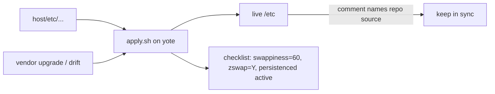

<div align="right">

[](https://github.com/toxicwind/sovereign-projects#license)
[](https://github.com/toxicwind/sovereign-projects)

</div>

# yote host provisioning

> Source of truth for host-level `/etc` config on the yote box.

> **Why care? Hand-tuned box config rots — vendor packages silently override it (ask the swappiness=150 incident). This directory mirrors `/etc` paths exactly and `apply.sh` re-asserts the intended state, so the box is reproducible and drift is a diff, not a mystery.**

- **`etc/` mirrors `/etc` paths exactly — deploy with `./apply.sh` (runs on yote, needs sudo)**
- **zram mask — comment-only udev rule masks the vendor `30-zram.rules` that trampled `vm.swappiness=60`**
- **nvidia-persistenced self-heal — `Restart=on-failure` drop-in for the early-start race**
- **Drift-proof — live `/etc` files carry a comment naming their repo source; re-running `apply.sh` re-asserts state**
- **Proven live — every artifact documents its root cause, fix, and no-reboot verification**



## Quick start

```bash
cd projects/yote/host && ./apply.sh   # runs on yote, needs sudo
cat /proc/sys/vm/swappiness           # -> 60
cat /sys/module/zswap/parameters/enabled  # -> Y
```

## License & security

- **License:** [MIT](https://github.com/toxicwind/sovereign-projects#license)
- **Security:** `apply.sh` needs sudo and writes host `/etc` — review the diff before applying on a live box. The zram mask survives `cachyos-settings` upgrades precisely because it doesn't edit `/usr/lib` directly.

---

This directory is the canonical source of truth for host-level `/etc` config
on **yote** (the CachyOS/Arch bridge box). Files under `etc/` mirror their
`/etc` paths exactly. Deploy with:

```bash
cd projects/yote/host && ./apply.sh   # runs on yote, needs sudo
```

Re-running `apply.sh` after package upgrades or drift re-asserts the
intended state. The live `/etc` files carry a comment naming their repo
source; keep both sides in sync.

## Artifacts

### `etc/udev/rules.d/30-zram.rules` — zswap + swappiness=60 mask

**Root cause (found 2026-09-21):** the `cachyos-settings` package ships
`/usr/lib/udev/rules.d/30-zram.rules`, which fires on every `zram0` init and
writes `vm.swappiness=150` and `N > /sys/module/zswap/parameters/enabled`.
That silently trampled Chris's hand-tuned dual setup:

- `/etc/sysctl.d/99-zswap-vm.conf` → `vm.swappiness=60`
  (lexically wins over `99-znver4-llm.conf`=10 and `/usr/lib/sysctl.d/70-cachyos-settings.conf`=100;
  `vm.dirty_ratio=10` from the same file is the correct expected value)
- kernel cmdline `zswap.enabled=1` + `CONFIG_ZSWAP_DEFAULT_ON=y`

The vendor rule's zram-only policy is defensible for pure-zram setups, but
the bug is the silent override of explicit tuning — plus it contributed to
the 2026-09-21 11:21:54 MDT ffs order-0 allocation warning by routing
reclaim pressure 3:1 toward anon/zswap at maximum volume.

**Fix:** a same-named, comment-only file in `/etc/udev/rules.d` masks the
vendor file by precedence (verified: udev reports
`Skipping overridden file '/usr/lib/udev/rules.d/30-zram.rules'`) and
survives `cachyos-settings` upgrades — unlike editing `/usr/lib` directly.

**Proven live (no reboot):** `udevadm control --reload-rules` +
`udevadm trigger --action=change --sysname-match=zram0` leaves
`vm.swappiness=60` and zswap `Y` untouched.

### `etc/systemd/system/nvidia-persistenced.service.d/override.conf` — persistenced self-heal

**Root cause (found 2026-09-21):** on the 2026-09-20 bore-kernel repair
boot, `nvidia-persistenced` started at 21:39:11 MDT, ~7 minutes before
`/dev/nvidia*` existed (the bore nvidia driver was installed mid-boot;
initramfs rebuilt 21:46:34). The stock NVIDIA unit has no restart policy,
so it stayed `failed` until noticed. Daemon and driver were healthy —
verified by running it as root manually.

**Fix:** drop-in adds `Restart=on-failure` + `RestartSec=15` so future
early-start races self-heal, plus start-limit settings.

**Important:** `StartLimitBurst`/`StartLimitIntervalSec` belong under
`[Unit]` on systemd ≥ 230 (verified 261.3 on yote). Under `[Service]`,
`systemd-analyze verify` warns `Unknown key ... ignoring` and they have no
effect. An earlier version of this drop-in had them misplaced; corrected
2026-09-21.

**Proven live (no reboot):** `systemctl restart` → active,
`nvidia-smi` persistence mode `Enabled`; `kill -9` on the daemon →
systemd reborns it within seconds (`NRestarts=1`).

## Full investigation record

The complete hunt (4 lanes: swappiness provenance, page-alloc failure,
zswap/persistenced/hardware, btrfs audit) lives at
`~/workspace/kernel-anomaly-hunt/2026-09-21-findings.md` on the hatch cell.
Snapshot pressure resolved itself (275.98 GiB free on 2026-09-21; no btrfs
balance needed). Hardware healthy (NVMe 11% used, 0 media errors; RTX 3090
34°C).

## Deploy checklist after `apply.sh`

- `cat /proc/sys/vm/swappiness` → `60`
- `cat /sys/module/zswap/parameters/enabled` → `Y`
- `systemctl is-active nvidia-persistenced` → `active`
- `nvidia-smi --query-gpu=persistence_mode --format=csv,noheader` → `Enabled`
- `systemd-analyze verify nvidia-persistenced.service` → clean


## Build-cache home configs (added 2026-09-21)

home/ mirrors HOME paths (no sudo; installed as the invoking user by
apply.sh via install_home_file). These are the canonical sources for
the build-cache environment that buildsrv injects into every job
(pitchfork.toml daemons.buildsrv env):

- home/.cargo/config.toml : [build] rustc-wrapper = sccache.
  Routes all Cargo rustc invocations through sccache (10 GiB at
  HOME/.cache/sccache). Requires CARGO_INCREMENTAL=0 in the daemon env:
  sccache refuses incremental compilation outright.
- home/.config/ccache/ccache.conf : max_size = 10.0G, compression = true.
  Backs CC/CXX/CMAKE compiler launchers in the buildsrv env
  (10 GiB at HOME/.cache/ccache).

Proven 2026-09-21: real buildsrv job, cargo clean between builds,
second build showed nonzero sccache hits (2 hits, 50 percent hit rate).
