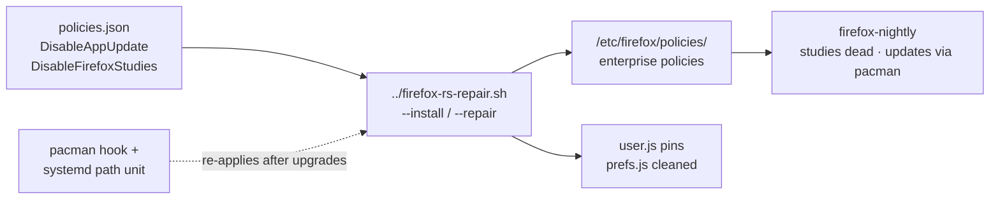

# Firefox enterprise policies — `/etc/firefox/policies/`

<div align="right">


</div>

**Deterministic Firefox on a box that runs nightly from pacman.** In-browser updates would fight the package manager and can leave a half-updated install; experiments would enroll the browser in studies nobody asked for. So the browser's behavior is pinned in one place — `policies.json` in this directory — and a repair script re-applies it after every upgrade. Do not hand-edit on the box; change the repo source and re-run the script (or let the pacman hook / path unit re-apply it).

Deployed from `projects/yote/ops/firefox-policies/` by [`../firefox-rs-repair.sh`](../firefox-rs-repair.sh) (`--install` / `--repair`).

## Quick Start

```bash
cat projects/yote/ops/firefox-policies/policies.json
projects/yote/ops/firefox-rs-repair.sh --repair
```

Then open `about:policies` in Firefox to confirm both policies show as active.

## Current policies

| Policy | Value | Why |
|---|---|---|
| `DisableAppUpdate` | `true` | This box runs `firefox-nightly` from pacman. In-browser updates would fight the package manager and can leave a half-updated install. Updates come from `pacman -Syu`; the `firefox-rs-repair` pacman hook re-applies this repair after every upgrade. |
| `DisableFirefoxStudies` | `true` | No experiments/studies enrolled, while Remote Settings security/update collections keep working and emergency remediation is preserved (mechanism traced below). |

## Architecture



## SET: `DisableFirefoxStudies` — source-traced, 2026-09-21

Chris's requirement: no experiments/studies enrolled, Remote Settings security/update collections keep working, emergency remediation preserved if separable from experimentation. The mozilla-central trace (gecko-dev master, all citations file:line) says this policy delivers exactly that:

**What it does** — `browser/components/enterprisepolicies/Policies.sys.mjs:933-948`: calls `manager.disallowFeature("Shield")` and locks the two CFR new-tab prefs (`browser.newtabpage.activity-stream.asrouter.userprefs.cfr.addons`, `...cfr.features`) off.

**What "Shield" gates** — the ONLY consumer of the feature string is `ExperimentAPI.studiesEnabled` (`toolkit/components/nimbus/ExperimentAPI.sys.mjs:308-314`), which ANDs `datareporting.healthreport.uploadEnabled`, `app.shield.optoutstudies.enabled`, and `Services.policies.isAllowed("Shield")`. With the policy set, `studiesEnabled` is false, which:

- refuses to start `RemoteSettingsExperimentLoader` (`RemoteSettingsExperimentLoader.sys.mjs:247-252`),
- unenrolls EVERY active experiment AND rollout with reason `STUDIES_OPT_OUT` (`ExperimentManager.sys.mjs:890+`, reliably awaited since Bug 1969309),
- blocks force-enroll (`RemoteSettingsExperimentLoader.sys.mjs:584-588`).

So: Nimbus experiments, rollouts, secure experiments, and messaging experiments are all dead — enrolled or future.

**What it does NOT touch:**

- Remote Settings syncs: zero occurrences of `studiesEnabled`/`isAllowed`/`Shield` in `services/settings/remote-settings.sys.mjs` (753 lines) or `RemoteSettingsClient.sys.mjs` (1370 lines) — grep-verified. Blocklists, OneCRL/cert-revocation, hijack blocklists, and `normandy-recipes-capabilities` keep syncing on their normal poll. There is no `services.settings.enabled` kill-switch; the layers are fully orthogonal.
- Normandy emergency remediation: `Normandy.sys.mjs:137` calls `RecipeRunner.init()` unconditionally; the runner gates only on `app.normandy.enabled` (default true, `firefox.js:2738`) and a valid https `app.normandy.api_url` (`RecipeRunner.sys.mjs:198-225`) — no `Services.policies` reference anywhere in the runner. The recipe path (6h timer, `normandy-recipes-capabilities` RS collection, add-on rollout actions) survives the policy. This is the separable emergency path.

**History:** the policy body is untouched since ~2020 (800-commit scan of `Policies.sys.mjs` found nothing); 2025 changes (Bug 1950237 live opt-out observers, Bug 1969309 awaited unenroll) only strengthened the kill. The "Shield" string's meaning migrated from the Normandy era to Nimbus-only — which is why the emergency path survives.

**Empirical check** (proves the emergency path is healthy): watch `services.settings.last_update_seconds` and `services.settings.main.normandy-recipes-capabilities.last_check` advance — both are set only after a clean sync (`remote-settings.sys.mjs:476-501`).

No narrower mechanism does better: a bare `app.shield.optoutstudies.enabled` pref lock misses the CFR locks and the policy-level guarantee (the policy keeps `isAllowed("Shield")` false even if prefs are tampered with).

- **No enrollment happens without data.** The 2026-09-21 incident was a poisoned `services.settings.server` (`data:,#remote-settings-dummy/v1`, a Mozilla test fixture from `services/settings/Utils.sys.mjs`) plus a blanked `app.normandy.api_url`, which starved ALL Remote Settings syncs (no successful client sync since 2026-07-22). With the real server restored, recipe delivery resumes and enrollment decisions are driven by actual recipes again.
- **Enrollment audit** (2026-09-21): existing enrollments inventoried; the no-future-studies posture is enforced by keeping the recipe pipeline honest, not by breaking the pipeline.

## Remote Settings collections this preserves

Security- and update-relevant collections that keep syncing with the default server (none are gated by the studies policy):

- `hijack-blocklists`, `cert-revocation` / blocklist family
- `addons-manager-settings`, `addons-data-leak-blocker-domains`
- `search-config-v2`, `doh-config` / `doh-providers`
- `fingerprinting-protection-overrides`, `query-stripping`, `anti-tracking-url-decoration`, `cookie-banner-rules-list`
- `password-rules`, `change-password-urls`, `fxmonitor-breaches`
- `nimbus-desktop-experiments`, `nimbus-secure-experiments` (recipe delivery)

## Config

- **Source of truth** — `policies.json` in this directory. The deployed `/etc/firefox/policies/` must match it byte-for-byte; the repair script is the only writer.
- **Durability** — pacman hook + systemd path unit re-apply the repair after upgrades and on path changes. `user.js` pins survive profile writes (Firefox reads it at every startup, never writes it).

## Incident log

- **2026-09-21:** `services.settings.server` found set to `data:,#remote-settings-dummy/v1` and `app.normandy.api_url` blanked in the Nightly profile. Provenance hunt in progress (see fleet). Repaired by `firefox-rs-repair.sh v2`: prefs.js cleaned, good values pinned in `user.js` (Firefox reads it at every startup, never writes it), policies deployed, pacman hook + systemd path unit installed for durability.

## Dev / Contributing

- Policy changes start as a source trace like the `DisableFirefoxStudies` one above: mechanism, exact file:line citations, what it kills, what it preserves. A policy without a trace doesn't ship.
- Test on the box with `--repair` and confirm in `about:policies` before relying on the pacman hook.

## License + Security

- This directory ships **no standalone LICENSE file** — it is declarative config (`policies.json`) plus documentation in the sovereign-projects tree.
- **Security posture:** the policies *are* the security control — studies and in-browser updates are disabled at the enterprise-policy layer, which survives pref tampering. The emergency remediation path (Normandy recipes) is deliberately preserved and verified healthy via the Remote Settings sync timestamps above.
