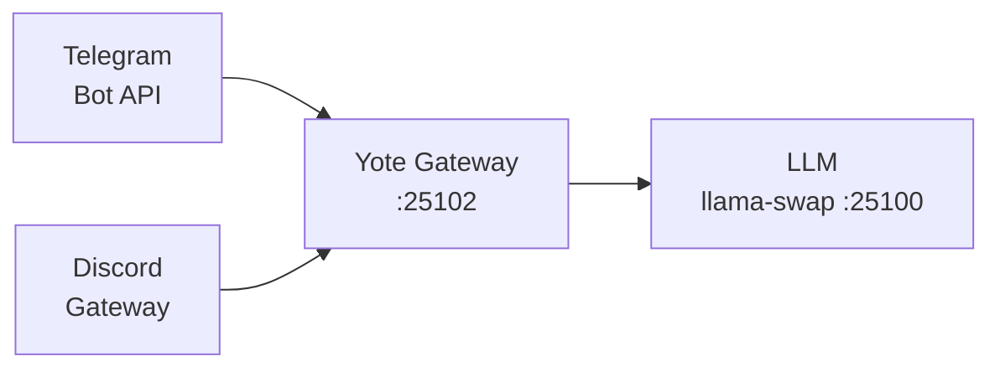

# Yote — Unified Messaging Gateway

<div align="right">


</div>

> Extracted from [OpenFang](https://github.com/toxicwind/openfang) `crates/openfang-channels` — the Telegram and Discord channel code, unified into a single service.

**One gateway, both chat networks, your own models behind them.** Instead of running a Telegram bot and a Discord bot as two services with two configs, yote merges them: one binary, one port, one LLM endpoint. Messages come in from either network, get answered by the sovereign inference fabric, and go back out where they came from.

## Architecture



| Module | Source |
|---|---|
| `src/main.rs` | Gateway core + HTTP API |
| `src/telegram.rs` | Telegram Bot API channel |
| `src/discord.rs` | Discord gateway channel |

## Quick Start

```bash
cargo build --release
export TELEGRAM_BOT_TOKEN="${TELEGRAM_BOT_TOKEN}" DISCORD_BOT_TOKEN="${DISCORD_BOT_TOKEN}" LLM_ENDPOINT=http://127.0.0.1:25100/v1
./target/release/yote
```

## Config

| Service | Port | Env Var |
|---|---|---|
| Yote HTTP API | 25102 | `YOTE_PORT` |

| Env var | Purpose |
|---|---|
| `TELEGRAM_BOT_TOKEN` | Telegram bot token |
| `DISCORD_BOT_TOKEN` | Discord bot token |
| `LLM_ENDPOINT` | OpenAI-compatible chat endpoint (default: `http://127.0.0.1:25100/v1`, the herd router) |
| `YOTE_PORT` | HTTP API port (default: `25102`, the sovereign SSOT port for yote) |

## Dev / Contributing

- Standard Cargo project — `cargo build --release` produces `target/release/yote`.
- Channel code lives in `src/telegram.rs` / `src/discord.rs`; keep channels thin and push shared logic into `src/main.rs`.
- Note the **gateway duality** (see `projects/yote/README.md`): this Rust gateway and the TypeScript gateway in `projects/yote/src/` share the name and port — unification is Chris's call, so don't "fix" the overlap unilaterally.

## License + Security

Apache-2.0 OR MIT (same as OpenFang — see `Cargo.toml`).

**Security posture:** bot tokens arrive via environment variables only — never commit them, never bake them into the binary. The LLM endpoint defaults to the box-local herd router; point it at anything external only over TLS.
