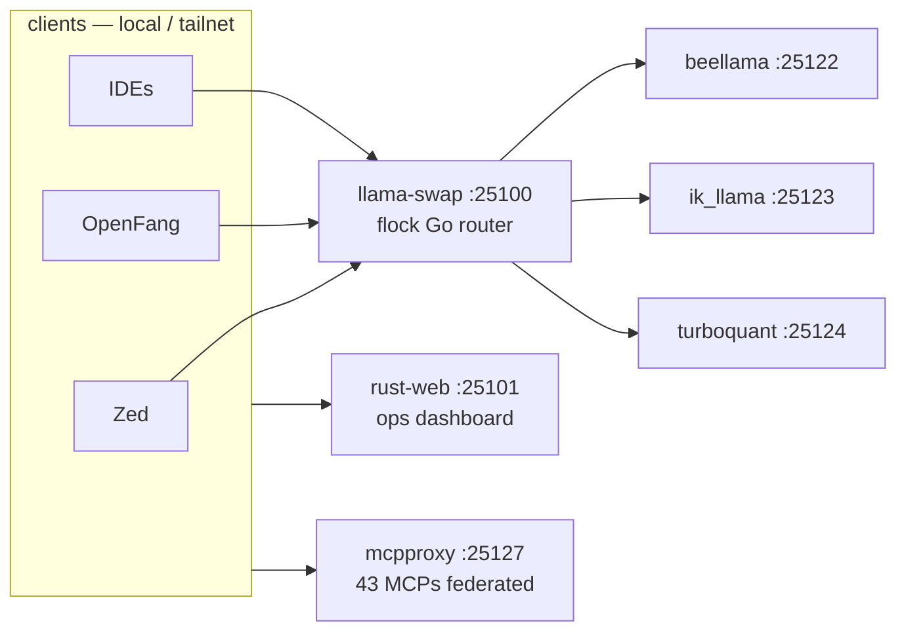

# Sovereign — local multi-service AI stack on one box

One OpenAI-compatible LLM front door, an agent kernel, a Telegram bot, an ops dashboard, metrics, and optional Tailscale exposure — all on awrawr-pc, orchestrated by `mise` + `pitchfork`. No Caddy, no landing page, no multipath proxy: every service has a stable 25xxx port, straight from `config/ports.env`.

- **One LLM front door** — llama-swap (toxicwind fork) on **:25100**: `/ui`, `/v1`, `/models/sse`, flock Go router.
- **Agent kernel** — OpenFang on **:25103** (206 models, 61 skills, Discord bridge).
- **Ops dashboard** — rust-web on **:25101** (rust-web only, with embedded watchdog).
- **MCP federation** — mcpproxy on **:25127** (43 MCPs → 1 endpoint).
- **Metrics + search + vision** — prometheus :25105, Grafana :25110, GHAS API :25112, byte-vision :25121.
- **Ports SSOT** — `config/ports.env`; never invent port numbers in app code.



## Quick start

```bash
cd /home/toxic/sovereign && mise install
mise run up       # owned hot-reload modules
mise run health
```

## Surfaces

| Surface | URL |
|---|---|
| Chat UI | http://127.0.0.1:25100/ui/ |
| OpenAI API | http://127.0.0.1:25100/v1 |
| Ops dashboard | http://127.0.0.1:25101/ |
| Dashboard JSON | http://127.0.0.1:25101/ops/api/status |
| OpenFang UI | http://127.0.0.1:25103/ |
| OpenFang API | http://127.0.0.1:25203/ |
| HF Downloader | http://127.0.0.1:25106/ |
| Grafana | http://127.0.0.1:25110/ |
| MCP Gateway | http://127.0.0.1:25120/health |
| Mesh Hub | http://127.0.0.1:25115/mesh/features |

## What's running (`mise run up`)

| Process | Port | Runtime | Role |
|---|---|---|---|
| **llama-swap** | **25100** | Go (toxicwind fork) | Inference router + flock Go router + `/ui` + `/v1` |
| **rust-web** | **25101** | Rust | Ops dashboard + embedded watchdog |
| **yote** | 25102 | Bun | Telegram / status |
| **openfang** | **25103** | Rust (binary) | Agent kernel — OpenFang OS, 206 models, 61 skills, Discord bridge |
| **prometheus** | 25105 | Go | Metrics |
| **hf-downloader** | 25106 | Bun | GGUF download UI |
| **null-g-proxy** | 25107 | Bun | Extra LLM proxy |
| **mcpproxy** | 25127 | Go | MCP federation (43 MCPs → 1 endpoint) |
| **grafana** | 25110 | Go | Optional dashboards |
| **ghas-api** | 25112 | Bun | GitHub Advanced Search API |
| **ghas-mcp** | 25113 | Bun | GHAS MCP (HTTP mode, depends on ghas-api) |
| **mesh-hub** | 25115 | Bun | 20 GHAS-inspired features × every service |
| **byte-vision** | 25121 | Go binary | Vision MCP (OCR / screenshot analysis) |
| **tailscale-funnel** | — | Bash | Tailscale Funnel exposure (public HTTPS endpoint) |
| **redis** | 25199 | Redis | Session cache, telemetry backing store |

Backends for swap: `BEELLAMA_PORT`=**25122**, `IK_LLAMA_PORT`=**25123**, `TURBO_PORT`=**25124** (llama-server forks).

### Llama-swap interfaces (both coexist — you pick)

| Interface | File | What it is |
|---|---|---|
| **Binary launcher** | `stack/services/llama-swap.sh` | Shell launcher — launches the Go binary, health loop, fail loud |
| **MCP stdio wrapper** | `src/mcp/llama_swap.ts` | Bun MCP server (`StdioServerTransport`). Env-only config (no file reads). Used by MCP federation / gateway |

The launcher (`llama-swap.sh`) is the primary service entry. The MCP wrapper (`llama_swap.ts`) is an additional stdio interface for agent/MCP use. They share the same port (`LLAMA_SWAP_PORT=25100`) but serve different clients — the script launches a binary; the wrapper is a Bun process.

## Architecture

### Inference chain

```
clients (Zed / OpenFang / Grok / IDEs)
   └─► llama-swap :25100   (toxicwind fork)
          │  internal/flock/ — ELO scoring, circuit breakers, 6 strategies
          │  SQLite WAL health DB (modernc.org/sqlite)
          └─► beellama :25122 | ik_llama :25123 | turboquant :25124
```

### flock Go port (in llama-swap fork)

The TypeScript flock router (`tools/sovereign-router/sovereign-router-ts/router.ts`) has been ported to Go inside the llama-swap fork at `~/projects/llama-swap-main/internal/flock/`. This gives llama-swap native multi-provider routing with:

- **6 strategies:** hybrid, ast_race, sticky_affinity, weighted_elo, circuit_chain, fifo_matrix
- **ELO scoring** with circuit breaker (closed/open/half)
- **SQLite WAL** health DB for request history, model health, healing events
- **7 providers:** llama-swap (local), OpenRouter, NVIDIA NIM, Groq, Cerebras, Google, Mistral
- **40+ model aliases** mapped to CODING categories

The standalone Bun `sovereign-router` (`tools/sovereign-router/sovereign-router-ts/`) remains in-tree for external tooling use — no port assigned in `config/ports.env`, not started by `mise run up`. The Go port inside llama-swap is the primary router.

### Sovereign Monitor — agentic runtime intelligence

`tools/sovereign-monitor/` provides kernel-aware, autonomous failure-recovery primitives used by the agent loop itself:

| Module | Coverage | Purpose |
|---|---|---|
| `recursive-fallback.ts` | 88%+ | Multi-level try/catch with helpers, recursive decomposition, and watchdog escalation (ReAct / Reflexion grounded) |
| `watchdog.ts` | 100% | Bounded agentic-loop watchdog: judge → SIGINT → SIGKILL escalation, audit trail, MCP stdio exclusion |
| `repo-radar.ts` | 100% | Autonomous repo discovery via shallow GHAS queries; novelty scoring; autonomy signal detection |

The recursive fallback is the **default failure discipline** for every non-trivial tool call: primary → fix_syntax (coerce input) → scaffold (write helper script) → borrow_ghas (discover pattern) → retrieve_tool (shallow MCP query) → recurse (decompose + retry smaller sub-problem) → escalate (watchdog trips). Each catch block has its own nested try/catch — no single point of failure.

### Repo audit & maximal audit framework

Two complementary audit systems live in this repo:

**`skills/repo-audit/`** — repo-audit skill (see `SKILL.md`):

- `repo_audit.py` — remote GitHub repo analysis via `gh` CLI (privacy/naming/topic signals)
- `local_audit.py` — scans `/home/toxic/projects` for git repos, builds a tree-structure DataFrame, flags duplicates/symlinks
- `projects.map` — benign path map of known projects
- Outputs: CSV, Parquet, JSON (`repo-audit.csv`, `repo-audit.parquet`, `repo-audit.json`)

**`src/maximal-sovereign-agentic-audit/`** — maximal modular audit framework (`local-audit.ts` entry):

- `modules/precheck.ts` — pre-flight checks; `modules/autofix.ts` — `--fix` auto-remediation
- `modules/git-scanner.ts` + `modules/parser.ts` + `modules/dataframe.ts` — repo discovery and shaping
- `modules/parquet.ts` — Parquet export; `modules/completions.ts` — LLM-assisted analysis (`--completions`)
- `benchmark.ts` — audit benchmarking harness

```bash
bun src/maximal-sovereign-agentic-audit/src/index.ts -- [--json] [--parquet] [--fix] [--completions]
```

### Quickshell screenshot integration

The agent captures the user's Hyprland desktop via quickshell (ii rice) snip tool:

- `~/.config/quickshell/ii/screenshot-region.sh` — socket-free primary capture (slurp+grim), recursive multifallback, AST-aware snip routing (code/text/image via tesseract+magick)
- `~/.config/quickshell/ii/modules/common/utils/RecursiveFallback.qml` — QML singleton engine for nested fallback
- `prune-stale-sockets.sh` — cleans crashed-instance IPC dirs

Screenshot actions: `auto` (capture + classify + route to clipboard/file), `copy` (capture + clipboard only). Print Screen key triggers `ScreenSnipToggle.qml` which calls the shell script directly (no dual-instance spawning).

## Why no Caddy / no landing

| Removed | Why |
|---|---|
| **Caddy** | Path routing fought real services (`/api/*` → openfang while rust-web also needs APIs). **`mise run up` never started it.** Multipath proxy not needed when every service has a stable 25xxx port. Artifacts archived under `/home/toxic/archive/caddy-removed-*`. |
| **landing** (`LANDING_PORT` / Bun `src/landing`) | Duplicate static server for the same files rust-web already serves. Deleted; dashboard APIs live on rust-web at **`/ops/api/*`**. |

All public-facing services bind to `0.0.0.0` for LAN/Tailscale access. Internal mesh-front backends stay on `127.0.0.1:252xx`. Redis on `:25199`, Qdrant on `:25133` — both `0.0.0.0`. Access services **directly** on their ports (LAN or Tailscale MagicDNS). Optional Funnel points at **rust-web only**.

## Hot reload

| Component | Mechanism |
|---|---|
| rust-web | `cargo watch` via `stack/services/rust-web-hot.sh` |
| Bun services | `bun --hot` in process modules |
| prometheus | lifecycle reload wrapper (if enabled) |
| llama-swap | restart: `mise run restart-llama` (binary, not rewritten in-tree) |

After editing a process module: full `mise run down && mise run up` (pitchfork reads config on start).

## Configuration

| Source | Contents |
|---|---|
| **`config/ports.env`** | Port SSOT (loaded by mise `_.file`) |
| **`.env.local`** | Optional overrides / build flags |
| **`~/.secrets`** | Secrets (not in git) |

Never invent port numbers in app code — use env / `src/lib/ports.ts` / `stack/lib-ports.sh`. All bind addresses use `0.0.0.0` for network accessibility (pitchfork `ready_http` health checks stay `127.0.0.1`).

## Project layout

```
sovereign/
├── README.md
├── AGENTS.md                 → global rules (symlink)
├── config/ports.env          # SSOT ports
├── mise.toml + mise/tasks/   # up / down / health / doctor / e2e
├── pitchfork.toml            # native config (no generation)
├── stack/services/*.sh       # entry shims (llama-swap.sh, rust-web-hot.sh, ...)
├── src/                      # Bun apps (services, deploy, mcp, lib)
├── src/maximal-sovereign-agentic-audit/  # maximal modular audit framework (local-audit.ts)
├── skills/repo-audit/        # repo-audit skill (repo_audit.py, local_audit.py, projects.map)
├── rust_algo_web/            # rust-web dashboard + watchdog
├── tools/sovereign-router/   # TS sovereign-router (standalone; no SSOT port)
├── tools/sovereign-monitor/  # recursive-fallback, watchdog, repo-radar (agentic runtime)
├── tests/                    # unit + integration tests (≥88% coverage enforced)
├── grafana/provisioning/     # plugins/ + alerting/ dirs (empty but required)
└── tailscale/                # optional Funnel (no Caddy)
```

## Zed provider integration

Zed connects directly to Sovereign Stack services; provider configs live in `.zed/settings.json` (in-repo).

| Provider | Wire | Port |
|---|---|---|
| **nvidia** | `NvidiaLanguageModelProvider` | external (NVIDIA NIM direct) |
| **llama-swap** | `LlamaCppLanguageModelProvider` | `:25100` → routes to beellama `:25122`, ik_llama `:25123`, turboquant `:25124` |
| **mcpproxy** | `mcpproxy-sovereign` context server | `:25127` (30+ MCPs → 1 endpoint, via `mcp-remote` HTTP→stdio bridge) |

Free/keyless OpenAI-compatible endpoints (via the standalone sovereign-router, no SSOT port): `auto` (6-strategy routing), `fcm`, plus OpenRouter-free and NVIDIA NIM model aliases.

## Dev / contributing

```bash
bun test                     # all tests (131+ tests across 9 files)
bun run test:cov             # coverage ≥88% enforced (text + lcov)
bun run test:gateway:cov     # MCP gateway core coverage (100% target)
bun run test:best-models     # model SSOT tests (live integration)
```

Doctor / health:

```bash
mise run doctor   # pitchfork + ports + hot-reload core + ast-grep pin
mise run health   # curl probes for key ports
mise run status   # pitchfork list + 25xxx listeners
```

## License + security

Stack glue: MIT where marked. Upstream binaries retain their licenses (llama-swap, Zed, Grafana, etc.).

- No app auth. Treat as **localhost + Tailscale** only.
- Host firewall should drop public input; open only LAN/tailnet as you choose.
- Do not expose `:25100`/`:25101` to the open internet without your own gate.
