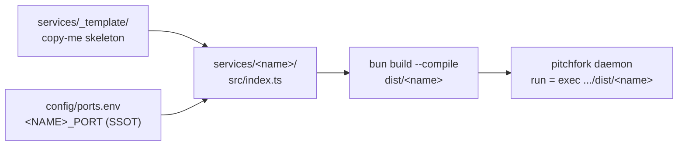

# services/ — sovereign TS service monorepo

<div align="right">
   
</div>

*Every production service in the sovereign estate lives here as a Bun/TypeScript package. **Python is for ML/torch glue and throwaway probes — never for a pitchfork daemon.** (Chris's order, 2026-09-21.)*

One layout, one build, one port discipline, one supervisor. A new service is a copy of the template plus a port registration — boring on purpose, so the estate stays operable at 3 AM.

## Layout

```text
services/
  tsconfig.base.json   # shared strict TS config — all services extend this
  _template/           # copy-me skeleton (valid package, builds as proof)
  <name>/              # one dir per service, e.g. keypool
    package.json       # name @sovereign/<name> + scripts + sovereign{} block
    tsconfig.json      # extends ../tsconfig.base.json
    src/index.ts       # entry point
    .env.example       # documents which <NAME>_PORT var the service reads
```

Current resident: `keypool`.

## From template to daemon



## Quick Start

```bash
cp -r services/_template services/myservice
# edit package.json (rename @sovereign/<name>, sovereign{} block) + src/index.ts per the checklist below
cd services/myservice && bun install && bun run build
```

Full scaffolding checklist:

```bash
cp -r services/_template services/<name>
cd services/<name>
# 1. package.json: rename to @sovereign/<name>, fix build outfile,
#    fill sovereign.port / sovereign.portEnv / sovereign.daemon
# 2. src/index.ts: replace TEMPLATE_PORT + SERVICE, implement
# 3. config/ports.env: add <NAME>_PORT=<free port> (check: no duplicates)
# 4. pitchfork.toml: add [daemons.<name>] with run = "exec /home/toxic/sovereign/services/<name>/dist/<name>"
#    and env = { <NAME>_PORT = "<port>" }  (or source ports.env)
# 5. bun install && bun run --filter @sovereign/<name> typecheck
```

## package.json contract

```json
{
  "name": "@sovereign/<name>",
  "private": true,
  "type": "module",
  "scripts": {
    "build": "bun build src/index.ts --compile --outfile dist/<name>",
    "dev": "bun --watch src/index.ts",
    "lint": "tsc --noEmit -p tsconfig.json",
    "test": "bun test",
    "typecheck": "tsc --noEmit -p tsconfig.json"
  },
  "sovereign": {
    "port": 25109,
    "portEnv": "KEYPOOL_PORT",
    "daemon": "keypool",
    "description": "what it does, one line"
  }
}
```

The `sovereign` block is the **port registry discipline**: the port number is declared once here, assigned once in `config/ports.env`, and read at runtime from `process.env[portEnv]`. A service that hardcodes a port is a bug — the template's `requiredPort()` fails fast when the env var is missing.

## Build convention

`bun run build` produces a **single self-contained binary** at `dist/<name>` via `bun build --compile`. pitchfork `run` lines execute the binary directly — no bun runtime dependency at deploy time, instant startup, one artifact to pin in `deploy/manifest.yaml`.

## Task runner

`turbo.json` at the repo root defines the pipelines:

| task | what it does |
|---|---|
| `build` | compile binary, topological (`^build` first) |
| `typecheck` | `tsc --noEmit`, after upstream builds |
| `lint` | static checks (currently tsc; dedicated linter not yet selected) |
| `test` | `bun test`, after build |
| `dev` | `bun --watch`, persistent, never cached |

Run from the root: `bun run ws:build` (all services), or per-service: `bun run --filter @sovereign/<name> build`.

## Service conventions (all non-negotiable)

- **Event-driven, never timers.** No `setInterval` polling loops. Wake on requests, inotify, WebSocket messages, process events.
- **Bind 127.0.0.1 only.** Public exposure goes through mesh-front.
- **`/health` endpoint**, 200 + JSON `{ok, service, port}`. Health checks depend on it.
- **Graceful shutdown** on SIGTERM/SIGINT — pitchfork restarts must be clean.
- **Fail fast** on missing/invalid config. A service that limps along misconfigured is worse than one that refuses to start.
- **No secrets in code.** Env or the secret broker. Ever.

## Configuration

| surface | purpose |
|---|---|
| `config/ports.env` | SSOT for every `<NAME>_PORT` assignment |
| `services/<name>/.env.example` | documents which `<NAME>_PORT` var the service reads |
| `package.json` → `sovereign{}` | declares port, portEnv, daemon name once per service |
| `pitchfork.toml` → `[daemons.<name>]` | supervisor wiring: `run`, `env`, readiness |

## Migration status (ts-migration)

- Phase 1 (this): monorepo foundation — workspaces, turbo, scaffold. DONE.
- Phase 2 (planned): Tier 0 rewrites — keypool, model-guard, squawk-ws, awrawr-mcp.
- Phase 3 (planned): Tier 1 — exporter, stash-guard, buildsrv.
- Phase 4 (planned): Tier 2 — watchdogs, pollers, remainder.

## Dev & contributing

New service? Copy `_template`, follow the 5-step checklist, keep every convention above. The template builds as-is — if your copy doesn't `typecheck` clean under the shared strict config, fix your code, not the config.

## License & Security

Internal estate services — part of the sovereign projects, not published for external use. The conventions are the security posture: loopback-only binds, fail-fast config, no secrets in code, graceful shutdown under supervision. A service that violates them doesn't ship.
