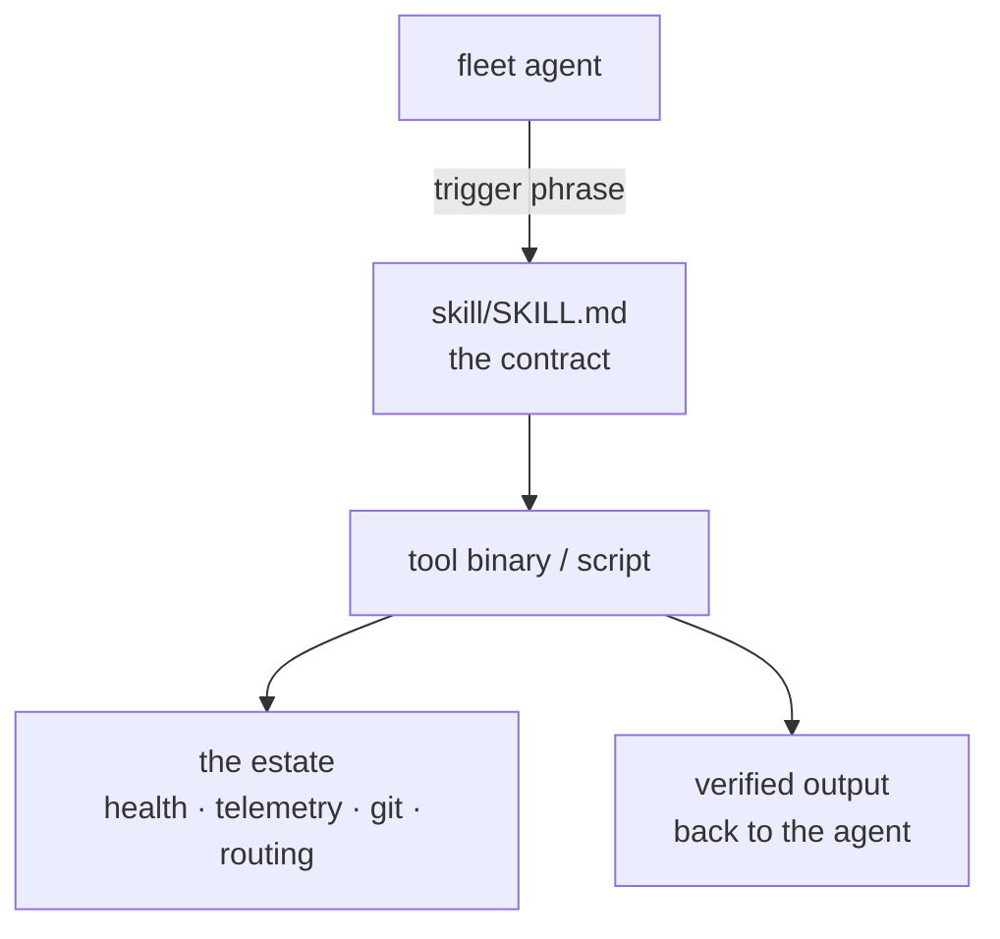

# Skills — Sovereign Helpers Toolkit


**First-class reusable automation for the Sovereign estate**: health checks, telemetry, migration tools, and fleet utilities. Built for Bun / POSIX, zero data loss. Also reachable as `helpers/` at the repo root.

## Why skills

Every skill here is a playbook with a `SKILL.md` contract: trigger phrases, usage, and constraints — written so agents can pick the right tool without reading its source. If a workflow is reusable, it becomes a skill here instead of a one-off script.



## Quick Start

```bash
# 1. Full parallel health audit across all ports
bun run skills/health-audit.ts

# 2. Clean runaway cargo-watch watchers causing CPU spikes
./skills/clean-orphans.sh

# 3. Probe the Mesh JSON-RPC handshake
bun run skills/mesh-probe.ts
```

## Tool catalog

| Script | Runtime | Purpose | Usage |
|---|---|---|---|
| **`health-audit.ts`** | Bun / TypeScript | Parallel live probe across all service endpoints, full untruncated JSON | `bun run skills/health-audit.ts [--json]` |
| **`clean-orphans.sh`** | POSIX bash | Terminates orphan compiler loops (`cargo-watch`) and rogue agent workers | `./skills/clean-orphans.sh` |
| **`mesh-probe.ts`** | Bun / TypeScript | JSON-RPC 2.0 initialize handshake probe for the MCP gateway (`:25127`) | `bun run skills/mesh-probe.ts` |
| **`hardware-telemetry.sh`** | POSIX bash | CPU, L3 cache, frequency governor, swap, and RTX 3090 GPU metrics | `./skills/hardware-telemetry.sh` |
| **`ast-migrate.ts`** | Bun / TypeScript | AST structural pattern matching and codemods via `ast-grep` | `bun run skills/ast-migrate.ts [dir] [scan\|rewrite]` |
| **`surgical-edit`** | Python 3 (stdlib) | Assertive exact-text config surgery: all checks before any write, atomic | `skills/surgical-edit/bin/surgical-edit patch.json` |
| **`herd-probe`** | Python 3 (stdlib) | Exact-token probe of a herd model route (verbatim output check) | `skills/surgical-edit/bin/herd-probe <model> <expected>` |
| **`hft-latency`** | Python 3 (stdlib) | HFT strategy racer: concurrent first-valid-wins, fail-fast ceilings, `--hedge-ms` hedged launch | `skills/hft-latency/bin/race.py --strategies s.json --tag t [--hedge-ms 300]` |

More tools live in the directory (`engine-audit.ts`, `fleet-status`, `gguf-rank`, `model-switch`, `repo-audit`, `tau-tmux`, `git-mutator`, `paper-search`, …) — the table above is the core set. Each skill subdirectory carries its own `SKILL.md` with triggers and constraints.

## Contributing a skill

New code is Bun-first (Chris 2026-09-21). A skill is a directory with a `SKILL.md` (name, description, triggers, usage, behavior, constraints) plus its implementation. Keep it stdlib-only where possible; declare any third-party dependency in the `SKILL.md` so agents don't discover it at runtime.

## License & Security

- **License:** no repo-wide license file ships in this tree; skills are original to this estate.
- **Security:** skills run against the live estate — health probes, process killers, git mutators. Read a skill's `SKILL.md` constraints before running it; `clean-orphans.sh` and `git-mutator` are destructive by design. No credentials live in any skill; credential-shaped values are canaries: verify, never exfiltrate.

---
*Up: [root README](../README.md) · [fleet knowledgebase](../docs/fleet-knowledgebase.md)*
