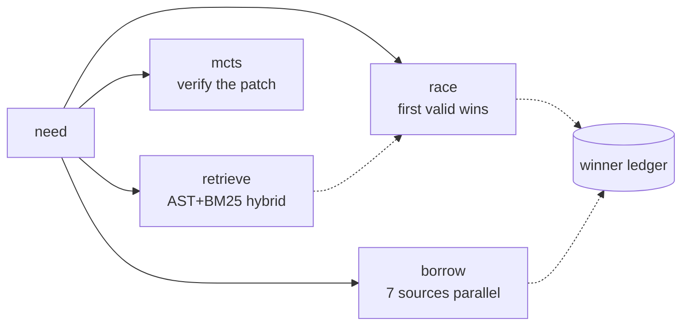

<div align="right">

[](https://github.com/toxicwind/sovereign-projects#license)
[](https://bun.sh)
[](https://bun.sh)
[](https://github.com/toxicwind/sovereign-projects)

</div>

# Skills — the estate's helper toolkit

> Reusable automation for the estate: live health audits, hardware telemetry, MCP handshake probes, AST codemods, assertive config surgery, and **pattern-forge** — one pure-Bun engine for finding code, racing implementations, and mining prior art.

> **Why care?** The estate runs on small sharp tools, not tribal knowledge. Seven overlapping skills once did retrieval, racing, and prior-art search separately — none referenced each other, two shipped byte-identical code, and the fastest retrieval path crawled 400 GB of build artifacts before dying. Merged into one, with a persistent winner ledger and a real AST, it indexes **26× faster, queries 127× faster**, and spends nothing without logging it.

| Tool | Runtime | What it does |
|---|---|---|
| **`pattern-forge`** | **Bun, zero deps** | retrieve · race · bench · borrow · mcts · subgraph — the merged master |
| `health-audit.ts` | Bun | Parallel live probe across every service endpoint, untruncated JSON |
| `clean-orphans.sh` | POSIX bash | Terminates runaway `cargo-watch` loops and rogue agent workers |
| `hardware-telemetry.sh` | POSIX bash | CPU, L3 cache, governor, swap, RTX 3090 metrics |
| `mesh-probe.ts` | Bun | JSON-RPC 2.0 `initialize` handshake probe for the MCP gateway (`:25127`) |
| `ast-migrate.ts` | Bun | AST structural pattern matching and codemods via `ast-grep` |
| `surgical-edit` | Python 3 stdlib | Assertive exact-text config surgery — all checks before any write, atomic |
| `herd-probe` | Python 3 stdlib | Exact-token probe of a herd model route |

## Quick start

```bash
skills/pattern-forge/bin/forge doctor                                   # self-check all six legs
skills/pattern-forge/bin/forge retrieve --root ~/estate/ranch --query "stream broker" --top 5
skills/pattern-forge/bin/forge borrow "self-evolving training arenas"  # mine 7 sources in parallel
```

## pattern-forge — the merged master



Eight skills collapsed into one, each leg absorbing a prior skill:

| Leg | Absorbed from | Doctrine |
|---|---|---|
| `retrieve` | `ast-bm25-racer`, `ast_indexer.py` | BM25 over path + symbols, reweighted by exact hits, async density, import centrality |
| `race` | `hft-latency` | Concurrent, hedged, first **valid** wins; losers aborted, never orphaned |
| `bench` | `code_racer.py` ×2 copies | Nanosecond leaderboard; a throwing candidate ranks last, not first |
| `borrow` | `emergent-enrich`, `race-borrow.ts`, `paper-search` | arXiv, alphaXiv, OpenAlex, S2, DBLP, HF, GitHub, exa — all in flight at once |
| `mcts` | `mcts_engine.py` | Choose a patch by verifying candidates, not reasoning about them |
| `subgraph` | `dynamic_subgraph_inducer.py` | Traceback → the import neighbourhood that caused it |

**The rules that make it trustworthy.** Valid means matching *and* exit 0 — a crash is not a win. A hedge means the primary runs alone and backups launch only if nobody wins, so a fast primary costs nothing. The winner ledger records every race, so the slow path is tried less and stays warm instead of rotting. Paid sources are *audited, not gated*: exa runs whenever a key resolves and every call logs its `costUsd`.

```json
{"strategies":[
  {"name":"primary", "cmd":["bun","run","a.ts"], "match":"^OK"},
  {"name":"backup",  "cmd":["bun","run","b.ts"], "match":"^OK"}
]}
```

```bash
skills/pattern-forge/bin/forge race --strategies s.json --hedge-ms 300 --lead
skills/pattern-forge/bin/forge bench --candidates c.json      # ns leaderboard
skills/pattern-forge/bin/forge mcts --candidates "bun test" --real
```

## Honest limits

- Python symbol extraction is lexical, not an AST — Bun has no built-in Python parser and tree-sitter would break the zero-dependency guarantee.
- DBLP serves a bot-check wall to our shared egress IP, and anonymous Semantic Scholar returns 429. Those are the network, not the code; both degrade without failing the run.
- Superseded skills live under `skills/archive/` (incl. `race`, `paper-search`, `race-borrow`, plus earlier merges). Nothing was deleted outright — `pattern-forge` supersedes them.

## Everything else

76 skills in this directory. Also live: `fleet-status`, `gguf-rank`, `model-switch`,
`repo-audit`, `tau-tmux`, `surgical-edit` (also under archive), `hashline`, `git-mutator`,
`readme-maximal`, and `lib/estate.sh` + `lib/estate_paths.py` — the shared path
resolvers every skill uses instead of hardcoding `/home/toxic/...`.

## Security

Local operational tooling. `clean-orphans.sh` terminates runaway processes by
design — review before running on a shared box. `surgical-edit` writes atomically
and refuses partial application. `forge borrow` makes outbound network calls and
logs paid-source cost to `~/.cache/pattern-forge/`.

## License

[MIT](https://github.com/toxicwind/sovereign-projects#license) — mixed with
upstream licenses where noted. Symlinked as `helpers/` at the estate root.

---
*Up: [estate README](../README.md) · [fleet knowledgebase](../docs/fleet-knowledgebase.md)*