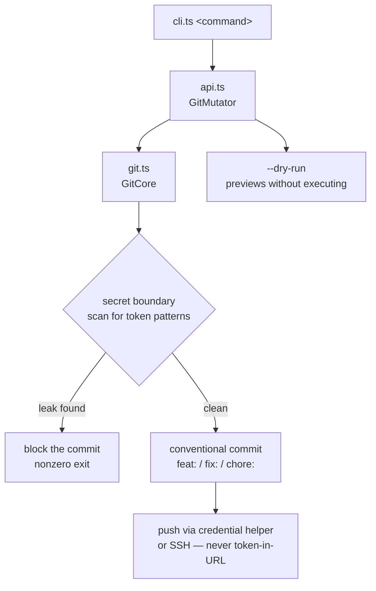

# git-mutator


**Safe git operations with agentic completion auditing.** Manages staged/unstaged/untracked files, commits with secret-boundary verification, and pushes via credential helper or SSH — never token-in-URL. The `commit-push` flow audits first and blocks on any secret leak, so the fleet can commit autonomously without leaking credentials into history.

## Quick Start

```bash
# 1. See what's staged, unstaged, and untracked
bun helpers/git-mutator/cli.ts status

# 2. Audit for completion UUIDs, agent artifacts, and secret leaks
bun helpers/git-mutator/cli.ts agentic-audit

# 3. Audit → commit → push in one flow (blocks on leaks)
bun helpers/git-mutator/cli.ts commit-push "feat: add thing"
```

## Commands

| Command | Description |
|---|---|
| `status` | Show git status (staged/unstaged/untracked) |
| `diff [--staged]` | Show diff (working tree or staged) |
| `commit <msg>` | Commit with conventional commit message |
| `push [remote] [branch]` | Push to remote via credential helper/SSH |
| `commit-push <msg>` | Audit → commit → push (blocks on leaks) |
| `ensure-gitignore` | Add security patterns to .gitignore |
| `scan-secrets [files]` | Scan for credential patterns |
| `agentic-audit [files]` | Audit completion UUIDs, agent artifacts, secret leaks |
| `diff-configs <A> <B>` | Diff two config files |
| `help` | Show usage |

## How it works



## Behavior

- **Secret boundary**: blocks commits if token patterns detected in tracked files
- **Credential safety**: uses git credential helper or SSH only (never token-in-URL)
- **Agentic audit**: scans for completion UUIDs, `.claude`/`.codex`/`.cursor` artifacts, secret leaks
- **SSOT respect**: excludes the port SSOT (`config/ports.env`) from secret scanning
- **Dry-run mode**: `--dry-run` previews without executing

## Constraints

- Commit messages must follow conventional commit format (`feat:`, `fix:`, `chore:`, etc.)
- `.bak.` files are added to `.gitignore` automatically
- `commit-push` audits first and blocks on any secret leak
- Per-attempt deadline: 30s (`DEFAULT_TIMEOUT_MS` in `cli.ts`)

## Files

| File | What it is |
|---|---|
| `api.ts` | `GitMutator` — high-level API |
| `git.ts` | `GitCore` — git operation engine |
| `cli.ts` | CLI entry point (`#!/usr/bin/env bun`) |
| `types.ts` / `errors.ts` | types and error taxonomy |
| `index.ts` | modular exports |
| `basic.test.ts` | tests |
| `SKILL.md` | the skill contract: triggers, tool-call examples, behavior, constraints |

## License & Security

- **License:** no repo-wide license file ships in this tree; git-mutator is original to this estate.
- **Security:** this is the secret-boundary enforcer — it blocks commits containing token patterns and pushes only via credential helper/SSH. It never writes credentials into URLs or history. The port SSOT is excluded from secret scanning by design. Credential-shaped values are canaries: verify, never exfiltrate.

---

*Up: [skills README](../README.md) · [root README](../../README.md)*
