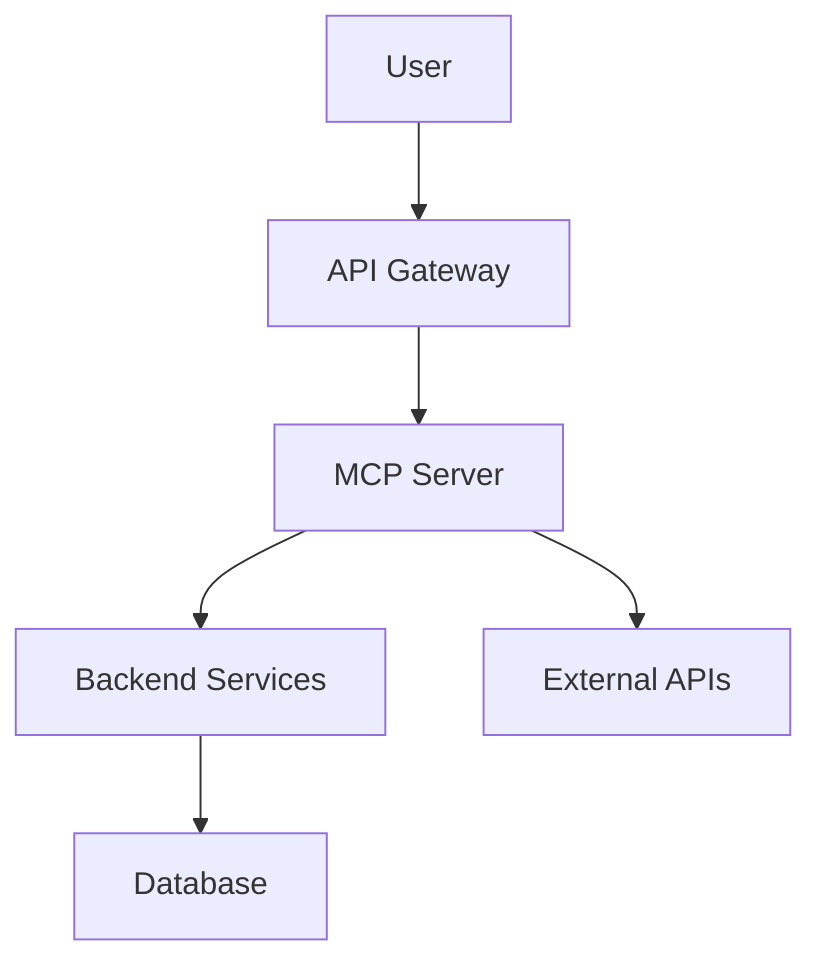

# readme

**Maximal README Engineering** – Standardize all project READMEs with badges, clear hero sections, feature highlights, diagrams, quick-start commands, architecture overviews, configuration guides, contribution guidelines, and security/legal notices.

## Why This Matters

A consistent, high-quality README is essential for discoverability, onboarding, and maintainability. This skill enforces a uniform template across the estate, making it easy for contributors and users to quickly understand each project's purpose, usage, and integration points.

## Badges

[](LICENSE)
[](latest)
[](https://github.com/toxic/task/actions)

## Hero Section

Every README begins with a compelling hero that answers **"Why should I care?"** in the first few lines. This includes:

- A clear one-line summary of the project's purpose
- A benefit-focused description of what the project delivers
- A hint of who benefits (developers, operators, end‑users)

## Feature Bullets

Key capabilities are presented as concise, scannable bullet points. Each bullet should start with a strong verb and highlight a concrete advantage.

- **Standardized formatting** – consistent heading hierarchy, badge placement, and code highlighting
- **Fast onboarding** – three‑command quick‑start guide for immediate value
- **Architecture clarity** – diagrams and component breakdowns for complex systems
- **Security first** – explicit license, security policies, and secret‑management guidance
- **Contribution friendly** – clear dev workflow, branching strategy, and review process

## Diagrams & Screenshots

Where appropriate, visual assets improve understanding:
- **Architecture diagrams** (mermaid or SVG) showing system components and data flow
- **Screenshots** of CLI output, configuration examples, or tool interactions
- **Code snippets** with language‑specific syntax highlighting

## Quick Start

Three real commands to get started:

```bash
# Clone and enter the project
git clone https://github.com/toxic/task.git
cd task

# Install dependencies and run the demo
npm install && npm run dev

# Access the API
curl http://localhost:3000/api/v1/health
```

## Architecture

High‑level view of the system components, data flow, and integration points. Use mermaid diagrams for visual clarity.



### Component Breakdown

- **MCP Server** – Model Context Protocol gateway handling tool discovery and execution
- **API Gateway** – Entry point for external requests, rate limiting, authentication
- **Backend Services** – Business logic layer (order processing, inventory, etc.)
- **Database** – Persistent storage for state and metadata
- **External APIs** – Third‑party integrations (payment, shipping, notifications)

## Configuration

Key configuration files and environment variables:

| File | Purpose | Environment Variables |
|------|---------|-----------------------|
| `config.yaml` | Global application settings | `APP_ENV`, `LOG_LEVEL` |
| `.env` | Local development overrides | `DB_HOST`, `SECRET_KEY` |
| `docker-compose.yml` | Container orchestration | — |

### Example `.env`

```yaml
APP_ENV=development
LOG_LEVEL=info
DB_HOST=postgres.local
SECRET_KEY=change-me-in-production
```

## Development & Contributing

- **Setup** – `make setup` installs dependencies and initializes the project
- **Testing** – Run `make test` to execute unit and integration suites
- **CI/CD** – Pull requests are built and scanned via GitHub Actions
- **Code of Conduct** – All contributions must adhere to the community guidelines

### Contribution Process

1. Fork the repository
2. Create a feature branch (`git checkout -b feat/my-feature`)
3. Make changes and add tests
4. Submit a pull request with a clear description of the improvement
5. Review and merge after passing CI checks

## License & Security

- **License** – MIT (see LICENSE file)
- **Security** – No hardcoded secrets; use environment variables or vaults for sensitive data
- **Compliance** – All projects follow the estate's security and privacy policies

## Support

For questions or issues, open a ticket in the main repository or contact the core team via the established channels.
