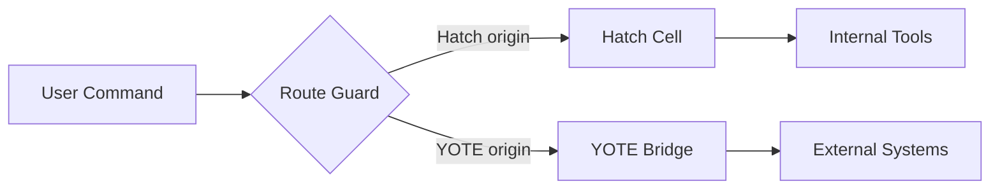

# router

**Route every command to the right box** – ensure commands are dispatched to either the Hatch cell or the YOTE bridge based on their origin, preventing cross‑box contamination and maintaining isolation.

## Why It Matters

Commands must never leak between environments. Running a Hatch‑origin command on YOTE (or vice versa) can cause:
- Incorrect execution context (different paths, permissions, or tool availability)
- Security violations (cross‑environment data exposure)
- Unpredictable behavior (wrong binary, missing dependencies)

This skill enforces a strict routing discipline using HATCH and YOTE bridges.

## The Rule

- **Hatch** – executed within the `hatch cell` (`/home/hatch/*`)
- **YOTE** – executed via the bridge (`/home/toxic/*`)
- **Guard** – every command is checked against its intended box; a wrong‑box invocation exits with a clear error showing the correct `send …` line.

## Usage

```bash
# Route a command to the HATCH cell (internal development)
send hatch -- ls /home/hatch/workspace

# Route a command through the YOTE bridge (external integration)
send yote -- ls /home/toxic/shingle

# Custom timeout for long‑running jobs
send yote --timeout 60 -- ./long-job.sh
```

## Semantics

- **Default behavior** – command tokens are joined and run via `bash -c` on the target box.
- **`--argv`** – tokens become exact `argv` (no shell expansion), avoiding quoting bugs.
- **Exit codes** – real exit codes propagate from the target box.
- **Timeout** – `--timeout` seconds (default 120) prevents hanging commands.
- **MCP callers** – `yote_send` on YOTE's MCP server is the routed endpoint; `hatch_send` is v2 (see `~/workspace/router/hatch_send-v2-spec.md`).

## Guarantees

- Wrong‑box invocations are caught immediately with a descriptive error that shows the corrected `send …` line.
- Cross‑environment leakage is prevented by strict dispatch.
- Developers can focus on one box at a time without worrying about accidental cross‑talk.

## Quick Start

```bash
# Verify the guard works by trying an invalid route
send hatch -- ls /home/toxic/secret_file  # Should fail with a clear error

# Successful Hatch command
send hatch -- ls /home/hatch/workspace

# Successful YOTE command
send yote -- ls /home/toxic/shingle
```

## Architecture



### Component Breakdown

- **Hatch Cell** – Isolated development environment with its own binaries and packages.
- **YOTE Bridge** – Translates commands between Hatch and the broader ecosystem (cloud, external APIs, etc.).
- **Command Dispatch** – The router validates the origin and routes accordingly.
- **Error Handling** – Clear diagnostics when a command is sent to the wrong box.

## Configuration

- **Routing rules** – Defined in `router/routing.rules` (YOTE/YOTE mapping)
- **Timeouts** – Configurable per‑command via `--timeout`
- **Environment separation** – Hatch uses `~/hatch/*`, YOTE uses `~/toxic/*`

## Development & Testing

- **Local testing** – Use `send hatch` and `send yote` locally to verify routing.
- **Integration tests** – End‑to‑end tests simulate cross‑box scenarios and assert correct behavior.
- **CI** – Routing logic is tested in the main CI pipeline.

## Security & Best Practices

- **Never mix boxes** – Treat Hatch and YOTE as completely separate namespaces.
- **Least privilege** – Each box should have its own set of permissions and tools.
- **Audit trails** – All commands are logged through the router for traceability.
- **Secrets management** – Avoid embedding secrets in commands; use environment variables or vaults.

## License & Support

- **License** – See the project's LICENSE file for details.
- **Support** – Open issues or tickets for routing problems in the main repository.

## Related Projects

- [fix-omp-launcher](fix-omp-launcher/)
- [fix-tau-session-corruption](fix-tau-session-corruption/)
- [gatehouse-mcp](gatehouse-mcp/)
- [tau-audit](tau-audit/)
- [tau-binary-build](tau-binary-build/)
- [tau-fork-pinning](tau-fork-pinning/)
- [zipfs-vault](zipfs-vault/)

## Status

Version: **1.0.0**
Last updated: 2026-10-02
