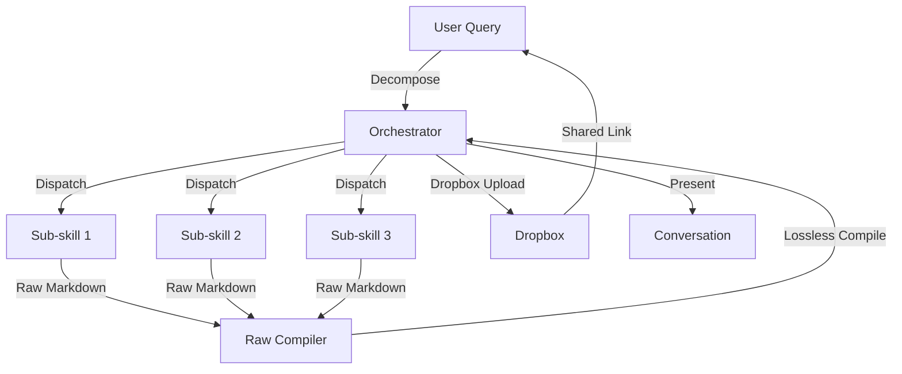

# Sovereign Master Orchestrator {badges}

<!-- badges: start -->
<a href="https://github.com/toxicwind/sovereign-projects">
  
</a>
<a href="https://dropbox.com">
  
</a>
<a href="https://exa.ai">
  
</a>
<a href="https://google.com/search">
  
</a>
<!-- badges: end -->

## Master orchestration and lossless compilation engine for distributed skills.

**What**: Coordinates specialized skills into a unified master output, enforcing 2-4 sections per sub-skill, executing zero-edit raw compilation, and persisting deliverables to Dropbox.

**Why**: When an investigation or systems task requires coordinating 2+ specialized skills and assembling multi-source research into an authoritative, unedited master dossier while preserving full primary data matrices, code blocks, and mathematical formalisms.

**Who**: Root coordinator across all domain-specific sub-skills. Enforces strict output contracts, Dropbox filesystem, dual-channel search (Exa + Google), and zero-halt context ingestion.

## Feature bullets

- **2-4 Section Constraint**: Every sub-skill must structure output into exactly 2, 3, or 4 discrete, self-contained sections
- **Lossless Raw Compilation**: Zero editorial filtering, summarization, or rewriting — all code blocks, mathematical operators, ASCII flowcharts, and URL citations preserved verbatim
- **Dropbox as Primary Filesystem**: All durable artifacts stored directly in Dropbox via `dropbox:create_folder` and `dropbox:create_file`
- **Dual Primary Search Architecture**: Exa neural retrieval + Google real-time search deployed in parallel or sequence
- **Auto-Embedded Loaders**: `bin/env_loader.sh` configures dynamic paths and `$PYTHONPATH`; `bin/dns_loader.py` verifies DNS reachability
- **Zero-Halt Topic Resolution**: When invoked on existing chat, topic derived deterministically from last message + high-perplexity chat tokens — never asks user
- **Portable Directory Layout**: Standard construct with `bin/`, `env/`, `scripts/`, `references/`

## Diagram



## Quick start

```bash
# 1. Initialize dynamic environment & network loaders
bin/env_loader.sh
bin/dns_loader.py

# 2. Query decomposition & sub-skill selection
# (Handled automatically by the orchestrator)

# 3. Lossless raw compilation & Dropbox sync
# (Handled by scripts/raw_compiler.py + dropbox:create_file)
```

## Config / optional services

- **Dropbox API**: Required for durable artifact storage; exponential backoff with jitter on rate limits
- **Exa Search**: `custom_mcp...:web_search_exa`, `web_fetch_exa`, `agent_run` for dense semantic dorking
- **Google Search**: `google:search`, `google:browse` for real-time news, live company status, official filings
- **DNS Reachability**: `bin/dns_loader.py` verifies Dropbox and search endpoint reachability

## Dev / contributing

- Sub-skills must output exactly 2–4 sections; outputs >4 sections are consolidated before master ingestion
- Never edit or summarize sub-skill outputs during consolidation — value is in lossless compilation
- When invoked in existing conversation thread, topic is derived from last message + high-perplexity tokens
- Avoid en-dashes/em-dashes; use standard hyphens or colons
- If Dropbox API encounters rate limits, apply exponential backoff with jitter

## License + security

- **License**: Open Claw source (see `skill.toml`)
- **Security**: Never edit/sub-summarize sub-skill outputs during consolidation; verified topic resolution from chat history prevents injection attacks via ambiguous topics