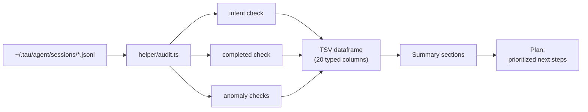

# tau-session-audit


**Flight recorder for TAU agent sessions.** Point it at `~/.tau/agent/sessions/` and get back what the user wanted, what actually got done, and what to do next — as a queryable TSV dataframe, not a wall of text.

## Why

Agent sessions die mid-flight — interrupted runs, compacted contexts, forgotten experiments. Re-reading raw JSONL to reconstruct "what was the user doing here?" is archaeology. This audit does the archaeology for you: it reads every session file, reconstructs user intent from titles/models/event sequences, scores completion, flags anomalies (malformed JSONL, near-empty sessions, credential pins), and prints a prioritized plan of next steps.

## Features

- **Intent reconstruction** — maps sessions to what the user was actually working on
- **Completion tracking** — what finished vs. what's still in-progress, with rates per intent
- **Anomaly detection** — malformed JSONL, near-empty sessions, suspicious event types
- **Queryable output** — 20-column TSV dataframe: pipe to a file, load into pandas/polars
- **K-means clustering** — 3 clusters by event count for session archetyping
- **Read-only** — never modifies session files

## How it works



## Quick Start

```bash
bun run /home/toxic/sovereign/skills/tau-session-audit/helper/audit.ts
bun run /home/toxic/sovereign/skills/tau-session-audit/helper/audit.ts --check plan
bun run /home/toxic/sovereign/skills/tau-session-audit/helper/audit.ts --check all > sessions.tsv
# GitHub-ready Markdown report to stdout
bun run /home/toxic/sovereign/skills/tau-session-audit/helper/audit.ts --report
```

## Checks

| Check | Description |
|---|---|
| `intent` | Reconstruct user intent from session titles/models |
| `completed` | Track what was completed vs. in-progress |
| `plan` | Generate next steps based on intent + completion |
| `anomalies` | All anomaly types |
| `unknown-types` | Events with unrecognized type `?` (malformed JSONL) |
| `near-empty` | Sessions with ≤4 events |
| `empty` | Alias for near-empty |
| `compaction` | Sessions with compaction events |
| `credential-pin` | Sessions with credential_pin events |
| `ttsr-injection` | Sessions with ttsr_injection events |
| `branch-summary` | Sessions with branch_summary events |
| `session-init` | Sessions with session_init events |
| `mode-change` | Sessions with mode_change events |
| `service-tier-change` | Sessions with service_tier_change events |
| `all` | All checks |

## Output

The audit prints a **TSV dataframe** (maximal schema) followed by summary sections.

### Dataframe schema (TSV)

```
file	events	title	model	cwd	intent	completed	anomalyScore	session_init	mode_change	service_tier_change	compaction	credential_pin	ttsr_injection	branch_summary	message	custom	custom_message	thinking_level_change	title_change	unknown_types
```

20 typed columns — load directly into analysis tooling:

```bash
bun run helper/audit.ts --check all > sessions.tsv
python3 -c "import pandas as pd; print(pd.read_csv('sessions.tsv', sep='\t').head())"
```

### Summary sections (filtered by `--check`)

1. **Summary** — total files, events, completed/incomplete counts
2. **Intent Breakdown** — count per intent category
3. **Completion Rate** — by intent with percentages
4. **K-Means Clustering** — 3 clusters by event count
5. **Model Distribution** — top models
6. **CWD Analysis** — working directory distribution
7. **Anomaly Detection** — top 10 anomaly scores
8. **Plan** — prioritized next steps
9. **Anomaly Summary** — counts per type
10. **Top 10 Largest** — by event count
11. **Unknown Types** — malformed JSONL events
12. **Near-Empty** — ≤4 event sessions

## Exit codes

- `0` — audit complete, plan generated
- `1` — critical anomalies found (unknown types, corrupted files)

## Architecture

```
skills/tau-session-audit/
├── README.md        — this file
├── SKILL.md         — TAU skill definition (when/how to invoke)
└── helper/
    ├── audit.ts     — the audit (Bun + TypeScript)
    └── audit.test.ts — tests
```

`audit.ts` parses every `*.jsonl` under `~/.tau/agent/sessions/`, classifies events by type, scores anomalies, clusters by event count, and emits the TSV + summaries. The `--check` flag selects which stages run.

## Configuration

No config file. The session source dir is `~/.tau/agent/sessions/`; `--verbose` adds per-file detail.

## Dev

```bash
# run tests
bun test skills/tau-session-audit/helper/audit.test.ts
```

Contributions: keep the dataframe schema stable (downstream scripts read TSV by column order). New event types get a named `--check` flag, never a silent catch-all.

## License & Security

Part of the [sovereign monorepo](../../README.md#license) — stack glue is MIT where marked. The audit is strictly **read-only**: it opens session JSONL for parsing and writes only to stdout (or the file you redirect it to). It never modifies sessions, config, or credentials.
