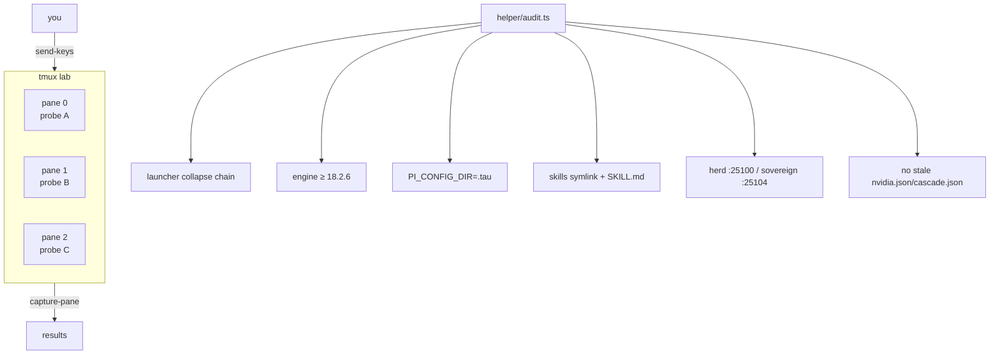

# tau-tmux


**tmux lab + live TAU audit.** Run parallel TAU experiments in tmux panes and verify the live TAU install with real checks that observe the box — nothing stubbed, nothing assumed.

## Why

TAU config is a moving target: launcher collapse chains, config dirs, provider catalogs, router reachability. "It works on my machine" dies fast when six agents share one install. This skill gives you a disposable tmux lab for parallel probes plus an audit script that verifies the actual live install — every check observes the box, and any check that fails tells you exactly which assumption broke.

## Features

- **Detached multi-pane lab** — fire probes into panes without attaching (`send-keys` + `capture-pane`)
- **Live install audit** — `helper/audit.ts` verifies the real TAU install end-to-end
- **Verified flags** — flag table checked against `tau --help` (engine 18.2.6), not guessed
- **History-aware** — docs were corrected when the provider catalog moved to `~/.tau/agent/models.yml` (2026-09-20)

## How it works



## Quick Start

```bash
# Detached 3-pane lab, probe in pane 0, read the results
tmux new-session -d -s tau-lab \; split-window -h -t tau-lab \; split-window -v -t tau-lab:0.1
tmux send-keys -t tau-lab:0.0 "tau -p 'reply with exactly: PANE0_OK'" C-m; tmux capture-pane -t tau-lab:0.0 -p | tail -5
bun run /home/toxic/sovereign/skills/tau-tmux/helper/audit.ts
```

Clean up the lab when done: `tmux kill-session -t tau-lab`.

## Audit

```bash
bun run /home/toxic/sovereign/skills/tau-tmux/helper/audit.ts [--verbose]
```

Exit 0 = all checks pass. Checks:

| Check | What it observes |
|---|---|
| launcher chain | TAU launcher collapse chain resolves |
| engine version | engine 18.2.6+ |
| config dir | `PI_CONFIG_DIR=.tau` honored |
| skills | skills symlink live with discoverable `SKILL.md` files |
| routers | herd (`:25100`) and sovereign (`:25104`) reachable |
| staleness | no stale `nvidia.json` / `cascade.json` |

## Flags that exist (verified against `tau --help`, 18.2.6)

| Flag | Meaning |
| ---- | ------- |
| `--skills "<glob>"` | Filter discovered skills (there is no singular `--skill`) |
| `--profile <name>` | Isolated profile (only `default` exists by default) |
| `-p` / `--print` | Non-interactive: process prompt and exit |
| `--no-skills` | Disable skills discovery (fastest boot) |
| `--config <file>` | Extra config.yml-style overlay for this run (repeatable) |

## Architecture

```
skills/tau-tmux/
├── README.md     — this file
├── SKILL.md      — TAU skill definition
└── helper/
    └── audit.ts  — live install audit (Bun + TypeScript)
```

The audit script runs each check as a real observation (resolving paths, probing ports, reading config) — no mocks, no hardcoded "pass".

## Configuration

No config file. The audit reads the live TAU install state (`~/.tau/`, engine version, router ports). tmux lab sessions are named per-run (e.g. `tau-lab`); kill them when done.

## Dev

```bash
# run the audit in verbose mode to see each check's evidence
bun run skills/tau-tmux/helper/audit.ts --verbose
```

Contributions: every new check must observe the box (no stubs — the 2026-09-20 cleanup removed a helper whose checks always returned true). Flags documented here must be re-verified against `tau --help` after engine upgrades.

## License & Security

Part of the [sovereign monorepo](../../README.md#license) — stack glue is MIT where marked. The audit is **read-only**: it probes ports, reads config, and resolves symlinks, but never writes to the TAU install, never sends prompts, and never touches credentials.
