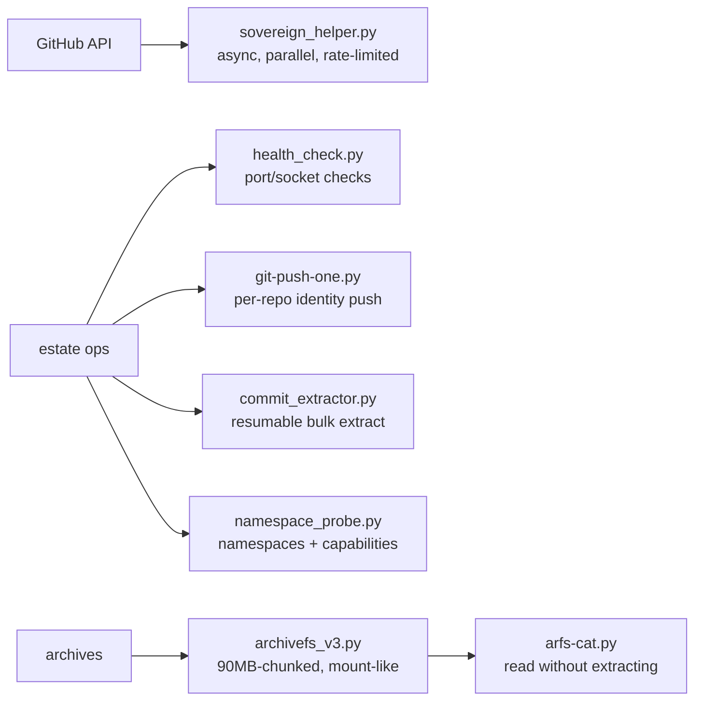

# sovereign-scripts

<div align="right">
  
</div>

*Python automation toolkit for sovereign infrastructure — GitHub API ops, repo audits, archiving, sandboxing, and health checks. The grab-bag that keeps the estate running when a one-liner won't cut it.*

## Scripts

| Script | What it does |
|---|---|
| `sovereign_helper.py` | Master hook for GitHub API ops — async, parallel, rate-limited |
| `health_check.py` | Port/socket health checks for the sovereign environment |
| `git-push-one.py` | Push one file to a GitHub repo with per-repo identity |
| `commit_extractor.py` | Bulk GitHub commit extraction with resumable state |
| `archivefs_v3.py` | Mount-like binary archive with 90MB chunking |
| `arfs-cat.py` | cat/ls files inside an ArchiveFS archive without extracting |
| `auto-hook-loader.py` | Load all auto-hooks from the agent hooks dir |
| `namespace_probe.py` | Linux namespace & capability audit |
| `cache_timing.py` | Cache side-channel timing probe (educational) |
| `unshare-root.py` | Run commands in an unshared user namespace as root |
| `mitm-proxy/` | MITM proxy helpers (`playwright_mitm.py`, `race_aware_loader.sh`) |
| `patches/` | Patch scripts (`browser_guard.py`) |

See `AGENTS.md` in this directory for repo conventions.

## Architecture



## Quick Start

```bash
python3 sovereign-scripts/health_check.py
python3 sovereign-scripts/git-push-one.py --help
python3 sovereign-scripts/commit_extractor.py --owner toxicwind --output ./commits
```

## Usage

```bash
python3 sovereign_helper.py
python3 health_check.py
python3 git-push-one.py --help
python3 commit_extractor.py --owner toxicwind --output ./commits
```

Every script documents its own flags — `--help` is the contract.

## Configuration

Most scripts take flags directly; the GitHub-API scripts expect credentials from the environment (never hardcoded — see Security). `archivefs_v3.py` chunks at 90MB; `arfs-cat.py` reads archives without extracting them.

## Dev & contributing

Follow `AGENTS.md` in this directory: verify live before claiming, fail loud (never silence errors), prefer `fd`/`rg` over `find`/`grep`. New script? Give it `--help`, keep it dependency-light, and add a row to the table above.

## License & Security

Internal estate tooling — part of the sovereign projects, not published for external use. The GitHub-API scripts act with your credentials: keep tokens in the environment, never in the repo. `mitm-proxy/` and `cache_timing.py` are dual-use by nature (proxy tooling, timing probes) — they exist for auditing our own estate; point them at other people's infrastructure and you're on your own.
