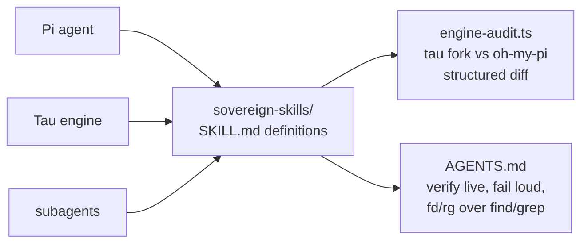

# sovereign-skills

<div align="right">
  
</div>

*Skill definitions, agent recipes, and behavioral conventions for the sovereign ecosystem — consumed by Pi, Tau, and subagents. Keep definitions atomic, self-contained, and deterministic.*

A skill is a contract an agent can load and follow without asking questions. If it needs a conversation to be understood, it's not a skill yet.

## Contents

| Path | What it is |
|---|---|
| `engine-audit.ts` | Audits the Tau engine fork against upstream oh-my-pi; emits structured diff dataframes |
| `AGENTS.md` | Contributor rules for this repo |

Repo rules (from `AGENTS.md`): verify live before claiming, fail loud (never silence errors), prefer `fd`/`rg` over `find`/`grep`.

```bash
# Audit the Tau engine vs upstream
bun run sovereign-skills/engine-audit.ts
```

## Architecture



Skills flow one way: definitions here, consumers everywhere. `engine-audit.ts` is both a skill and its own proof — it audits the Tau engine fork against upstream `oh-my-pi` and emits structured diff dataframes you can actually query.

## Quick Start

```bash
bun run sovereign-skills/engine-audit.ts
ls sovereign-skills/
sed -n '1,40p' sovereign-skills/AGENTS.md
```

## Adding a skill

1. Create `skills/<name>/SKILL.md` — atomic, self-contained, deterministic
2. Add `references/` for routing tables

A skill that depends on tribal knowledge fails review. Write it so a fresh subagent with no context can execute it cold.

## Configuration

Skills are markdown + references, not services — there's no port, no daemon, no env. The one executable here is `engine-audit.ts`, run directly with bun.

## Dev & contributing

Keep definitions atomic (one skill, one job), self-contained (no "see that other doc for the real steps"), and deterministic (same inputs, same behavior). Test a new skill by handing it to a fresh agent and watching — if it asks a clarifying question, the skill is incomplete.

## License & Security

Internal agent-behavior definitions — part of the sovereign projects, not published for external use. Skills shape what agents do, so they get the same scrutiny as code: review additions, keep them deterministic, and never encode credentials or bearer tokens in a SKILL.md.
