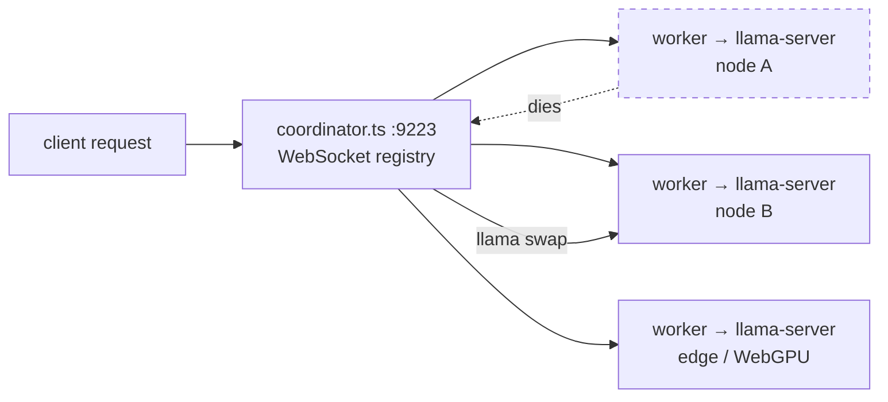

# kataware-doki — llama-server as a first-class, self-healing mesh provider

NOT an Ollama wrapper. Direct llama.cpp HTTP API, wrapped in a distributed node mesh: when one llama-server dies, requests automatically route to the next available node. No single point of failure.

- **Core primitive: llama swap** — distributed node failover, transparent to the caller.
- **Mesh lifecycle** — workers register over WebSocket; the coordinator tracks latency, VRAM, model, and slots per node.
- **Heartbeat 30s / eviction 120s** — dead nodes are pruned automatically (configurable in `llama-server.ts`).
- **Lowest-latency routing** — each request goes to the lowest-latency idle node; failures retry on the next node.
- **Tuned for RTX 3090 24GB** — model registry with VRAM-budgeted model/drafter pairings.



## Quick start

```bash
# Terminal 1: start llama-server
llama-server -m ~/models/Qwen3.6-27B-Q5_K_S.gguf \
  --port 8080 --flash-attn --cache-type-k f16 \
  --chat-template qwen --parallel 4

# Terminal 2: start coordinator
bun run coordinator.ts

# Terminal 3: start worker
LLAMA_BASE_URL=http://localhost:8080 LLAMA_MODEL=qwen3.6-27b-q5 bun run worker.ts
```

Send a request:

```bash
curl http://localhost:9223/v1/chat/completions \
  -H "Content-Type: application/json" \
  -d '{"model":"qwen3.6-27b-q5","messages":[{"role":"user","content":"hi"}]}'
```

## Endpoints used (direct llama.cpp HTTP API)

| Endpoint | Purpose |
|---|---|
| `/completion` | Raw text generation (prompt → content) |
| `/v1/chat/completions` | OpenAI-compatible chat (if --chat-template) |
| `/tokenize` | Token counting |
| `/detokenize` | Token → text |
| `/embedding` | Vector embeddings |
| `/props` | Server metadata (model, n_ctx, n_parallel) |
| `/health` | Health check |

## Mesh lifecycle

1. Worker starts llama-server with `--model`.
2. Worker registers with the coordinator via WebSocket (`ws://127.0.0.1:9223/ws`, env `KATAWARE_COORDINATOR`).
3. Coordinator tracks nodes: latency, VRAM, model, slots.
4. Heartbeat every 30s, eviction after 120s dead (`heartbeatMs`/`evictionMs` in `llama-server.ts`).
5. Request arrives → swap to lowest-latency idle node.
6. Node fails → retry on next node (transparent to caller).

## Model registry (RTX 3090 24GB)

- Qwen 3.6 27B Q5_K_S (14GB) + DFlash drafter Q4_K_M (4GB) = 18GB total
- Llama 4 Maverick 17B 128E Q4_K_M (12GB)
- Llama 3.2 3B Q8_0 (3.5GB) — edge/CDP nodes
- Phi-3 Mini, Gemma 2B — WebGPU in Chrome tabs

## Architecture

| File | Role |
|---|---|
| `llama-server.ts` | First-class provider: `LlamaServerConfig`, `LlamaNode`, self-healing mesh (`evict()` on a 30s interval, 120s timeout) |
| `coordinator.ts` | Mesh coordinator on port 9223 — WebSocket registry, `register`/`heartbeat` message types, magic-auth |
| `worker.ts` | Worker: env `LLAMA_BASE_URL` (default `http://127.0.0.1:8080`), `LLAMA_MODEL` (default `qwen3.6-27b-q5`), coordinator WS |
| `models.ts` | Model registry / IDs |
| `register.ts` | Registration helpers |
| `cdp-node.ts` | CDP/WebGPU edge node support |

## Config

| Knob | Default | Notes |
|---|---|---|
| `LLAMA_BASE_URL` | `http://127.0.0.1:8080` | worker → its llama-server |
| `LLAMA_MODEL` | `qwen3.6-27b-q5` | model ID (must match `--model` on the server) |
| `KATAWARE_COORDINATOR` | `ws://127.0.0.1:9223/ws` | worker → coordinator |
| `heartbeatMs` / `evictionMs` | `30000` / `120000` | in `llama-server.ts` |

## Dev / contributing

- Run with `bun` — no build step.
- Add a model: extend `models.ts` with the VRAM budget and quantization, matching the registry table above.
- The coordinator's port (9223) is the mesh's public surface; keep node HTTP (`:8080` etc.) on loopback.

## License + security

Stack glue: MIT where marked. The mesh is a **loopback service** — keep the coordinator and node HTTP ports on `127.0.0.1`; never expose them without your own auth gate. Model files under `~/models/` are large binaries and live outside git.
