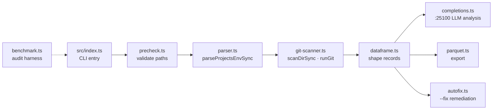

# Maximal Sovereign Agentic Audit — production-grade repo auditing for the Sovereign ecosystem

A fully agentic, modular repository audit system: local-first scanning of every project in `projects.env`, a multi-tier module architecture, LLM-assisted analysis through the :25100 API, and Parquet export for data work. One orchestrator (`local-audit.ts`), nine focused modules, zero monolith.

- **Local-first** — scans the on-disk projects directly; no remote crawling.
- **Modular** — types, constants, parser, git-scanner, completions, autofix, precheck, dataframe, parquet — each its own module.
- **Agentic completions** — `--completions` pipes findings through the :25100 API for AI-powered insights.
- **Autofix** — `--fix` remediates what it can, automatically.
- **Parquet export** — audit results as Parquet for downstream analysis.
- **Precheck** — validates every required path and file exists before the audit runs.



## Quick start

```bash
# full audit (package script: --all --precheck --parquet output/repo-audit.parquet)
bun run audit
```

```bash
# local audit only
bun run local --all --precheck
```

```bash
# with LLM-assisted analysis
bun run start --all --completions
```

## Architecture

```
src/
├── index.ts              # CLI entry point
├── local-audit.ts        # orchestrator (imports all modules)
├── benchmark.ts          # audit benchmarking harness
└── modules/
    ├── types.ts          # RepoRecord, LocalAuditResult, SymlinkRecord, AuditMode
    ├── constants.ts      # all file paths and URLs
    ├── parser.ts         # parseProjectsEnvSync() — parses projects.env
    ├── git-scanner.ts    # scanDirSync(), scanSymlinksSync(), runGit()
    ├── completions.ts    # analyzeWithCompletions() via the :25100 API
    ├── autofix.ts        # autoFix()
    ├── precheck.ts       # preCheck()
    ├── dataframe.ts      # toDataFrame()
    └── parquet.ts        # exportParquet()
```

## Config

| Knob | Effect |
|---|---|
| `--all` | audit every project in `projects.env` |
| `--precheck` | validate required paths/files before running |
| `--parquet <path>` | export results as Parquet |
| `--json` | JSON output |
| `--fix` | auto-remediate fixable findings |
| `--completions` | LLM-assisted analysis via :25100 |

## Dev / contributing

```bash
bun test --coverage        # test suite (package script)
bunx biome check src/ tests/   # lint
bun build src/index.ts --outdir=dist --minified   # build
```

- `package.json` scripts are the contract: `start`, `local`, `audit`, `test`, `lint`, `build`.
- New scan capability = new module under `src/modules/` + wiring in `local-audit.ts`. Keep modules single-purpose.
- `benchmark.ts` is the audit benchmarking harness — measure before claiming faster.

## Requirements

- Bun 1.4+
- `parquetjs-lite` (declared dependency)
- Git repos in `/home/toxic/projects/` and `/home/toxic/sovereign/`

## License + security

MIT where marked. The auditor walks your project trees and reads file contents — it runs locally and sends nothing anywhere except the :25100 completions endpoint when you pass `--completions`. Never point it at a directory containing secrets you don't want summarized; audit output (JSON/Parquet) can contain path names and file metadata, so treat report files as internal.
