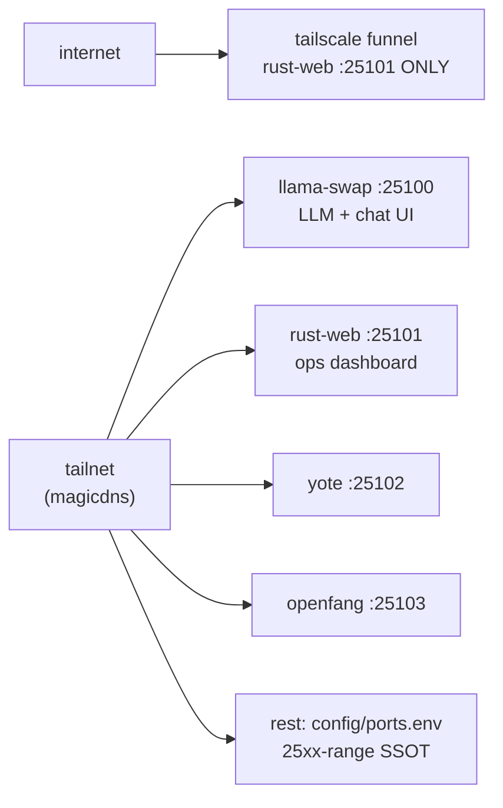

# Tailscale (sovereign)

<div align="right">
   
</div>

*Optional **Tailscale Funnel** edge for the sovereign estate. There is **no Caddy** (removed: wrong ports, path conflicts with openfang `/api/*`, unused by `mise run up`). No reverse-proxy path soup — services are reached directly, over the tailnet or through one narrow Funnel opening.*

## Surfaces (use directly)

| Service | Port | URL |
|---|---|---|
| llama-swap (LLM + chat UI) | 25100 | `http://127.0.0.1:25100/ui/` · `/v1` |
| rust-web (ops dashboard) | 25101 | `http://127.0.0.1:25101/` |
| yote | 25102 | … |
| openfang | 25103 | … |
| rest | see `config/ports.env` | 25xx-range SSOT |

Over Tailscale: `http://<magicdns>:25100` etc. — direct ports, no proxy prefix games.

## Architecture



Funnel is a single narrow opening, not a gateway: exactly one service (rust-web) is exposed to the internet. Everything else is tailnet-only — you reach the LLM remotely via Tailscale + direct `:25100`, not through Funnel.

## Quick Start

```bash
bash tailscale/funnel.sh up
bash tailscale/funnel.sh status
curl -s http://<magicdns>:25101/ | head -c 300
```

1. **up** — expose rust-web (`RUST_WEB_PORT`, default `25101`) via Tailscale Funnel.
2. **status** — confirm what's actually exposed.
3. From anywhere on the tailnet, hit services directly — for the LLM remotely, use Tailscale + direct `:25100`.

Tear it down with `bash tailscale/funnel.sh down`.

## Funnel (optional)

`funnel.sh up` exposes **only rust-web** (`RUST_WEB_PORT`, default 25101) via Tailscale Funnel. It is **not** a multi-service gateway. For LLM access remotely, use Tailscale + direct `:25100`.

```bash
bash tailscale/funnel.sh status
bash tailscale/funnel.sh down
```

## tailray

Tray applet (`tailray.service`) may still run; it's independent of Caddy and of Funnel.

## Configuration

| variable | default | purpose |
|---|---|---|
| `RUST_WEB_PORT` | `25101` | the one port Funnel exposes |
| `config/ports.env` | — | single source of truth for all 25xx-range ports |

## Dev & contributing

`funnel.sh` is the whole control plane (`up` / `status` / `down`). If you add a service to the estate, register its port in `config/ports.env` and reach it over the tailnet — don't widen Funnel without a reason written down.

## License & Security

Internal estate networking — part of the sovereign projects, not published for external use. Security model: Funnel exposes exactly one service (rust-web) to the internet; everything else is tailnet-only with direct-port access and no proxy auth in front. Keep tailnet ACLs tight, and treat `funnel.sh up` as the intentional, auditable moment a surface goes public.
