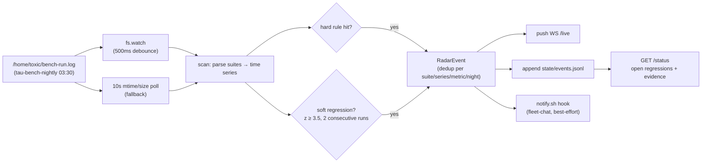

# bench-radar


> Nobody reads the nightly benchmark log. This service does — and pages the moment a suite degrades, instead of letting anomalies sit unnoticed for days.

## Hero

`bench-radar` is a resident, **reactive** regression-detection service for the tau nightly benchmark (cron `tau-bench-nightly`, daily 03:30 America/Denver → `/home/toxic/bench-run.log`). It parses every completed suite into a JSONL time series, runs rolling-median + MAD z-score detection plus hard anomaly rules, and **pushes** regression events over a WebSocket the instant they are evaluated. For the fleet, it turns a log nobody reads into a signal nobody misses.

## Features

- **Reactive push, not polling** — `/live` WebSocket: snapshot on connect, then `{type:"regression", event}` the moment a regression is detected
- **Hard rules page immediately** — suite `exit != 0`; router-models `nonempty=0/N` (backend returning empty); title-models `warmMeanMs=0` while `coldMs>0` (warm runs not executing); suite section missing vs the previous complete run
- **Soft regressions are statistically gated** — rolling-median + MAD z-score (z ≥ 3.5 and ≥25% relative move, ≥4 history points; ≥40% move on short history); change-point aware: a soft regression must degrade **2 consecutive runs** before paging, first sight only arms a pending watch
- **Dedup** — one event per (suite, series, metric, night)
- **No first-boot spam** — backfill runs on boot and records historical events with `"backfill": true`, but never fires the notify hook
- **Durable append-only state** — `events.jsonl`, `evaluated.json`, `pending.json`, plus deterministic time-series exports (`nights.jsonl`, `series.jsonl`) rewritten on every scan



## Quick Start

```bash
pitchfork start bench-radar
curl http://127.0.0.1:25181/health
curl -s http://127.0.0.1:25181/status | head -c 600
```

## API

| Route | Method | What it returns |
|---|---|---|
| `/health` | GET | liveness |
| `/status` | GET | latest night, per-suite verdicts, open regressions with evidence |
| `/live` | WS | snapshot on connect, then `{type:"regression", event}` pushes |
| `/events` | GET | last 50 events (newest first) |
| `/scan` | POST | force an immediate log rescan (returns new events found) |

## Detection

- **Hard rules (page immediately):** suite `exit != 0`; router-models `nonempty=0/N` (backend returning empty); title-models `warmMeanMs=0` while `coldMs>0` (warm runs not executing); suite section missing vs the previous complete run. `SKIP` lines (e.g. ollama-unreachable) are informational only.
- **Soft regressions:** rolling-median + MAD z-score per numeric series (z ≥ 3.5 and ≥25% relative move, ≥4 history points; ≥40% move on short history). Change-point aware: a soft regression must degrade **2 consecutive runs** before paging — first sight only arms a pending watch. New series names get the same treatment: 2 consecutive degraded runs or a hard anomaly.
- **Dedup:** one event per (suite, series, metric, night).

## State

`state/` holds `events.jsonl` (durable, append-only), `evaluated.json` (already-scored run|suite pairs), `pending.json` (armed 1-night watches), `alerts.log` (notify.sh output), plus deterministic time-series exports rewritten on every scan: `nights.jsonl` (one row per run: night, run_start, per-suite exit + series count) and `series.jsonl` (one row per run/suite/series/metric value). Backfill runs on boot record historical events with `"backfill": true` and never fire the notify hook — no first-boot spam, but history is visible in `/status`.

## Reactivity

The log is watched with `fs.watch` (500ms debounce → immediate scan); the 10s mtime/size poll remains as fallback. Detections push over the `/live` WebSocket the moment they are evaluated — no polling downstream. `POST /scan` forces an immediate rescan.

## Alerting

`notify.sh` fires once per new event (argv $1 = event JSON). Default: appends to `state/alerts.log` and best-effort POSTs to fleet-chat.

| Env | Default |
|---|---|
| `FLEET_CHAT_URL` | `http://127.0.0.1:25122` |
| `BENCH_RADAR_ROOM` | `ops` |
| `BENCH_RADAR_AGENT_ID` | `bench-radar` |

The lane wires the room. Env-gated, never fatal to the scan.

## Config

| Env | Default |
|---|---|
| `BENCH_RADAR_PORT` | `25181` (registered in `config/ports.env`) |
| `BENCH_RADAR_LOG` | `/home/toxic/bench-run.log` |
| `BENCH_RADAR_STATE` | `tools/bench-radar/state` |
| `BENCH_RADAR_POLL_MS` | `10000` (fallback poll; the watcher is `fs.watch`) |
| `BENCH_RADAR_BACKFILL` | `1` to page on history (default: record only) |

## Dev / contributing

- Source: `server.ts` (Bun, stdlib + node:fs only), `notify.sh` (hook).
- Run in the fleet: pitchfork-managed — `pitchfork start bench-radar` (stanza in `sovereign/pitchfork.toml`).
- Mesh: registered as `bench-radar` in `src/lib/ghas-mesh-features.ts` (service IDs, catalog, dependency graph); `BENCH_RADAR_PORT` in `config/ports.env`.
- Contributing: keep detection reactive and zero-dependency; add new hard rules next to the existing rule table in `server.ts`, never in the notify hook.

## License & security

Internal sovereign tooling — part of `toxicwind/sovereign-projects`, not published as a standalone package. Listens on loopback only (`127.0.0.1:25181`); the fleet-chat post is best-effort over a local URL and never blocks detection. Treat the pushed regression events as advisory signal: they page on evidence, but the evidence is in `/status` — check it before acting.
