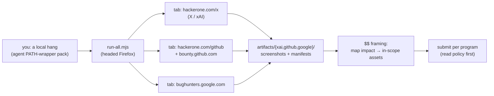

# bugbounty


> Headed Playwright openers for **real, paid bounty programs** — one window, one tab per portal, screenshots on disk, so a finding can be framed against in-scope assets for cash.

## Hero

`bugbounty` opens the X/xAI, GitHub, and Google bug-bounty portals in real headed browsers (Firefox-first, CDP attach supported), captures screenshots + manifests into an artifacts tree, and ships framing notes that map a local hang into each program's **in-scope** surface. Scripts open the portals; you map impact to in-scope assets for the payout.

## Programs

| Script | Program | $$ surface |
|---|---|---|
| `open-xai.mjs` | [HackerOne X / xAI](https://hackerone.com/x) | X/xAI/Grok security bounties |
| `open-github.mjs` | [HackerOne GitHub](https://hackerone.com/github) + [bounty.github.com](https://bounty.github.com/) | Criticals advertised **$30k+** |
| `open-google.mjs` | [Google Bug Hunters VRP](https://bughunters.google.com/) | Google VRP rewards ($$ tiers) |
| `run-all.mjs` | All three | One headed window, many tabs |

Evidence pack to attach: `~/projects/agent-path-wrapper-bug/`



## Quick Start

```bash
cd ~/sovereign/tools/bugbounty
export DISPLAY=:0
node run-all.mjs
```

Or one program at a time: `node open-xai.mjs`, `node open-github.mjs`, `node open-google.mjs`. Screenshot-only then exit: `BB_CLOSE=1 node run-all.mjs`. Package scripts: `npm run xai|github|google|all|all:shot`.

## Config

| Env | Default | Effect |
|---|---|---|
| `DISPLAY` | — | required for headed launch |
| `BB_CDP_URL` | — | attach to a running browser instead of launching (e.g. `http://127.0.0.1:9222`) |
| `BB_CLOSE` | — | `1` = screenshot-only, then exit |
| `BB_ARTIFACT_DIR` | `~/sovereign/tools/bugbounty/artifacts` | where screenshots + manifests land |
| `FIREFOX_BIN` | auto-detect (`/usr/lib/firefox/firefox` → `/usr/local/bin/firefox` → `firefox`) | browser binary |

## $$ framing (read program policy before submit)

These are **paid** programs. Your finding must still **match scope**:

| Program | Best $$ angle for this issue |
|---|---|
| **X / xAI** | Grok/API/web **security** impact (auth, data leak, prompt injection with impact) — pure local hang may be out-of-scope; frame **remote agent impact** if any |
| **GitHub** | In-scope **github.com** / Copilot cloud security only — local IDE hang usually **no bounty** unless cloud agent boundary |
| **Google** | Antigravity/Gemini **cloud** security if in VRP rules — local desktop hang often **no payout** |

Scripts open the portals; **you** map impact to in-scope assets for cash. Per-program submit hints live in `lib/helpers.mjs` (`PROGRAMS`).

## Dev / contributing

- `lib/helpers.mjs` — Firefox-first launch, CDP attach, screenshots, manifests, program URLs + submit hints.
- Dependencies: `playwright@1.61.0` (`npm install` once). Private package (`"private": true`).
- Keep the framing honest: the value of this pack is *opening the real portal next to the real evidence*. Never fabricate an in-scope mapping — record what the program policy actually says.

## License & security

Internal sovereign tooling — part of `toxicwind/sovereign-projects`, not published as a package. **Security posture:** these scripts open live paid bounty portals in a headed browser on your machine — review every URL in `lib/helpers.mjs` (`PROGRAMS`) before running, never submit automated reports, and read each program's policy + scope before any submission. Screenshots in `artifacts/` may contain session context; don't ship them raw in a report.
