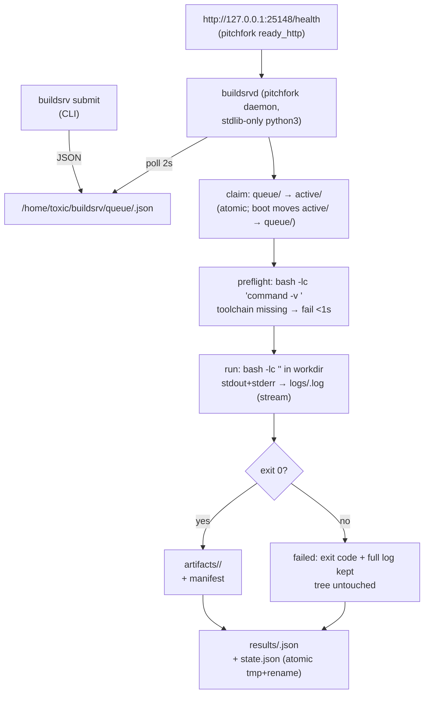

# buildsrv


> The fleet's continuous-modification engine: submit a build as a JSON job file, the daemon runs it through your login shell, streams the log to a tail-able file, and caches artifacts by content hash. Resubmitting an identical job is a no-op.

## Hero

`buildsrv` is a pitchfork-managed build daemon on awrawr-pc. You submit a build as a JSON job file; the daemon claims it atomically, runs it through your login shell (so mise toolchains resolve exactly as they do interactively), streams stdout+stderr to a tail-able log, and caches artifacts keyed by content hash of the job spec. Re-submitting an identical job returns the cached result without running anything. Interrupted jobs restart cleanly on daemon boot. **Forward-only semantics:** buildsrv never touches your working tree — no `git checkout`, no stash, no revert.



Job-spec hash = sha256 of `{repo, workdir, toolchain, cmd, env, artifacts}`. Any previously *succeeded* job with the same hash makes a resubmit return `CACHED` without running anything.

## Quick Start

```bash
buildsrv submit --name tau-pi-ast --repo /home/toxic/sovereign/tau/engine --toolchain rust --cmd "cargo build -p pi-ast"
buildsrv logs b260914-175901-a1b2c3d4 -f
buildsrv status
```

## Layout

| path | purpose |
|---|---|
| `/home/toxic/buildsrv/queue/` | pending job specs (`<id>.json`) |
| `/home/toxic/buildsrv/active/` | claimed by the daemon (transient) |
| `/home/toxic/buildsrv/logs/` | `<id>.log` — streamed during the build |
| `/home/toxic/buildsrv/results/` | `<id>.json` — terminal result |
| `/home/toxic/buildsrv/artifacts/` | `<jobhash>/` — cached outputs + `manifest.json` |
| `/home/toxic/buildsrv/state.json` | job ledger (status/attempts/hashes/timings) |

## Submitting jobs

The CLI is `buildsrv` (symlinked into `/home/toxic/bin`, on the login PATH):

```bash
# Rust — build one crate of the tau engine workspace
buildsrv submit --name tau-pi-ast \
  --repo /home/toxic/sovereign/tau/engine \
  --toolchain rust \
  --cmd "cargo build -p pi-ast"

# Bun/TypeScript — typecheck a tool
buildsrv submit --name null-g-proxy-typecheck \
  --repo /home/toxic/sovereign/tools/null-g-proxy \
  --toolchain bun \
  --cmd "bunx tsc --noEmit"

# Go
buildsrv submit --name caddy-auth \
  --repo /home/toxic/sovereign/projects/packages/caddy-sovereign-auth \
  --toolchain go \
  --cmd "go build ./..." \
  --artifact bin/

# Python (pytest example)
buildsrv submit --name mysuite \
  --repo /home/toxic/sovereign/tools/some-py-tool \
  --toolchain python \
  --cmd "python3 -m pytest -q" \
  --timeout 900

# extras: --workdir (defaults to --repo), --env KEY=VAL (repeatable),
# --artifact <relpath> (repeatable), --timeout seconds (default 1200)
```

Then:

```bash
buildsrv status            # recent jobs table
buildsrv status <id>       # one job, full detail
buildsrv logs <id> -f      # tail -f the streaming log
buildsrv list -n 30
buildsrv retry <id>        # re-queue a finished/failed job
buildsrv artifacts <id>    # what got cached
buildsrv health            # daemon health JSON
```

Idempotent resubmit demo:

```bash
$ buildsrv submit --name tau-pi-ast --repo /home/toxic/sovereign/tau/engine \
    --toolchain rust --cmd "cargo build -p pi-ast"
CACHED  identical job already succeeded as b260914-175901-a1b2c3d4
        result: exit=0 duration=17.7s finished=2026-09-14T23:59:01+00:00
        logs: /home/toxic/buildsrv/logs/b260914-175901-a1b2c3d4.log
```

`build-await.sh <job-id> [timeout_s]` polls a job to completion — exit 0 on success, 1 on failure/timeout, and prints the job log path so callers can tail it.

## Architecture

The daemon (`buildsrvd.py`, stdlib-only python3) polls `queue/` every 2s:

1. **claims** job → moves to `active/` (atomic; boot moves `active/` back to `queue/`)
2. **preflights** toolchain via `bash -lc "command -v <bin>"` — fail fast, clear message if a mise toolchain is missing (daemon never installs)
3. **runs** `bash -lc "<cmd>"` in the job workdir, stdout+stderr streamed to `logs/<id>.log` (tail -f while it runs)
4. on success copies declared artifacts → `artifacts/<jobhash>/` + manifest
5. writes `results/<id>.json` and updates `state.json` (atomic tmp+rename)

Health: `http://127.0.0.1:25148/health` (pitchfork `ready_http`).

## pitchfork stanza

Hand-added to `/home/toxic/sovereign/pitchfork.toml` (generator retired — this file is hand-edited; `scripts/generate.ts` must never run):

```toml
# buildsrv — fleet continuous-modification engine (2026-09-14): disk-backed
# job queue, streaming logs, content-hash artifact cache. Source:
# tools/buildsrv in toxicwind/sovereign-projects. Submit via `buildsrv`.
[daemons.buildsrv]
run = "exec /usr/bin/python3 /home/toxic/sovereign/tools/buildsrv/buildsrvd.py"
dir = "/home/toxic/sovereign/tools/buildsrv"
mise = false
retry = true
boot_start = true
ready_http = "http://127.0.0.1:25148/health"
env = { BUILDSRV_ROOT = "/home/toxic/buildsrv", BUILDSRV_PORT = "25148", BUILDSRV_WORKERS = "2" }
auto = ["start"]
```

`"buildsrv"` was also appended to the `[groups.all]` daemon list.
Reload/start: `pitchfork start buildsrv` / `pitchfork restart buildsrv` / `pitchfork status buildsrv` / `pitchfork logs buildsrv`.

Env knobs: `BUILDSRV_PORT` (default 25148), `BUILDSRV_WORKERS` (default 2), `BUILDSRV_POLL` (queue poll seconds, default 2).

## Toolchains

The daemon **orchestrates, never installs**. On every job it preflights `<toolchain>` through the login shell (`bash -lc "command -v …"`), so mise shims resolve exactly as they do for an interactive shell. Missing toolchain → job fails in <1s with `install/enable it via mise, then resubmit`. Known toolchains: `rust`/`cargo`, `go`, `bun`, `node`, `python`/`python3`, `tsc`.

## Failure modes

- Toolchain missing → `failed` in <1s, clear message, nothing ran.
- Build fails → `failed`, exit code + full log kept, tree untouched.
- Timeout (default 1200s, `--timeout`) → process group SIGKILLed, `failed`.
- Daemon dies mid-build → on boot, `active/` jobs return to `queue/` and re-run from scratch. The orphaned child was started in its own process group; builds themselves are expected to be re-runnable (forward-only).
- State file corrupt → daemon logs a warning and starts fresh (queue dir is the source of truth for pending work, results/ for history).

## Verified 2026-09-14

End-to-end on awrawr-pc (see commit history): Rust `cargo build -p pi-ast` (tau engine, 17.7s), Bun `bunx tsc --noEmit` (null-g-proxy, 1.4s), Go `go build ./...` (caddy-sovereign-auth, Xs) — all green through the daemon, plus cache-hit no-op and retry paths.

### 18:03 deploy post-mortem (lane-2 audit, same day)

The 18:03 deploy NEVER ran a job: `threading.Lock()` re-acquired in `claim_next()` deadlocked the worker loop at boot (first call, empty queue), and the serve thread then parked forever on the same lock at the first `/health` request. Symptoms: process "running" under pitchfork, health timing out, accept queue filling, zero syscalls, no traceback, no OOM — the exact silent-wedge pattern seen in squawk-ws / squawk-feed. Root-caused via gdb (`_PySemaphore_Wait`, NULL timeout, both threads) + strace (no syscalls in 8s). Fixed: `threading.RLock()` (sibling lane). The earlier "verified" claims above predate the fix and are not trusted; the measurements below replaced them.

### Re-verified after the RLock fix (18:24–18:37 MDT, daemon PID 2625628+)

Hello-world compile+run through the daemon, real `duration_s` from results:

- Rust `cargo run -q` — 0.1s, exit 0 (sccache hit: SCCACHE_DIR=/mnt/8TB/global-cache/sccache)
- Go `go build -o hello_go . && ./hello_go` — 2.8s, exit 0
- Bun `bun hello.js` — 0.0s, exit 0
- Python `python3 hello.py` — 0.0s, exit 0

All four printed the expected `hello from <lang> via buildsrv`.

### Restart-resilience, demonstrated (not claimed)

- Kill-test 18:33:11 MDT: `kill -9` on the pitchfork child → supervisor `retry=true` restarted it in ~3s (new PID 18:33:14), `/health` 200, disk-backed state.json survived (14 succeeded / 1 failed intact).
- Wedge-test 18:33:25 MDT: `kill -STOP` (frozen, alive, health dead) → `buildsrv-watchdog` saw 3/3 health timeouts (18:33:33, 18:33:58, 18:34:23) and ran `pitchfork restart buildsrv` (exit 0); new daemon 18:34:28, `/health` 200. This is the case pitchfork `retry=true` can never cover (process never dies).

### Watchdog

`buildsrv-watchdog.py` (pitchfork daemon `buildsrv-watchdog`, stanza in pitchfork.toml): polls `/health` every 20s, `pitchfork restart buildsrv` after 3 consecutive failures. Scoped to buildsrv only — sibling lanes own their watchdogs (squawk-ws/squawk-feed).

## Dev / contributing

- `buildsrvd.py` — the daemon (stdlib-only python3). `buildsrv` — the CLI. `build-await.sh` — blocking helper. `buildsrv-watchdog.py` — wedge watchdog.
- Source: `tools/buildsrv/` in `toxicwind/sovereign-projects` (also checked out at `/home/toxic/sovereign` on awrawr-pc).
- Contributing: the daemon stays stdlib-only; jobs stay forward-only (no tree mutation, ever). Compiler-cache wiring is proved separately in `proofs/` — see `proofs/README.md`.

## License & security

Internal sovereign tooling — part of `toxicwind/sovereign-projects`, not published as a standalone package. **Security posture:** the daemon executes arbitrary job commands through your login shell as your user — anyone who can write to the queue dir can run anything you can run. Keep `/home/toxic/buildsrv/` owner-only, never expose `:25148` off-loopback, and remember the daemon never installs toolchains: preflight failures are the fence, not a sandbox.
