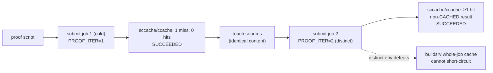

# buildsrv compiler-cache proofs


> Reproducible proof scripts demonstrating that the buildsrv daemon's environment correctly wires compiler caches into every build job — miss, then hit, measured on real daemon runs.

## Hero

Two scripts, two compilers, one claim: **compiler caches are actually warm inside buildsrv jobs.** Each proof submits a cold job (expects a cache miss), touches the sources with identical content, then submits a second job with a distinct `PROOF_ITER` env — so buildsrv's whole-job artifact cache cannot short-circuit — and expects a cache hit. Both proved SUCCEEDED on 2026-09-21.



## Quick Start

```bash
./buildsrv-sccache-proof.sh
./buildsrv-ccache-proof.sh
```

(Requires the buildsrv daemon up: `pitchfork status buildsrv`.)

## sccache (Rust)

`buildsrv-sccache-proof.sh`:

1. Creates a lib+bin Rust crate (library target required — sccache treats binary-only crates as non-cacheable via the crate-type rule).
2. Zeroes sccache stats.
3. Submits job 1 (cold): expects 1 cache miss, 0 hits.
4. Touches sources (identical content), submits job 2 with a distinct `PROOF_ITER` env so buildsrv's whole-job artifact cache cannot short-circuit; expects ≥1 cache hit and a non-CACHED result.

Verified 2026-09-21: job b260921-125457-494679c6 (1 miss), job b260921-125502-d8b067e7 (1 hit, 50% Rust hit rate). Both SUCCEEDED.

## ccache (C)

`buildsrv-ccache-proof.sh`:

1. Creates a C program.
2. Zeroes ccache stats.
3. Submits job 1: `ccache gcc -O2 -c main.c -o main.o` (compile step only — ccache does not cache link steps, so compile and link are split), then links with plain gcc and runs the binary. Expects 1 miss.
4. Touches the source, submits job 2 with distinct `PROOF_ITER` env; expects ≥1 hit and a non-CACHED result.

Verified 2026-09-21: job b260921-125554-02ec538e (1 miss), job b260921-125559-291c3f98 (1 hit, 50% hit rate). Both SUCCEEDED.

## Daemon environment

Both caches are inherited from the buildsrv daemon's pitchfork environment (`pitchfork.toml` `[daemons.buildsrv]`): `RUSTC_WRAPPER=sccache`, `SCCACHE_DIR`, `CCACHE_DIR`, `CMAKE_C_COMPILER_LAUNCHER=ccache`, `CMAKE_CXX_COMPILER_LAUNCHER=ccache`.

## Dev / contributing

Keep the proofs honest: they must measure a *real miss then a real hit* through the live daemon, never stub the stats. If the daemon's environment changes, the `PROOF_ITER` trick (distinct env per iteration) is what keeps buildsrv's own whole-job cache from masking the compiler-cache behavior under test.

## License & security

Internal sovereign tooling — part of `toxicwind/sovereign-projects`, not published as a standalone package. The scripts submit real build jobs to the live buildsrv daemon as your user; they create scratch crates in temp dirs and inherit the daemon's compiler-cache environment. Nothing here is a sandbox — review before running against a daemon you share.
