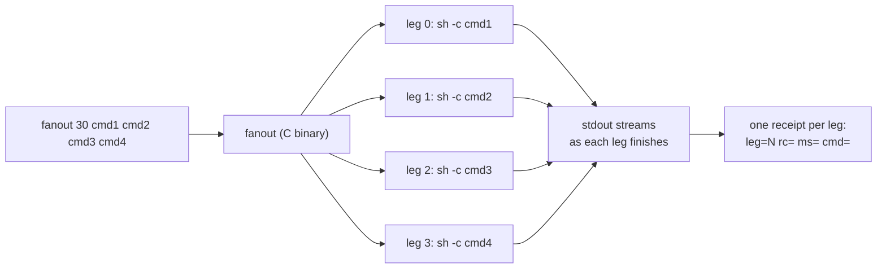

# fanout


> Parallel command fan-out: race independent probes from a single turn instead of running them serially. One receipt line per leg — leg, exit code, wall time, command.

## Hero

`fanout` runs shell commands concurrently and prints a per-leg receipt. It exists for one reason: **racing independent probes/checks from a single turn instead of running them serially.** Measured 2026-09-19: 4× `sleep 1` finished in 1042ms parallel vs 4159ms serial (~4.0x speedup).



## Quick Start

```bash
fanout 30 "curl -s -o /dev/null -w '%{http_code}' http://127.0.0.1:25100/health" "curl -s -o /dev/null -w '%{http_code}' http://127.0.0.1:25148/health"
```

## Usage

```
fanout <timeout_s> <cmd1> [cmd2 ...]
```

Each command runs via `sh -c`. Stdout streams as each leg finishes, then one receipt line per leg:

```
leg=N rc=<exit> ms=<wall_ms> cmd=<command>
```

- A leg exceeding `<timeout_s>` is killed and reports `rc=128`.
- Overall exit code is nonzero if any leg failed.

## Measured

2026-09-19 (cell): 4× `sleep 1` → 1042ms parallel vs 4159ms serial (~4.0x). Earlier run: 1.02s vs 3.50s (~3.4x).

## Stagger discipline (2026-09-19, from live fleet incidents)

This tool parallelizes *your shell commands*. **Subagent spawns** are a different surface: the runtime runs agents concurrently, but the spawn path contends under bulk dispatch. Rules, learned live:

- Stagger bulk spawns ~2s apart. Never fire a large identical bulk spawn twice — simultaneous spawns hit DB lock timeouts.
- On a DB lock timeout: retry in **smaller batches**, never the identical bulk call.
- A spawn error with an infra signature (compaction-model resolution timeout before inference, DB lock timeout, daemon-restart handle loss) means the work **never ran** — re-dispatch reactively on a fresh agent. Never mark the work failed.
- `completed` + canned `final_response` = refused. Check the digest on every spawn, not the status badge.

## Config / placement

No config — it's a single compiled C binary. Durable home: `sovereign/tools/fanout/` in `toxicwind/sovereign-projects`. Working copies: `/home/toxic/bin/fanout` (awrawr-pc), `~/workspace/bin/fanout` (cell — disposable; the repo is the source of truth).

## Dev / contributing

Rebuild from source where it lives; the committed artifact is the binary itself. Keep the receipt contract stable (`leg=%d rc=%d ms=%lld cmd=%.60s`) — fleet tooling parses it.

## License & security

Internal sovereign tooling — part of `toxicwind/sovereign-projects`, not published as a standalone package. Each leg runs through `sh -c` as your user with no sandboxing: quote arguments carefully and never fan out commands built from untrusted input.
