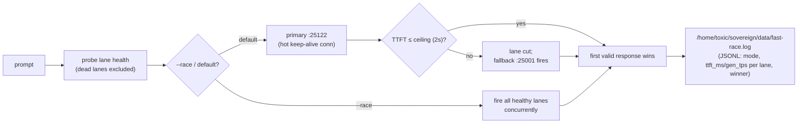

# fast-race


> HFT-style inference racing for the `fast` alias: hot persistent connections, redundant raced lanes, fail-fast TTFT ceilings, first valid wins — ~47ms time-to-first-token on the RTX 3090.

## Hero

`fast_race.py` applies the squawk HFT doctrine (see `shingle-workspace/squawk-hft-latency.md`) to local LLM inference on the exaone-1.2b-iq4xs `fast` endpoint. Two lanes race every request — the permanent pitchfork-supervised slot and a best-effort herd dynamic slot — and the first valid response wins, with a hard per-lane time-to-first-token deadline cutting dead lanes before they cost you.

| Doctrine | Implementation |
|---|---|
| Hot persistent connections | One keep-alive `HTTPConnection` per lane, dial once; silent re-dial on stale keep-alive |
| Redundant raced lanes | `:25122` (pitchfork-supervised, permanent) vs `:25001` (herd dynamic slot, auto-discovered, best-effort); first valid wins |
| Fail-fast ceilings | Per-lane TTFT deadline (default 2s); a miss cuts the lane, fallback fires |
| Measure every hop | JSONL race log + `--bench` P50/P95/P99 tables, warm-ups, hot-vs-cold |



## Quick Start

```bash
python3 fast_race.py "explain race conditions in one paragraph"
python3 fast_race.py --bench --reps 20
```

## Usage

```bash
fast_race.py "prompt"                    # primary with fail-fast fallback
fast_race.py --race "prompt"            # fire all healthy lanes, first valid wins
fast_race.py --bench [--reps N]         # reps x hot/cold + P50/P95/P99 per lane
fast_race.py --lanes 127.0.0.1:25122    # override lanes
fast_race.py --ceiling 2.0              # TTFT fail-fast ceiling (s)
echo "prompt" | fast_race.py            # stdin mode
```

Race log: `/home/toxic/sovereign/data/fast-race.log` (JSONL, one entry per race: mode, attempts with ttft_ms/gen_tps per lane, winner).

## Measured (2026-09-20, RTX 3090, beellama v0.4.6)

- TTFT p50: 47.1 ms (:25122) / 50.8 ms (:25001); gen ~380–440 tok/s
- Hot-vs-cold delta: **+9.8 ms saved per request** by persistent connections
- Streaming SSE via `/v1/chat/completions` (`stream_options.include_usage`)

## Notes

- Stdlib only (no deps). Lane health is probed at startup; dead lanes are excluded from the race (herd may evict `:25001` at any time).
- Complements the `race` skill (`~/workspace/skills/race/`): that races generic commands; this races inference lanes with TTFT/gen_tps telemetry.

## Dev / contributing

Single file, stdlib only — keep it that way. New lanes go into the `--lanes` surface; the fail-fast ceiling stays the contract, never a retry loop.

## License & security

Internal sovereign tooling — part of `toxicwind/sovereign-projects`, not published as a standalone package. Plain HTTP to loopback inference ports; no credentials involved. Bench numbers are from the estate's RTX 3090 — your TTFT will differ on different iron.
