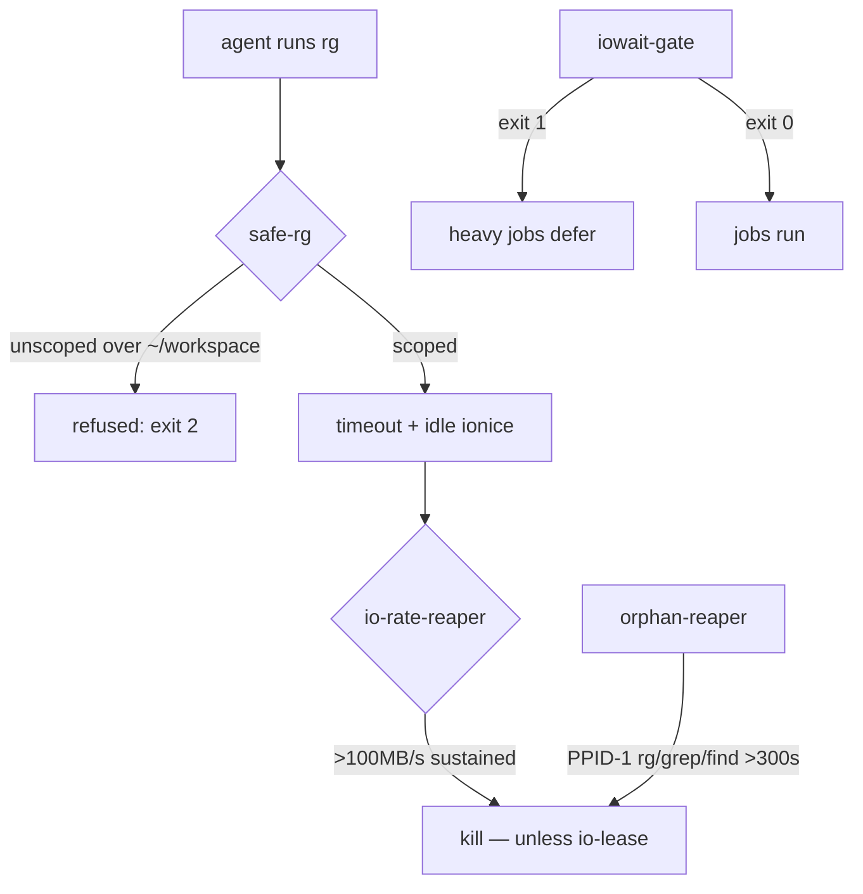

# fleet-ops


**Hatch-cell saturation patches.** The tooling that keeps a 2-core agent cell alive: unscoped recursive greps are refused, orphaned search processes get reaped, and heavy jobs defer when iowait climbs — built after the iowait-freeze incident (2026-09-19: 50–80% iowait, load 10–13 on 2 cores, caused by orphaned recursive greps over `~/workspace`).

## Why

One agent's `rg ~` can starve thirty others. The cell has 2 vCPUs of tool-path policy and zero tolerance for runaway I/O — so the estate's IO defenses live here as executable policy: guardrails on search, reapers for orphans, a saturation gate, and IO leases so forensics work can declare itself exempt. Also mirrored to `/home/toxic/.local/bin/` (on PATH) so every agent gets them by default.

## Features

- **safe-rg** — refuses unscoped `rg` over `~/workspace` (exit 2); scoped searches get timeout + idle ionice; `--yolo` override stays capped
- **orphan-reaper** — dry-run by default; `--kill` reaps PPID-1 `rg`/`grep`/`find` older than 300s touching `~/workspace`
- **io-rate-reaper** — kills by measured `/proc/PID/io` read rate (>100MB/s sustained), not just orphan status; honors `io-lease`
- **iowait-gate** — exit 0 when iowait < 40%, exit 1 when saturated; heavy jobs defer on 1
- **io-lease** — `io-lease --ttl 600 --reason TEXT` declares forensics work so reapers skip it
- **oracle-judge** — debate-oracle scaffolding: renders judge-brief, checks pro+con+synthesis readiness, prints the judging rubric + resolve invocation

## How it works



## Quick Start

```bash
safe-rg "pattern" --root ~/workspace/projects   # guarded search
iowait-gate && run-heavy-job.sh                  # defer when saturated
io-lease --ttl 600 --reason "forensics on X"     # exempt your work
```

## Layout

The directory also holds the operational sub-suites, each with its own README:

- [`cron-mirror/`](cron-mirror/README.md) — durable mirrors of the live cell cron bodies
- [`fleet-watchdog/`](fleet-watchdog/README.md) — lane-7 fleet presence + rollover watchdog

Runtime state (`safe-rg.log`, `.io-leases/`) is NOT committed.

## Architecture

Standalone scripts + the two sub-suites. Nothing here is a daemon: these are guardrails and reapers invoked by agents, crons, and watchdogs. The durable copies live in this repo (awrawr-pc is the persistent store); live copies also sit in `/home/toxic/.local/bin/` on PATH.

## Configuration

No config file. `io-lease` TTLs and reaper thresholds are CLI flags. Runtime state lives outside the repo.

## Dev

Contributions: every new reaper must be dry-run by default with an explicit `--kill` to arm it, and must honor `io-lease`. Guardrails refuse loudly (distinct exit codes) rather than silently rate-limiting.

## License & Security

Part of the [sovereign monorepo](../../README.md#license) — stack glue is MIT where marked. Safety design: reapers are dry-run by default, `safe-rg` refuses rather than rewrites, and `io-lease` gives humans/forensics an explicit exemption path. No network surface, no credentials — these tools act on local process state only.
