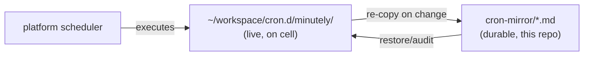

# cron-mirror


**Durable mirrors of the live cell cron bodies.** The cell (`~/workspace/cron.d/minutely/`) is the live source the platform scheduler executes; these mirrors are the durable record — awrawr-pc is the persistent store, cell storage is disposable. To update a mirror after editing the live cell body: re-copy the file here and commit.

## Why

The platform scheduler runs cron bodies that live on the cell, and the cell gets re-provisioned. If the only copy of a cron body is on the cell, a re-provision silently deletes fleet infrastructure. cron-mirror is the answer: every live body has a committed mirror in this repo, so the fleet can always restore or audit exactly what runs.

## Mirrored crons

| File | Interval | What it does |
|---|---|---|
| `lane-redrive__interval@5m.md` | 5m | Deterministic lane dirty-state reactor (2026-09-19). Reads the lane pollers' run ledger, classifies NEW/CHANGED dirty state, watermarks by `lane:debate_id:reason`, pages to `~/workspace/state/lane-redrive.pages.jsonl`. The fleet-watchdog driver syncs the pages file to awrawr-pc; `sweep.py` relays to the fleet room (watermarked, capped at 5/sweep). Never spawns, never kills. |
| `service-restart-watchdog__interval@4m.md` | 4m | Daemon self-heal incl. the io-governor root restart check (2026-09-19). **Note:** the io-governor self-heal step is ALSO patched into the durable `shingle-workspace/cron.d/minutely/service-restart-watchdog__interval@1m.md` (step 5), which is the canonical durable source for that check. |

## How it works



## Quick Start

```bash
diff ~/workspace/cron.d/minutely/lane-redrive__interval@5m.md tools/fleet-ops/cron-mirror/lane-redrive__interval@5m.md
cp ~/workspace/cron.d/minutely/lane-redrive__interval@5m.md tools/fleet-ops/cron-mirror/   # after edits
git add tools/fleet-ops/cron-mirror/ && git commit -m "mirror: sync cron bodies"
```

## Architecture

Two files, zero moving parts. The discipline is the system: edit the live body → re-copy → commit. The mirror never runs anything itself; it's a versioned record and a restore source.

## Configuration

None. The mirror is data, not code.

## Dev

Contributions: when you add a cell cron that fleet infrastructure depends on, mirror it here in the same pass. Mirrors are exact copies — no reformatting, no "improvements" that drift from the live body.

## License & Security

Part of the [sovereign monorepo](../../../README.md#license) — stack glue is MIT where marked. These files document what the scheduler executes; they contain no secrets. Review diffs before committing mirrors — a mirror that diverges from the live body is worse than no mirror, because it claims to be the record.
