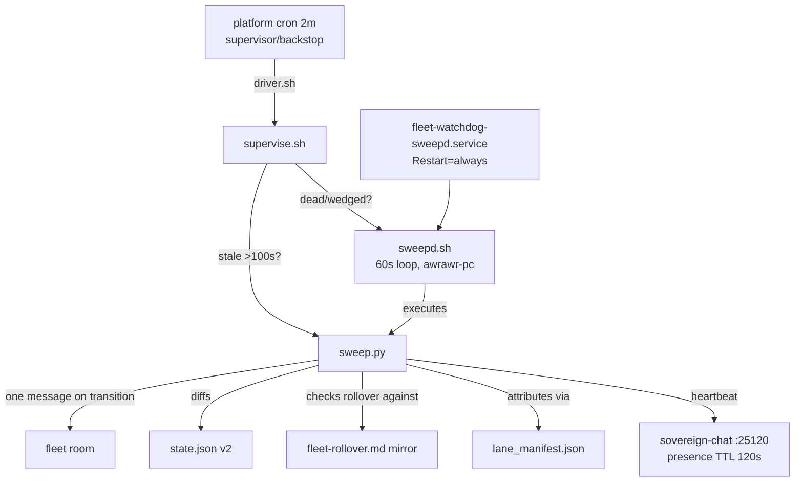

# fleet-watchdog v2


**Lane-7-owned fleet presence + rollover watchdog.** Heartbeats the lane-7 fleet room on a direct 60s sweep path, attributes presence via a canonical lane manifest, and pages the fleet only on transitions. Durable on awrawr-pc; the cell only runs the driver.

## Why

The platform scheduler was observed delivering a nominal 2m cron only every 12–16m. A presence heartbeat chained to that scheduler has no real margin — and the fleet needs a heartbeat with teeth: lanes that go stale must page, rollover identity blocks that vanish must be reported (never silently dropped), and the sweeper must resurrect itself without depending on the scheduler that failed it. v3's direct 60s sweep path on awrawr-pc is the answer: immune to agent-dispatch jitter and bridge 502s.

## Features

- **Direct 60s sweep** — `sweepd.sh` runs on awrawr-pc, no bridge hop (sovereign-chat is local at `127.0.0.1:25120`)
- **Change-only paging** — live→stale, stale→live, rollover block lost/restored, watchdog gap; steady state = silence
- **Manifest-checked rollover** — rollover identity blocks verified against `lane_manifest.json`, so a lane whose whole block disappears is **reported, never silently dropped**
- **Self-resurrecting** — systemd user unit (`Restart=always`, `RestartSec=10s`) + user lingering; a dead sweeper comes back in ~10s on the box itself
- **Supervisor backstop** — the 2m platform cron is supervisor-only: restarts a dead/wedged sweepd, runs ONE backstop sweep only when the last sweep is stale (>100s)
- **Single-flight** — non-blocking flock at sweep start; overlapping sweeps skip quietly

## How it works



## Quick Start

```bash
pgrep -af '[s]weepd.sh'                                  # is the sweeper alive?
tail /home/toxic/var/fleet-watchdog/sweepd.log          # what it's saying
python3 test_decide.py                                  # brain tests, exit 0
```

## Layout

- `sweep.py` — the watchdog. Runs **on awrawr-pc**. Heartbeats lane-7, reads `/v1/presence` (server timestamps: per-agent `last_heartbeat`, response `ts`, `ttl_s`), attributes presence via `lane_manifest.json`, checks rollover identity blocks in the durable mirror **against the manifest**, diffs against `state.json`, posts **one** consolidated fleet-room message only on transitions.
- `lane_manifest.json` — canonical lane identity manifest: chat_id prefix → lane (+ full chat_id). Regenerate with `sweep.py --gen-manifest` after a verified rollover update, then commit it.
- `driver.sh` — cell-side driver for the platform scheduler: syncs `/home/hatch/fleet-rollover.md` → durable mirror (best effort), then runs `supervise.sh` on awrawr-pc. The scheduler body is a one-liner running this file. The live cell copy is `~/workspace/fleet-watchdog/driver.sh`; this repo copy is the durable original — keep them identical.
- `sweepd.sh` — the direct 60s sweeper daemon (awrawr-pc local). Loops `sweep.py` every 60s, pacing with `isleep` (no `sleep` binary). Single instance via flock on `/home/toxic/var/fleet-watchdog/sweepd.lock`. Logs to `/home/toxic/var/fleet-watchdog/sweepd.log`.
- `supervise.sh` — the 2m supervisor (awrawr-pc local, run by `driver.sh`): restarts `sweepd.sh` when dead/wedged (via the systemd unit when installed, else pkill/setsid), runs one backstop sweep only when the last sweep is stale (>100s). Prints one JSON line.
- `systemd/fleet-watchdog-sweepd.service` — systemd user unit for `sweepd.sh` (Restart=always, RestartSec=10s). Symlinked into `~/.config/systemd/user/` and enabled; with user lingering it survives reboot. The repo copy is the source of truth.
- `sweep.lock` — single-flight lock: `sweep.py` takes it non-blocking at startup, so an overlapping sweepd/backstop sweep skips quietly (`overlap_skipped=true`) instead of double-paging. Gitignored.
- `state.json` — schema v2: per-lane `{block, live, last_seen_ts, last_transition, last_transition_ts}`, `last_sweep_ts`, capped `transitions` log (50). v1 state migrates automatically (booleans carried, `last_seen_ts` unknown pre-v2, `last_sweep_ts` seeded from the v1 file mtime so the gap detector stays honest).
- `fleet-rollover.md` — durable mirror of the lane-adoption doc.
- `test_decide.py` — synthetic transition scenarios against the pure `decide()` brain plus the blind-spot checks (`check_blocks` against a gutted mirror). Run on awrawr-pc: `python3 test_decide.py`.

## Cadence

60s sweep interval via the direct path (`sweepd.sh` on awrawr-pc: no agent-wrapper dispatch, no bridge hop). sovereign-chat presence TTL is 120s: the 60s sweep keeps the lane-7 heartbeat alive continuously with 60s of margin, and the gap detector (> 2× interval = 120s) pages only after two consecutive missed sweeps — a real sweeper outage, not jitter. The 2m platform cron supervises (restarts a dead/wedged sweepd, backstop sweep when stale) and syncs the rollover mirror; it is not the heartbeat path, so its dispatch latency cannot eat the margin.

## Paging rules (change-only; steady state = silence)

- live→stale: `lane-N STALE (last heartbeat Xh Ym ago)`
- stale→live: `lane-N LIVE again after X dark`
- rollover block lost / restored (header + chat_id prefix both required)
- watchdog gap: no sweep for > 2× interval → `watchdog gap: no sweep for X — resumed`
- watchdog blind: manifest + mirror both unreadable → pages at most hourly, no fabricated transitions
- first run posts the baseline; every sweep heartbeats (plane TTL mechanism)

## Runbook

- Manual sweep: `bash /home/toxic/sovereign/tools/fleet-ops/fleet-watchdog/supervise.sh` on awrawr-pc (or `driver.sh` from the cell, or the scheduled job).
- Sweeper status: `pgrep -af '[s]weepd.sh'`; tail `/home/toxic/var/fleet-watchdog/sweepd.log`.
- Brain tests: `python3 test_decide.py` on awrawr-pc (exit 0).
- Regenerate manifest: `python3 sweep.py --gen-manifest` on awrawr-pc, verify the 8 lanes, commit.
- Logs: the sweep prints one JSON line per run (ok, live/stale sets, pages, posted, transitions, map_source).

## Known limitations

- Last-seen for stale lanes comes from this watchdog's own observation history (the server exposes `stale_count` but no per-stale-agent timestamps). A lane never seen live by v2 reports "first sighting" on recovery instead of a downtime duration.
- Dead-man's switch: the 2m supervisor restarts a dead/wedged sweepd, so a lone sweeper death self-heals without paging; if both die, nobody pages until one resumes (then the gap page fires). A second independent monitor (lane-8's bridge health or equivalent) is the cross-check — not built here.
- The rollover mirror is synced cell→awrawr-pc by the driver each run; lanes still append to the cell original.

## License & Security

Part of the [sovereign monorepo](../../../README.md#license) — stack glue is MIT where marked. The watchdog posts to the fleet room (chat-topology: presence transitions only, never fabricated) and reads sovereign-chat presence over localhost. No credentials in the repo; the rollover mirror is a committed copy of an operational doc — treat diffs as reviewable fleet state.
