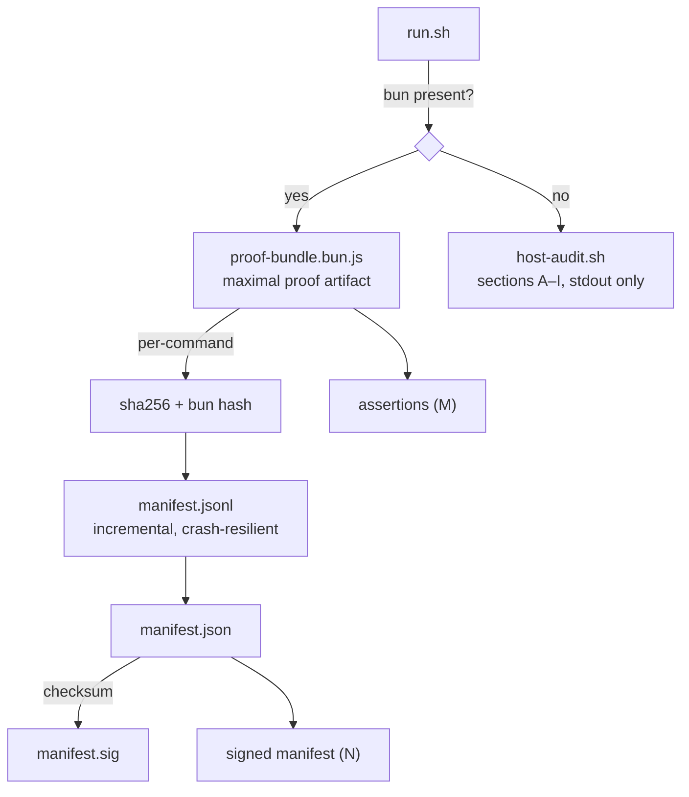

# host-proof


**Universal read-only host proof bundle.** Identifies whatever box it runs on — no hardcoded hostnames, no assumptions. Produces a hashed, signed proof artifact of host state: every command's stdout is checksummed, the manifest is tamper-evident, and secrets are never printed. Two implementations, one contract.

## Why

"This box" is never the box you think it is — containers, worktrees, re-provisioned cells, half-migrated checkouts. When you need to prove what a host *actually is* (for an audit, a dispute, a forensics trail), screenshots and claims don't cut it. host-proof runs a battery of observations, hashes every byte of evidence, and signs the manifest — so the bundle is self-verifying and tamper-evident after the run.

## Features

- **Host-agnostic** — no hardcoded hostnames; identifies whatever box it runs on
- **Tamper-evident** — every command's stdout hashed (sha256 + bun hash), recorded as JSON; final `manifest.json` checksummed into `manifest.sig`
- **Crash-resilient** — records append to `manifest.jsonl` incrementally
- **Assertions + signatures** — includes assertions (M) and a signed manifest (N)
- **Secret hygiene** — environment values are never printed: presence, sha256, and length only; config files (e.g. MCP configs) are hashed, never dumped
- **Honest fallback** — bash path uses labeled sections A–I with `CHECK-UNAVAILABLE` branches instead of assumptions
- **Zero-dep fallback** — `host-audit.sh` needs nothing but bash

## How it works



## Quick Start

```bash
./run.sh
OUT=~/host-proof-runs/mychat bun proof-bundle.bun.js
./host-audit.sh
```

(`host-audit.sh` takes an optional entity-hunt target, defaulting to hostname: `TARGET=mybox ./host-audit.sh`.)

## Verify (bun bundle)

```bash
sha256sum <OUT>/manifest.json
cat <OUT>/manifest.sig
```

The two hashes must match. If they do not, the manifest was modified after the run completed.

## Architecture

```
tools/host-proof/
├── run.sh              — entrypoint: picks bun when present, else bash; sets unique OUT dir
├── proof-bundle.bun.js — maximal proof artifact (preferred)
├── host-audit.sh       — zero-dependency bash fallback
└── README.md           — this file
```

Schema: `host-proof-bundle/v1`. Supersedes the `awrawr-proof` v3-bun draft (fixed a parse-time SyntaxError in that draft — a `${n##*/}` inside a JS template literal, which is JS interpolation, not shell).

## Configuration

No config file. `OUT` env var sets the output dir (default `$HOME/host-proof-$(hostname)-$$-$(date -u +%Y%m%dT%H%M%SZ)`); `TARGET` sets the bash fallback's entity-hunt target.

## Dev

Contributions: both implementations share one contract — read-only observation, hashed evidence, no secret values in output. New checks go in both paths or are explicitly marked `CHECK-UNAVAILABLE` in the bash fallback.

## License & Security

Part of the [sovereign monorepo](../../README.md#license) — stack glue is MIT where marked. Security is the product here: strictly read-only in both paths, environment values reported as presence/sha256/length only, configs hashed never dumped, and the signed manifest detects any post-run modification. The bundle is evidence-grade — safe to hand to another party as proof of host state.
