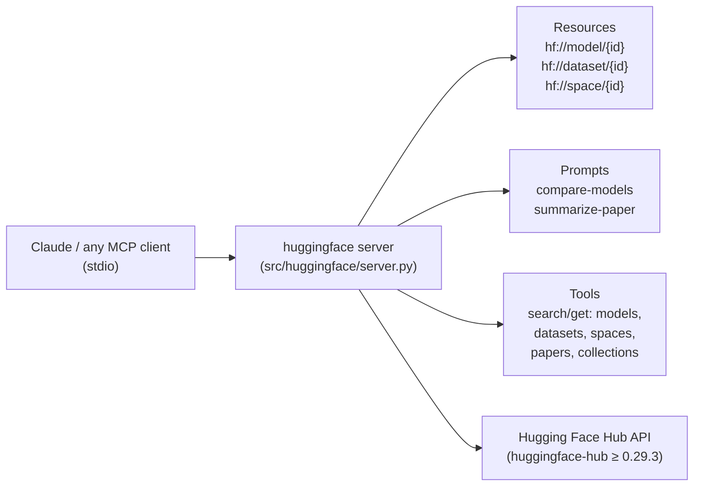

# Hugging Face MCP Server


[](https://smithery.ai/server/@shreyaskarnik/huggingface-mcp-server)

> A Model Context Protocol server giving LLMs read-only access to the entire Hugging Face Hub — models, datasets, spaces, papers, collections — so "compare these two models" or "summarize that paper" becomes one tool call instead of a web hunt.

## Hero

This is a vendored copy of the upstream [huggingface-mcp-server](https://github.com/cristianoaredes/null-g-proxy) by Shreyas Karnik (MIT). It exposes the Hugging Face Hub APIs over MCP stdio: custom `hf://` resource URIs, two prompt templates (`compare-models`, `summarize-paper`), and a tool set covering models, datasets, spaces, papers, and collections. Optional `HF_TOKEN` unlocks higher rate limits and private repos. The package installs as a `huggingface` console script (`pyproject.toml` `[project.scripts]`).



## Quick Start

```bash
uv sync
uv run huggingface
```

Then add to Claude Desktop config (`~/Library/Application Support/Claude/claude_desktop_config.json` on macOS, `%APPDATA%/Claude/claude_desktop_config.json` on Windows):

```json
"mcpServers": {
  "huggingface": {
    "command": "uv",
    "args": ["--directory", "/absolute/path/to/huggingface-mcp-server", "run", "huggingface"],
    "env": { "HF_TOKEN": "your_token_here" }
  }
}
```

Or install automatically via [Smithery](https://smithery.ai/server/@shreyaskarnik/huggingface-mcp-server):

```bash
npx -y @smithery/cli install @shreyaskarnik/huggingface-mcp-server --client claude
```

## Components

### Resources

Popular Hugging Face resources exposed over a custom `hf://` URI scheme:

- Models with `hf://model/{model_id}` URIs
- Datasets with `hf://dataset/{dataset_id}` URIs
- Spaces with `hf://space/{space_id}` URIs
- All resources have descriptive names and JSON content type

### Prompts

Two prompt templates:

- **`compare-models`** — comparison between multiple Hugging Face models. Required `model_ids` argument (comma-separated). Retrieves model details and formats them for comparison.
- **`summarize-paper`** — summarize a research paper from Hugging Face. Required `arxiv_id` argument; optional `detail_level` (brief/detailed). Combines paper metadata with implementation details.

### Tools

- **Model tools** — `search-models` (filters: query, author, tags, limit), `get-model-info`
- **Dataset tools** — `search-datasets` (filters), `get-dataset-info`
- **Space tools** — `search-spaces` (filters incl. SDK type), `get-space-info`
- **Paper tools** — `get-paper-info` (paper + implementations), `get-daily-papers` (curated daily list)
- **Collection tools** — `search-collections` (various filters), `get-collection-info`

## Config

No required configuration. Optional Hugging Face auth via `HF_TOKEN` env var:

- Higher API rate limits
- Access to private repositories (if authorized)
- Improved reliability for high-volume requests

Requires Python ≥ 3.13. Dependencies: `huggingface-hub>=0.29.3`, `mcp>=1.4.1`.

## Dev / contributing

Build and publish:

```bash
uv sync        # sync deps, update uv.lock
uv build       # sdists + wheels into dist/
uv publish     # needs UV_PUBLISH_TOKEN or --username/--password
```

Debug with the [MCP Inspector](https://github.com/modelcontextprotocol/inspector) (stdio servers are hard to debug otherwise):

```bash
npx @modelcontextprotocol/inspector uv --directory /path/to/huggingface-mcp-server run huggingface
```

Try these with Claude once connected: *"Search for BERT models on Hugging Face with less than 100 million parameters"*, *"What are today's featured AI research papers?"*, *"Compare the Llama-3-8B and Mistral-7B models"*.

## License & security

**MIT License** — Copyright (c) 2025 Shreyas Karnik (see `LICENSE`). This is a vendored upstream project, not sovereign-authored; upstream changes should be pulled, not hand-edited. **Security:** read-only Hub access by design — no repo writes, no token scopes beyond what you grant. Keep `HF_TOKEN` out of committed config; for rate-limit errors, add the token rather than hammering the public endpoint. Troubleshooting: check Claude Desktop MCP logs (`~/Library/Logs/Claude/mcp-server-huggingface.log` on macOS), verify Hub reachability, and confirm the queried ID exists on huggingface.co before blaming the server.
