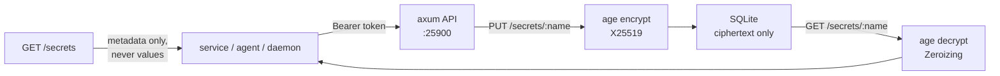

# keep


**keep is the single home for secrets.** Nothing secret ever lives in chat, env files, or repo history again — every service, agent, and daemon references secrets *by name* through keep's API, and keep holds the only encrypted copy.

## Why

Tokens keep leaking into GitHub repos and chat logs (see the 2026-09-17 credential incidents). The fix is structural, not procedural: there is exactly one place secrets are allowed to exist — keep. Everything else stores a name. If a value is anywhere else, it's a bug, and the fix is to move it into keep.

## Features

- **Age-encrypted at rest** — values are X25519-encrypted before touching SQLite; only ciphertext is persisted
- **Zeroized in memory** — plaintext lives only inside `zeroize::Zeroizing` wrappers
- **No secret in logs** — the API never logs a secret value; log lines carry the secret *name* only
- **Metadata-only listing** — `GET /secrets` returns name, purpose, rotation dates — never values
- **Versioned rotation** — `POST /secrets/:name/rotate` bumps the version on every rotation
- **Optional TLS** — rustls serve with cert/key; plaintext localhost HTTP with a loud warning when absent

## How it works



## Quick Start

```bash
cd tools/keep && cargo build --release
export KEEP_API_TOKEN=<redacted>
export KEEP_AGE_KEY_FILE=/secure/path/keep-age.key
export KEEP_DB_PATH=/var/lib/keep/keep.db
./target/release/keep
```

Requires Rust 1.70+ (2021 edition). One-time key setup:

```bash
cargo run --bin genkey   # prints KEEP_AGE_IDENTITY=... — store it in your vault
# (or use age-keygen from the rage package)
```

## API

All routes except `/health` require `Authorization: Bearer $KEEP_API_TOKEN`.

| Method | Path                   | Body                  | Returns                          |
|--------|------------------------|-----------------------|----------------------------------|
| GET    | /health                | —                     | `ok`                             |
| PUT    | /secrets/:name         | `{value, purpose?}`   | secret metadata                   |
| GET    | /secrets/:name         | —                     | `{value}` (authenticated only)    |
| GET    | /secrets               | —                     | metadata list — **never values**  |
| POST   | /secrets/:name/rotate  | `{value}`             | secret metadata (version bumped)  |

Example:

```bash
curl -H "Authorization: Bearer $KEEP_API_TOKEN" -X PUT \
  -d '{"value":"gsk_live_...","purpose":"groq key for herd lane"}' \
  http://127.0.0.1:25900/secrets/groq-main

curl -H "Authorization: Bearer $KEEP_API_TOKEN" \
  http://127.0.0.1:25900/secrets   # metadata only
```

## Architecture

```
tools/keep/
├── Cargo.toml
└── src/
    ├── main.rs    — startup, env config, axum + rustls serve
    ├── api.rs     — HTTP routes + Bearer <redacted> middleware
    ├── crypto.rs  — age encrypt/decrypt, identity loading
    ├── store.rs   — SQLite persistence (ciphertext only)
    └── bin/
        └── genkey.rs — one-time age identity generator
```

## Configuration

| Env var | Required | Default | Purpose |
|---|---|---|---|
| `KEEP_API_TOKEN` | yes | — | Bearer <redacted> for the API |
| `KEEP_AGE_KEY_FILE` | yes | — | age identity key file |
| `KEEP_DB_PATH` | yes | — | SQLite DB path |
| `KEEP_BIND` | no | `127.0.0.1:25900` | listen address |
| `KEEP_TLS_CERT` / `KEEP_TLS_KEY` | no | — | rustls cert/key; without them it serves plaintext HTTP on localhost with a loud warning — fine for local dev, not for production |

## Dev

```bash
cargo build
cargo test
```

Contributions: the security invariants are the architecture — ciphertext-only persistence, Zeroizing in memory, names-not-values in logs, metadata-only listing. Any change that moves a secret value into a log line, a list response, or an error message is a regression, full stop.

## Roadmap (not this scaffold)

- mTLS / SPIFFE for service-to-service auth instead of a shared Bearer <redacted>
- Audit log of every read (who, when, which name — never values)
- Rotation webhooks and TTL/expiry enforcement
- Backup/restore of the encrypted DB + identity escrow

## License & Security

Part of the [sovereign monorepo](../../README.md#license) — stack glue is MIT where marked. Security is the entire point: age (X25519) encryption at rest, zeroized memory, names-only logging, and metadata-only listing. Operational rules: run behind TLS in production, keep `KEEP_AGE_KEY_FILE` at 0600 on a path only the service user can read, and rotate `KEEP_API_TOKEN` if it ever appears outside the vault.
