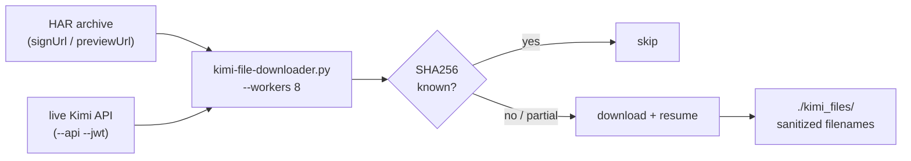

# Kimi File Downloader

<div align="right">
  
</div>

*Pull every file out of a Kimi web session — from a browser HAR export, the live API, or both — with concurrent workers, SHA256 dedup, and resume. One script, zero dependencies.*

You chatted with Kimi in the browser, files were shared, and now they're scattered across signed URLs that expire. Point this at the HAR archive (or a JWT for the live API) and it harvests everything: previews, attachments, and files the HAR never captured.

## Features

- **Concurrent downloads** with configurable workers (default 8)
- **Checksum verification** (SHA256) — already-downloaded files are skipped, not re-fetched
- **Resume support** — partial downloads continue where they stopped
- **HAR parsing** — extracts `signUrl`/`previewUrl` entries from browser archives
- **API pagination** — walks every feed page automatically when using `--api`
- **Filename extraction** — parses clean names from URL query params
- **Duplicate handling** — appends a checksum prefix on name collisions
- **List-only dry run** — see exactly what would download before spending bandwidth

## Architecture



Single-file Python, standard library only. No pip install, no virtualenv, no excuses.

## Quick Start

```bash
python3 tools/kimi-file-downloader.py --har "session.har.txt" --list-only
python3 tools/kimi-file-downloader.py --har "session.har.txt" --output ./kimi_files --workers 8
python3 tools/kimi-file-downloader.py --har "session.har.txt" --api --jwt "$KIMI_JWT" --output ./kimi_files
```

1. **List-only** — see what would be downloaded, download nothing.
2. **HAR download** — everything captured in the browser archive, 8 workers.
3. **HAR + live API** — also discovers files the HAR never captured (needs a JWT).

## Options

| Option | Description |
|---|---|
| `--har` | Path to HAR archive file |
| `--jwt` | JWT token (defaults to built-in) |
| `--output` | Output directory (default: `./kimi_downloads`) |
| `--api` | Also fetch from live API feeds |
| `--workers` | Concurrent downloads (default: 8) |
| `--list-only` | Only list URLs, don't download |

## Requirements

- Python 3.8+
- Standard library only — no external dependencies

## Notes

- The built-in JWT may expire. Pass `--jwt` with a fresh token from your Kimi session if downloads start failing.
- HAR files exported from browser dev tools (Network tab → Export HAR) work best.
- Files are saved with sanitized names (special characters replaced); collisions get a checksum prefix.

## Dev & contributing

It's one file (`tools/kimi-file-downloader.py`) — edit it directly. Keep it stdlib-only; that constraint is the feature. Test new flags against a small HAR with `--list-only` first.

## License & Security

Internal estate utility — part of the sovereign projects, not published for external use. The JWT is a bearer credential for your Kimi account: pass it via `--jwt` or the environment, never commit it, and prefer `--list-only` dry runs against untrusted HAR files before downloading.
