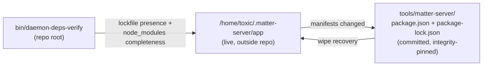

# matter-server


> The committed, integrity-pinned mirror of the live matter-server app's dependency manifests — rebuild the exact closure after a wipe with one `npm ci`.

## Hero

The live app runs from `/home/toxic/.matter-server/app` (outside this repo). This directory is the **canonical, committed mirror** of that directory's dependency manifests:

- `package.json` — single dependency: `matter-server@^1.4.0`
- `package-lock.json` — the pinned, integrity-hashed closure

When the live dir gets wiped, the mirror rebuilds it byte-identically. When the live manifests ever change, copy them back here so the mirror stays canonical.



## Quick Start

```bash
mkdir -p /home/toxic/.matter-server/app
cp tools/matter-server/package.json tools/matter-server/package-lock.json /home/toxic/.matter-server/app/
cd /home/toxic/.matter-server/app && npm ci --no-audit --no-fund
```

## Config

None. This directory holds manifests only — no daemon config, no env, no ports. The pin is the point: `npm ci` against the committed lockfile reproduces the exact closure.

## Dev / contributing

- `bin/daemon-deps-verify` (at the **repo root**, not in this directory) verifies the LIVE app dir directly — lockfile presence + `node_modules` completeness.
- The sync rule is bidirectional: live changes copy back here; here is what a rebuild trusts. Never hand-edit the lockfile — regenerate it from the live dir and commit.

## License & security

Internal sovereign tooling — part of `toxicwind/sovereign-projects`, not published as a package. The mirrored manifests pull upstream npm artifacts; integrity hashes in the lockfile are the supply-chain fence — always rebuild with `npm ci` (exact lockfile), never `npm install` (which can drift the closure). No secrets live here; keep it that way.
