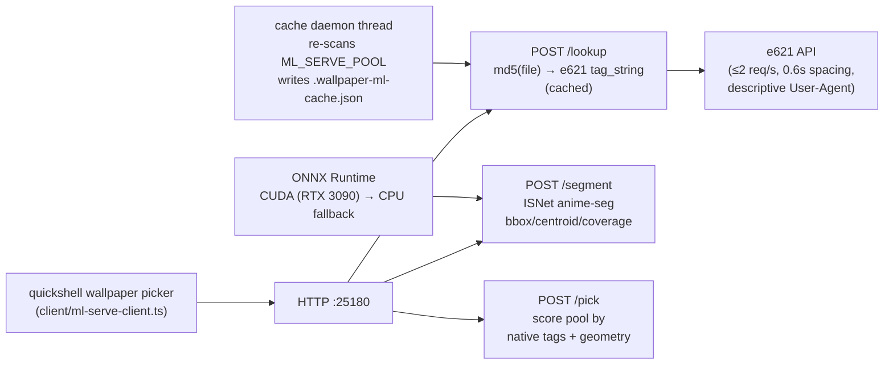

# ml-serve


> Resident ML inference for the desktop wallpaper pipeline: hot-loaded ONNX anime-subject segmentation plus e621 native tag resolution over HTTP — no cold-start per call, no redundant local tagger.

## Hero

`ml-serve` is a resident ML inference daemon. The model loads lazily on first use and stays resident; tag lookups are md5-cached against e621's native tag database. There is deliberately **no local image tagger** — e621 already has maximal tags, so redundant local compute is out. Tag resolution is `md5(file) → e621 API → cached sidecar JSON`.



## Features

- **Resident, not per-call** — model loads lazily once, stays hot; load time and rolling inference ms on `GET /health`
- **Native e621 tags, no local tagger** — `md5 → e621 API → cached sidecar`; miss returns `null` + `"source": "miss"`
- **Subject segmentation** — SkyTNT `anime-seg` ISNet: bbox/centroid/coverage in original pixel coords for crop placement
- **Smart picking** — `/pick` scores by `aspect_term + upscale − boost·furry·male − penalty·watermark` on native tags; files missing from e621 score on geometry alone
- **Cache-hot by design** — background thread re-scans the pool and pre-resolves tags into `.wallpaper-ml-cache.json`

## Quick Start

```bash
python3 tools/ml-serve/server.py            # foreground, :25180
systemctl --user enable --now ml-serve      # durable (unit in systemd/)
```

Or via pitchfork: `[daemons.ml-serve]` stanza in `pitchfork.toml` (`auto = ["start"]`).

## Endpoints

| Endpoint | Payload | Returns |
|---|---|---|
| `GET /health` | — | providers, models, e621 cache stats, timings |
| `POST /lookup` | `{"path": "/abs/img.png"}` | md5 + native e621 `tag_string` (`null` + `"source": "miss"` when not on e621) |
| `POST /segment` | `{"path": "/abs/img.png"}` | subject bbox/centroid/coverage in original px (`bbox: null` when no subject) |
| `POST /pick` | `{"dir": "/abs/dir", "furry_boost": 3.0, "wm_penalty": 1.5, "target_aspect": 1.78}` | best pick (lowest score wins) |

Defaults for `/pick`: furry=`anthro kemono`, male=`male`, watermark=`watermark text`; override via `E621_TAGS_FURRY` / `E621_TAGS_MALE` / `E621_TAGS_WM`.

## Models (shared cache `~/.cache/quickshell/wallpaper-ml/`, never in git)

| endpoint | model | artifact |
|---|---|---|
| `POST /segment` | SkyTNT `anime-seg` ISNet (anime subject seg) | `isnetis.onnx` |

Execution providers: CUDA first (RTX 3090), CPU fallback. Load time and rolling inference ms are exposed on `GET /health`.

## Cache daemon

A background thread re-scans `ML_SERVE_POOL` (default `~/Pictures/Wallpapers`) every `CACHE_INTERVAL_S` (default 60) and resolves new/changed files against e621 into `.wallpaper-ml-cache.json` inside the pool dir — entry schema `{"mtime","size","w","h","md5","tag_string":[…]|null,"source","ms"}` — so `/pick` is cache-hot. e621 lookups respect the 2 req/s limit (0.6s spacing) and require no API key; a descriptive `User-Agent` is sent (`E621_USER_AGENT`).

## Bun client

`client/ml-serve-client.ts` — dependency-free (plain `fetch`), drop it into any Bun tree. See `client/README.md`.

## Dev / contributing

- `server.py` — the daemon. `systemd/ml-serve.service` — the user unit. `client/ml-serve-client.ts` — the Bun client.
- Models live in the shared cache, never in git. Keep the "no local tagger" doctrine: new intelligence goes through e621 native tags or the segmentation model, not a new local classifier.

## License & security

Internal sovereign tooling — part of `toxicwind/sovereign-projects`, not published as a standalone package. Listens on loopback (`127.0.0.1:25180`); the systemd unit restarts on failure. **Security notes:** e621 is queried without an API key at ≤2 req/s — respect the spacing, keep the descriptive `User-Agent`, and don't point `ML_SERVE_POOL` at directories you wouldn't want md5-summarized into a cache file. Paths cross the API as absolute filesystem paths; don't expose the port beyond loopback.
