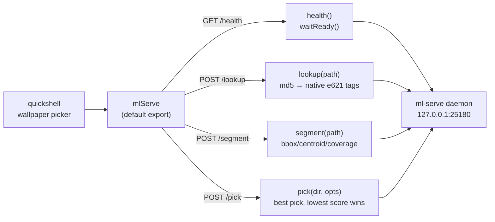

# ml-serve client (Bun/TypeScript)


> A dependency-free Bun client for the ml-serve inference daemon — plain `fetch`, no npm packages, no build step. Drop it into any Bun tree and rank wallpapers on native e621 tags.

## Hero

`ml-serve-client.ts` is the typed Bun client for the [ml-serve daemon](../README.md). Tags are e621 native (md5 lookup, daemon-side cached). There is no local tagger and no `tag()` call — use `lookup()` for a file's native tags, `segment()` for subject geometry, `pick()` to rank a directory.



## Quick Start

```ts
import { mlServe } from "<path-to>/ml-serve-client";

await mlServe.waitReady();
const { best } = await mlServe.pick("/home/toxic/Pictures/Wallpapers", {
  furry_boost: 3.0,
  target_aspect: 16 / 9,
});
if (best) applyWallpaper(best.path);
```

## Use from the quickshell wallpaper picker

```ts
import { mlServe } from "<path-to>/ml-serve-client";

// Rank the pool on cached e621 native tags; furry-male-tagged art
// floats to the top.
const { best } = await mlServe.pick("/home/toxic/Pictures/Wallpapers", {
  furry_boost: 3.0,
  target_aspect: 16 / 9,
});
if (best) applyWallpaper(best.path);

// Native e621 tags for one file (null when not on e621).
const l = await mlServe.lookup("/path/to/img.png");
console.log(l.tag_string?.slice(0, 10), l.source);

// Subject bbox for crop placement (null when no subject found).
const s = await mlServe.segment("/path/to/img.png");
if (s.bbox) placeCropWindow(s.bbox, s.centroid);
```

## API

| method | daemon route | returns |
|---|---|---|
| `health()` | `GET /health` | providers, models, e621 cache stats, timings |
| `waitReady(timeoutMs?)` | polls `/health` | resolves when the daemon is up (default 30s timeout) |
| `lookup(path)` | `POST /lookup` | md5 + native e621 `tag_string` (cached) |
| `segment(path)` | `POST /segment` | bbox/centroid/coverage in original px |
| `pick(dir, opts?)` | `POST /pick` | best pick (lowest score wins) |

`new MlServeClient("http://127.0.0.1:25180")` for a custom address; the default export `mlServe` points at the standard daemon port. Failures throw `MlServeError` (status + message).

## Dev / contributing

Single file, zero dependencies — keep it that way. The client mirrors the daemon's routes 1:1; when the daemon gains a route, add the method here with the same name. Typecheck with `bunx tsc --noEmit`.

## License & security

Internal sovereign tooling — part of `toxicwind/sovereign-projects`, not published as a package. Plain `fetch` to a loopback daemon; no credentials, no persistence. The client sends absolute filesystem paths to the daemon — only use it against a daemon you trust on the same machine.
