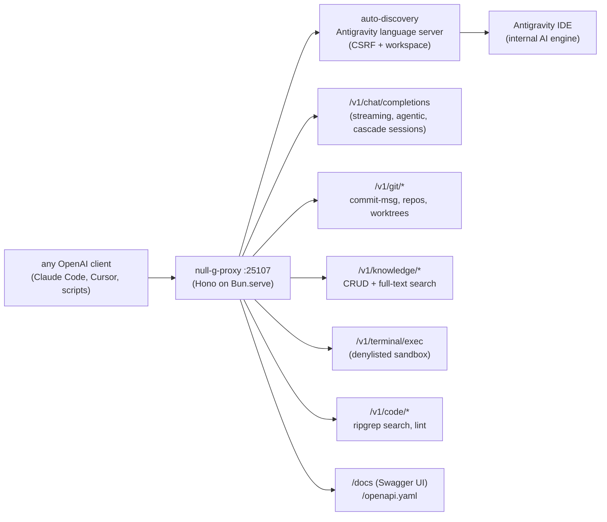

# null-g-proxy


> Self-hosted OpenAI-compatible proxy that exposes every AI capability of the Antigravity IDE — chat completions, Git intelligence, knowledge base, terminal execution, code intelligence — as a single local REST API. Any OpenAI client becomes an Antigravity client.

## Hero

`null-g-proxy` (Bun-native, v1.1.0) bridges any OpenAI-compatible client (Claude Code, Cursor, Continue, custom scripts) to the Antigravity IDE's internal AI engine. It auto-discovers the running IDE, proxies requests to it, and returns responses in the standard OpenAI format. The IDE runs Gemini, Claude, and GPT models with deep code awareness — this makes all of that available over HTTP with zero manual port configuration.



## Quick Start

```bash
cd tools/null-g-proxy && bun install
NULL_G_PROXY_PORT=25107 bun run src/index.ts
curl http://127.0.0.1:25107/v1/models
```

Lazy discovery: the proxy connects to the Antigravity IDE only on the first real API request, not on `/health` — make sure the IDE is running before sending requests.

## Features

| Capability | Description |
|---|---|
| **Chat Completions** | OpenAI-compatible `POST /v1/chat/completions` with streaming and multi-turn support |
| **Multi-model** | Switch between Gemini, Claude, and GPT models per request |
| **Streaming** | Server-Sent Events (SSE) for real-time response streaming |
| **Multi-turn sessions** | Persistent cascade sessions for stateful conversations |
| **Agentic mode** | Antigravity autonomously plans and executes complex multi-step tasks |
| **Git intelligence** | AI-generated commit messages, repo listing, worktree management |
| **Knowledge base** | CRUD and full-text search over a personal Markdown knowledge base |
| **Terminal execution** | Sandboxed shell execution with a security denylist (HTTP 403 on blocked commands) |
| **Code search** | ripgrep-powered codebase search with file glob and result limit filters |
| **Code lint** | ESLint / TypeScript compiler lint via HTTP |
| **Swagger UI** | Interactive API docs at `GET /docs` (backed by `openapi.yaml`) |
| **Zero-config** | Auto-discovers the running Antigravity IDE — no manual port configuration needed |

## Config

| Environment Variable | Default | Description |
|---|---|---|
| `NULL_G_PROXY_PORT` | `25107` | HTTP port (sovereign SSOT; `NULL_G_PORT` also honored) |
| `PORT` | _(legacy fallback)_ | only used if neither `NULL_G_*` var is set (old upstream default `8787`) |
| `ANTIGRAVITY_PORT` | _(auto)_ | Override language server port (disables auto-discovery) |
| `ANTIGRAVITY_CSRF_TOKEN` | _(auto)_ | Override CSRF token (required when `ANTIGRAVITY_PORT` is set) |
| `ANTIGRAVITY_WORKSPACE` | _(auto)_ | Filter discovery by workspace name (for multi-project setups) |

## API reference

### Health and models

```bash
curl http://127.0.0.1:25107/health        # status, uptime, active features
curl http://127.0.0.1:25107/v1/models     # models in OpenAI format
open http://127.0.0.1:25107/docs          # Swagger UI
```

### Chat completions

```bash
curl -X POST http://127.0.0.1:25107/v1/chat/completions \
  -H "Content-Type: application/json" \
  -d '{"model": "antigravity/gemini-3-flash",
       "messages": [{"role": "user", "content": "Explain dependency injection in one paragraph."}]}'
```

Streaming: add `"stream": true` (SSE). Agentic mode: add `"agentic": true`. Multi-turn: reuse a session via `cascade_id` (first response's `system_fingerprint`), end with `DELETE /v1/chat/sessions/$SESSION`.

### Git intelligence

```bash
curl -X POST http://127.0.0.1:25107/v1/git/commit-message \
  -H "Content-Type: application/json" \
  -d '{"workingDir": "/path/to/your/repo", "style": "conventional"}'
curl http://127.0.0.1:25107/v1/git/repos
```

### Knowledge base

```bash
curl "http://127.0.0.1:25107/v1/knowledge/search?q=authentication"
curl http://127.0.0.1:25107/v1/knowledge/list
```

Markdown files stored in `~/.gemini/antigravity/knowledge/` (global) or `<projectDir>/.antigravity/knowledge/` (per-project).

### Terminal execution

```bash
curl -X POST http://127.0.0.1:25107/v1/terminal/exec \
  -H "Content-Type: application/json" \
  -d '{"command": "ls -la", "cwd": "/path/to/project", "timeout": 30000}'
```

Blocked commands (recursive deletion, privilege escalation, shell injection, fork bombs, network attacks) return **HTTP 403**.

### Code intelligence

```bash
curl "http://127.0.0.1:25107/v1/code/search?q=resolveInstance&workspace=/path/to/project&glob=*.ts&max=10"
curl "http://127.0.0.1:25107/v1/code/lint?file=/path/to/project/src/index.ts"
```

## Available models

| Model ID | Provider | Best for | Timeout |
|---|---|---|---|
| `antigravity/gemini-3.1-pro-high` | Google | Complex reasoning, best quality | 120 s |
| `antigravity/gemini-3.1-pro-low` | Google | Balanced quality/speed | 90 s |
| `antigravity/gemini-3-flash` | Google | Fast, simple tasks | 60 s |
| `antigravity/claude-sonnet-4.6-thinking` | Anthropic | Extended thinking, analysis | 180 s |
| `antigravity/claude-opus-4.6-thinking` | Anthropic | Highest reasoning quality | 300 s |
| `antigravity/gpt-oss-120b` | OpenAI | Large capacity, versatile | 120 s |

Default: `antigravity/gemini-3.1-pro-high` (from `src/models.ts`).

## Dev / contributing

- `src/index.ts` — server bootstrap, discovery, route mounting. `src/routes/` — `terminal.ts`, `code.ts`, `git.ts`, `knowledge.ts`, `sessions.ts`. `src/models.ts`, `src/discovery.ts`, `src/cascade.ts`.
- Scripts (`package.json`): `bun run src/index.ts` (start), `bun --hot run src/index.ts` (dev), `bunx tsc --noEmit` (typecheck).
- Source: `tools/null-g-proxy/` in `toxicwind/sovereign-projects` — a Bun-native port of the upstream cristianoaredes/null-g-proxy. Keep route handlers in their `routes/*.ts` files; shared discovery logic stays in `discovery.ts`.
- Troubleshooting: `"status": "error"` on `/health` right after startup is normal (lazy discovery) — trigger it with any real endpoint, then confirm the IDE is running (`ps aux | grep language_server` for the port + CSRF token). Commit-message generation takes 30–90s (async AI, polls up to 180s). Port clash: set `NULL_G_PROXY_PORT`. Multiple workspaces: `ANTIGRAVITY_WORKSPACE="my-project"`.

## License & security

**MIT** (declared in `openapi.yaml`). **Security posture: local use only.** The terminal endpoint runs commands via `/bin/sh` as your user — the regex denylist blocks the most dangerous patterns, but it is not a hardened sandbox. Do not expose `:25107` beyond loopback without a reverse proxy with IP whitelisting, rate limiting, and authentication. The proxy inherits your filesystem permissions; discovery reads the IDE's local language-server port and CSRF token from your own processes.
