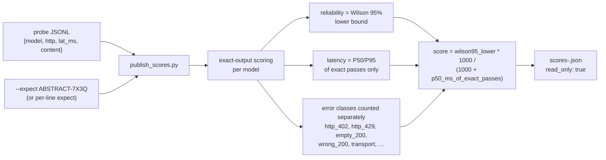

# routing-score


> Calibrated routing scores from exact-output probe results — observed reliability, Wilson 95% lower bounds, exact-pass latency only. Read-only by construction: it never touches router config, never parks peers, never alters selection logic.

## Hero

`routing-score` turns raw probe JSONL into an **advisory** signal for routing decisions. It is router-adjacent only: this tool reads one probe JSONL file and writes one score artifact. It never reads or writes `herd.yaml`, never parks peers, never hardcodes model choices into router config, and never alters selection logic. The published reliability is the Wilson 95% interval *lower bound*, so small samples are automatically penalized; latency is P50/P95 of exact passes only — a fast wrong answer earns no speed credit.



## Quick Start

```bash
python3 publish_scores.py --input reverify-20260920.jsonl --expect ABSTRACT-7X3Q --min-samples 3 --out scores-20260920.json
python3 -m pytest tests/ -q
```

## Method

September-2026 calibration grade, empirical throughout:

- **Reliability is observed**, never model self-reported confidence (Claim-Level Confidence Calibration, arXiv 2608.22483; SCOPE, arXiv 2602.13110).
- **Uncertainty is the Wilson 95% interval**; the published reliability is the interval *lower bound*, so small samples are automatically penalized (conformal spirit, cf. A-CRC-QA arXiv 2608.12008).
- **Latency is P50/P95 of exact passes only** — a fast wrong answer earns no speed credit.
- **Error classes counted separately** (`http_402`, `http_429`, `empty_200`, `wrong_200`, `transport`, …) so correlated failure modes stay visible (CAGE-CAL warning, arXiv 2605.30653: agreement can mask correlated failures).

Composite (transparent — every component is published alongside):

```
score = wilson95_lower_bound * 1000 / (1000 + p50_ms_of_exact_passes)
```

## Usage

```bash
# probe JSONL lines: {"model", "http", "lat_ms", "content"} (+ optional "expect")
publish_scores.py --input reverify-20260920.jsonl --expect ABSTRACT-7X3Q \
    --min-samples 3 --out scores-20260920.json
```

Per-line `"expect"` fields override `--expect` when present. Models with fewer than `--min-samples` attempts are flagged `"low_sample": true`.

## Artifact

`scores-<ts>.json`: `{generated_ts, input, records, expect, min_samples, method, read_only: true, scope_warning, models: {…}, ranking: […]}`. Per model: samples, exact count, reliability, Wilson interval, latency P50/P95, error-class breakdown, low-sample flag, composite score.

## Scope warning

These scores cover **one exact-output probe task**. They are not a general quality ranking — the same caveat as `projects/openrouter-probe/RANKING.md`. Treat them as routing signal, not truth.

## Lineage

- Probe format + exact-output scoring: `projects/openrouter-probe/probe_reliability.py`
- Live probing (separate concern): `tools/herd-ranker.py`
- Keypool racing telemetry: `bin/herd-keypool.py` (`/status` → `race`)

## Dev / contributing

- `publish_scores.py` — the scorer (stdlib). `tests/test_publish.py` — run with `python3 -m pytest tests/ -q`.
- The read-only contract is the feature: never add a write path to router config, peer parking, or selection logic. If a score should influence routing, it does so through a published artifact that something else reads — this tool stays a pure function of probe JSONL.

## License & security

Internal sovereign tooling — part of `toxicwind/sovereign-projects`, not published as a standalone package. Reads probe results, writes a score artifact, nothing else — no network, no credentials, no router mutation. The `read_only: true` field in every artifact is the contract; the scope warning in the artifact is load-bearing — don't quote scores without it.
