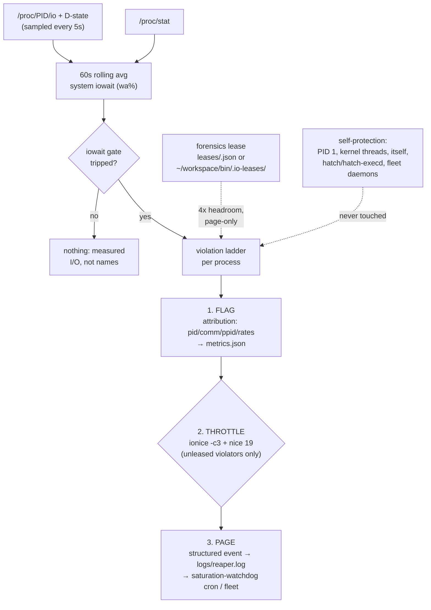

# saturation-guard


> Cell-side I/O supervisor/reaper: when the hatch cell wedges, it is 50–80% iowait from runaway recursive greps — not compute. This daemon gates every action on measured system iowait, never on CPU load. Flag → throttle → page. **Never kills.**

## Hero

Built as the first-class patch for debate **2c7ca733** (hatch cell saturation, 2026-09-19). The crash was **50–80% iowait from runaway recursive greps, not compute** — so this daemon tracks per-process disk I/O via `/proc/PID/io` and D-state time every 5s, keeps a 60s rolling average of system iowait (`wa%` from `/proc/stat`), and walks a violation ladder that is **verdict-conformant** (oracle winner seq 7): **flag** → **throttle** (`ionice -c3` idle class + `nice 19`) → **page** (structured event consumed by the 2m `saturation-watchdog` cron / fleet channel). The pre-verdict SIGTERM/SIGKILL code path exists but is **default-OFF** (`kill_enabled = false`) — enabling it contradicts the standing verdict and must never be the committed default.



## Quick Start

```bash
cd ~/workspace/saturation-guard
python3 daemon.py start     # daemonize; idempotent (second start exits 0)
python3 daemon.py status    # live iowait%, gate state, flags
```

## What it does

- Tracks per-process disk I/O via `/proc/PID/io` and D-state time every 5s.
- Maintains a 60s rolling average of system iowait (`wa%` from `/proc/stat`).
- Violation ladder per process, **verdict-conformant**: **flag** (attribution: pid/comm/ppid/rates in `metrics.json`) → **throttle** (`ionice -c3` idle class + `nice 19`, unleased violators only) → **page** (structured `page` event in `logs/reaper.log`, consumed by the 2m `saturation-watchdog` cron / fleet channel). **Never kills.**
- Orphaned processes (PPID 1) are the prime suspect class — the killer grep was orphaned — but actions fire on **measured I/O**, never on names alone.
- **Forensics leases** (answers lane-4's con; verdict seq 7 precision): a declared forensics job registers a lease — guard-local `leases/<pid>.json` (`daemon.py lease --pid ...`) **or** the shared fleet registry `~/workspace/bin/.io-leases/<pid>` — and gets 4× I/O headroom plus **page-only** treatment: flagged and attributed, never throttled, never killed. The guard cannot fratricide declared work.
- Self-protection: never touches PID 1, kernel threads, itself, the `hatch`/`hatch-execd` daemons (by process name), or fleet daemons (squawk-ws-client, squawk-push, ws_daemon, pitchfork — by distinctive script name). Protection is two-tier and deliberately narrow: a bare substring like "hatch" would match `/home/hatch` in every cmdline and blind the reaper.
- Metrics: `metrics.json` rewritten every tick (violations, throttles, terms, kills, pages, lease skips, iowait%, active flags, top I/O consumers).

## Oracle conformance (debate 2c7ca733, decided 2026-09-19 02:51 UTC)

The daemon was first built 02:25–02:47 UTC, minutes before the verdict landed; the pre-verdict SIGTERM/SIGKILL ladder conflicted with the winning seq-7 synthesis ("ionice plus page, never kill"). Reconciled forward (2026-09-19, lane-4): kill ladder default-OFF, leased violators page-only, shared `io-lease` registry honored. The constraints the oracle checked — additive only, zero-blast-radius, never kill — now hold in the committed default config.

## Runbook (lane-6 diagnostic discipline)

**Cell slow → check `wa%` first, never load average alone.**

- `wa% > 30%` sustained = iowait (disk), not CPU. Load average folds D-state (disk-wait) processes into the number — load 12 on 2 CPUs lied on 2026-09-19.
- Quick check: `vmstat 1 5` — high `wa` column = disk; high `us`/`sy` = CPU.
- `python3 daemon.py status` shows live iowait%, gate state, and flags.

## Usage

```bash
cd ~/workspace/saturation-guard
python3 daemon.py start              # daemonize; idempotent (second start exits 0)
python3 daemon.py start --foreground # foreground (debugging)
python3 daemon.py status             # live metrics
python3 daemon.py stop

# forensics lease: declare a long scan so it is throttled, never killed
python3 daemon.py lease --pid <PID> --minutes 30 --reason "ledger forensics" --by lane-7
python3 daemon.py release --pid <PID>
```

## Files

- `daemon.py` — the daemon (stdlib only, Python 3.12)
- `config.toml` — production config (iowait-gated, 60s sustain, throttle-first)
- `test-config.toml` — aggressive timings for verification runs (NOT production)
- `boot-probe` — cell reboot detector: snapshots `/proc/stat` btime + kernel boot_id, appends a REBOOT event with pre-reboot telemetry to a JSONL ledger on change (writes only under `~/workspace/state/`)
- `logs/reaper.log` — structured JSONL event log (rotated at 10 MB)
- `leases/` — active forensics leases (`<pid>.json`)
- `metrics.json` — live metrics snapshot
- `saturation-guard.pid` — pidfile (with fcntl lock for idempotent start)

## Design notes

- **Daemon, not cron.** Own tick loop; no scheduler dependency.
- **CPU lever:** the cell grants no cgroup delegation (`/sys/fs/cgroup` is root-owned), so CPU "caps" are nice-deprioritization. The I/O lever is primary — which matches the measured failure mode.
- **Additive only.** Escalation ends at throttle + page per the verdict; no process is ever signaled in the committed default config. Protected processes and leased forensics work are never throttled either.

## Dev / contributing

The oracle verdict is the constitution: additive only, zero-blast-radius, never kill. Any change to the ladder must stay verdict-conformant — the SIGTERM/SIGKILL path stays default-OFF, leases stay page-only. Verify against `test-config.toml` timings, never against production `config.toml`.

## License & security

Internal sovereign tooling — part of `toxicwind/sovereign-projects`, not published as a standalone package. **Security posture:** this daemon deliberately renices and re-ionices other processes — run it only where you trust the config, keep `kill_enabled = false` the committed default, and never widen the self-protection exclusions without a lane-6-style review. It reads `/proc` and writes only its own state dir; it never touches PID 1, kernel threads, or the `hatch`/`hatch-execd` daemons.
