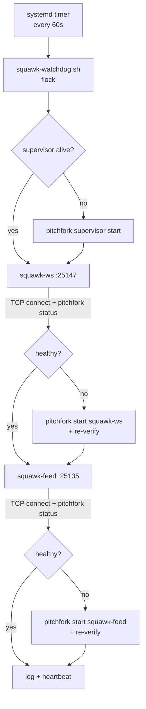

# squawk-watchdog


**Keeps the two Squawk fleet transports alive.** `squawk-ws` (WebSocket push feed, `127.0.0.1:25147`) and `squawk-feed` (fat long-poll relay-out, `127.0.0.1:25135`) are the fleet's nervous system — this watchdog checks them every 60s and restarts only what actually failed. It never stops or restarts anything healthy.

## Why

2026-09-14: both daemons "died silently" twice each. Root cause was never the daemons — fleet workers ran `pitchfork supervisor stop/start/--force` (5x that day), which kills every managed child, and each replacement supervisor was started WITHOUT `--boot`, so `boot_start` daemons never came back on their own. `retry = true` only covers crashes under a LIVE supervisor. A third "death" was a direct `kill` by a concurrent worker. Evidence trail: `/home/toxic/.shingle/directives.md`, 2026-09-14 entries. This watchdog is the structural fix: verify, don't assume; restart only the failed transport.

## Features

- **Dual verification** — TCP-connects the port AND checks `pitchfork status` for each daemon; either failing triggers `pitchfork start <name>` + re-verify
- **Supervisor-aware** — checks the pitchfork supervisor is alive first; if not, `pitchfork supervisor start`
- **Never touches the healthy** — no stops, no restarts of working daemons
- **Overlap-proof** — takes a flock so concurrent runs are impossible
- **Version-skew-proof** — resolves the pitchfork binary from the live supervisor process (`/proc/<pid>/exe`) so CLI/supervisor versions cannot skew (the 2.16.0 vs 2.25.0 hazard, 2026-09-14)
- **Reboot-resilient** — user systemd timer, survives machine restarts

## How it works



## Quick Start

```bash
cp tools/squawk-watchdog/squawk-watchdog.sh /home/toxic/.local/share/squawk-watchdog/
cp tools/squawk-watchdog/squawk-watchdog.{service,timer} ~/.config/systemd/user/
systemctl --user daemon-reload && systemctl --user enable --now squawk-watchdog.timer
```

Additive install — touches nothing live.

## Layout

- `squawk-watchdog.sh` — the watchdog (bash)
- `squawk-watchdog.service` / `squawk-watchdog.timer` — systemd user units

Logs: `/home/toxic/.local/state/squawk-watchdog/watchdog.log`
Heartbeat: `/home/toxic/.local/state/squawk-watchdog/heartbeat`

## Configuration

No config file. Watched daemons and ports are script constants (`squawk-ws` → `:25147`, `squawk-feed` → `:25135`, pitchfork groups `sovereign/squawk-ws` and `sovereign/squawk-feed`).

## Dev

Contributions: keep the "never touch the healthy" invariant — any new check must fail closed (a failed check restarts only its own target, never the supervisor, never the sibling daemon). Log every restart with before/after verification results.

## What it does NOT fix (needs Chris / fleet decision)

- Workers restarting the supervisor at will (`supervisor stop/start/--force` kills ALL 37 daemons fleet-wide). Convention needed: announce in directives.md first, or use `pitchfork restart <name>` for single daemons.
- Only 10 of 37 pitchfork daemons are running; 27 sit "available". On a real machine restart only the 6 `boot_start` daemons return.
- `pitchfork.service` unit pins 2.25.0 while the fleet runs 2.16.0.

## License & Security

Part of the [sovereign monorepo](../../README.md#license) — stack glue is MIT where marked. The watchdog runs locally on awrawr-pc, talks to localhost ports and the local pitchfork supervisor only, and holds no credentials. Its power is bounded by design: it can *start* two named daemons and the supervisor, never stop or kill anything.
