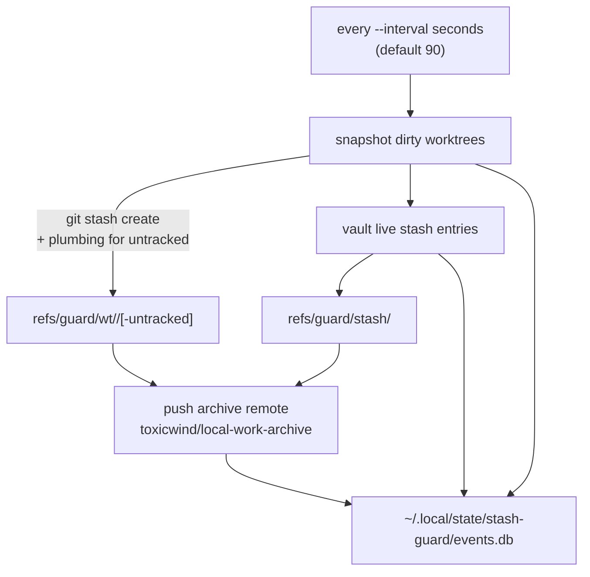

# stash-guard


**Autonomous WIP flight-recorder + drop-proof stash vault.** Snapshots dirty worktrees non-destructively every `--interval` seconds, pins every live stash entry so `git stash drop` can't lose work, pushes guard refs to an archive remote, and logs everything to an append-only SQLite flight recorder. Covers the sovereign/tau monorepo — and, in `--deep` mode, every git repo on the box.

## Why

Agents do real work in dirty worktrees, then a `git stash clear`, a rebase gone wrong, or a sweeper script eats it. The fix is structural, not procedural: a daemon that continuously snapshots WIP into git refs no one can accidentally drop, vaults the stash entries themselves, and pushes it all to an off-box archive remote. Your uncommitted work becomes recoverable by default.

## Features

- **Non-destructive snapshots** — `git stash create` builds a commit of tracked modifications *without touching the worktree*; untracked files snapshotted via plumbing (`hash-object`/`mktree`/`commit-tree`) honoring `.stashguardignore` + built-in excludes (`builds/`, `bench-*/`, `.broken-git-backup/`, `*.pcap`, …)
- **Drop-proof vault** — every live `stash@{n}` pinned at `refs/guard/stash/<sha12>`; `git stash drop` / `git stash clear` can no longer lose work
- **Archive push** — guard refs pushed to the `archive` remote (`toxicwind/local-work-archive`) with `--prune` so retention applies remotely too
- **Flight recorder** — every snapshot/vault/push lands in `~/.local/state/stash-guard/events.db` (SQLite, append-only)
- **Retention** — last `--keep` (default 24) snapshots per worktree; older refs pruned
- **Safe by default** — never touches worktree files, index, HEAD, or branches. Only creates git objects + `refs/guard/*` refs. The only mutating mode is `restore --apply --to <worktree>`, which is explicit.

## How it works



## Quick Start

```bash
python3 tools/stash-guard/stash-guard.py --once
python3 tools/stash-guard/stash-guard.py list
python3 tools/stash-guard/stash-guard.py restore refs/guard/stash/abc123def456 --apply --to /home/toxic/sovereign
```

Daemon (as run by pitchfork):

```bash
python3 tools/stash-guard/stash-guard.py --repo /home/toxic/sovereign \
    --deep --interval 90 \
    --extra-repos /home/toxic/sovereign/projects/tau-extensions,/home/toxic/sovereign/projects/tau-occupied-20260916
```

## pitchfork

`[daemons.stash-guard]` in the repo-root `pitchfork.toml`, also listed in `[groups.all]`. `boot_start = true`, `retry = true`.

## Architecture

```
tools/stash-guard/
├── stash-guard.py  — snapshotter + vault + pusher + flight recorder (stdlib only)
└── README.md       — this file
```

One file, stdlib-only Python. Guard refs follow a fixed namespace (`refs/guard/wt/...`, `refs/guard/stash/...`) so retention, restore, and remote prune all operate on the same predictable tree.

## Configuration

CLI flags: `--repo`, `--deep`, `--interval` (default 90), `--keep` (default 24), `--extra-repos`. The archive remote (`archive` → `toxicwind/local-work-archive`) must exist on each covered repo. `.stashguardignore` opts paths out of untracked snapshots.

## Dev

Contributions: keep the non-destructive invariant — the daemon must never modify worktree files, index, HEAD, or branches in any mode except explicit `restore --apply --to`. New snapshot sources get their own `refs/guard/` namespace, never the stash namespace.

## License & Security

Part of the [sovereign monorepo](../../README.md#license) — stack glue is MIT where marked. Security posture: read-mostly by design — it creates git objects and pushes refs to a remote you configured. The `restore --apply` path is the only writer to a worktree and requires an explicit ref + target. Secrets are never snapshotted deliberately; `.stashguardignore` and the built-in excludes keep build artifacts and captures out.
