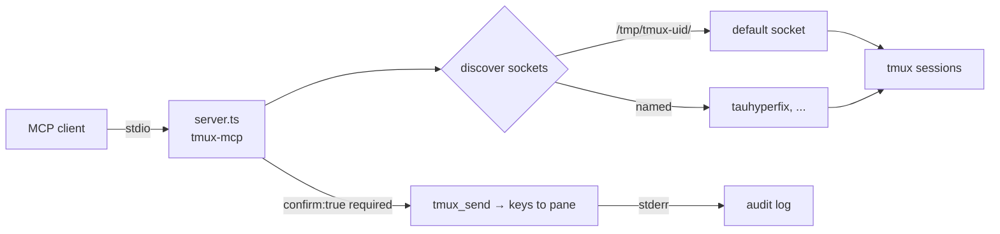

# tmux-mcp v2.0


**MCP server for tmux session inspection and control.** Lets agents list sessions, capture pane scrollback, and send keys — across *all* discovered tmux sockets, not just the default. Hardened for multi-socket estates where different lanes run on different sockets (e.g. `tauhyperfix`).

## Why

Agents live in tmux: experiment panes, long-running daemons, parallel probes. An agent that can't see its own panes is blind, and one that only sees the default socket misses half the estate. tmux-mcp exposes tmux over MCP stdio with a strict safety model — reads are free, sends are destructive-gated behind an explicit `confirm:true` so no keystroke is ever accidental.

## Features

- **Multi-socket discovery** — scans `/tmp/tmux-<uid>/` (or `$TMUX_TMPDIR`); enumerates the default socket *plus* named sockets like `tauhyperfix` (v1 only saw the default)
- **Read-only inspection** — `tmux_list` sessions, `tmux_capture` pane scrollback (last 100 lines)
- **Destructive-send gating** — `tmux_send` requires explicit `confirm:true` in the call; refused otherwise, and every confirmed send is logged to stderr
- **Safe by schema** — the gate is in the tool schema itself, not in a prompt or convention

## Tools

| Tool | Access | Description |
|------|--------|-------------|
| `tmux_list` | Read-only | Lists sessions across **all** discovered tmux sockets (default + named like `tauhyperfix`) |
| `tmux_capture` | Read-only | Captures pane scrollback (last 100 lines). `target` like `session:window.pane`, optional `socket` |
| `tmux_send` | **Destructive-gated** | Sends keys to a pane. Requires explicit `confirm:true` — refused otherwise |

## How it works



## Quick Start

```bash
/home/toxic/.bun/bin/bun /home/toxic/sovereign/tools/tmux-mcp/server.ts
```

Registered in the mesh gateway (`mesh/gateway/mcp_config.json`) as `tmux` (currently disabled pending deployment review).

## Architecture

```
tools/tmux-mcp/
├── server.ts   — MCP stdio server (Bun + TypeScript)
└── README.md   — this file
```

Single-file server. Socket discovery runs per-call so newly created sockets appear without a restart.

## Configuration

Env: `TMUX_TMPDIR` overrides the socket dir scan (default `/tmp/tmux-<uid>/`). No config file.

## Dev

Contributions: the destructive-send gate is load-bearing — any new write-capable tool must require an explicit confirmation field in its schema and log the confirmed action to stderr. Never send to interactive shells without the user's informed intent.

## License & Security

Part of the [sovereign monorepo](../../README.md#license) — stack glue is MIT where marked. Security model: reads are unrestricted, sends are gated by schema-required `confirm:true` and audit-logged to stderr. It executes `tmux` commands as the hosting user — scope exposure through the MCP client config (e.g. the mesh gateway registration), not through this server.
