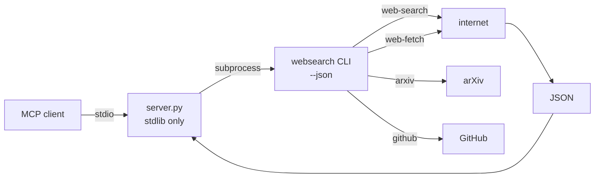

# websearch-mcp


**Stdlib-only MCP wrapper for the `websearch-skill` CLI.** The `websearch-skill` package (v0.6.1) ships no MCP server — it's CLI-only. This wrapper exposes its search, fetch, arXiv, and GitHub capabilities over MCP stdio using only the Python standard library: zero extra dependencies.

## Why

Agents need web search, page fetches, and paper/code lookup in their tool calls, not in a shell. Rather than vendoring a search client, this server shells out to the `websearch` CLI agents already have and translates its `--json` output into MCP tools. Stdlib-only means it runs anywhere Python 3 runs — no venv, no pip install, no dependency drift.

## Features

- **Zero dependencies** — Python standard library only
- **Four tools** — web search, URL fetch, arXiv search, GitHub code/repo search
- **CLI passthrough** — shells out to `websearch web-search --json` / `websearch web-fetch --json`; output translated to MCP tool results
- **Live-tested** — 2026-09-20: initialize + tools/list + real `web_search` returned live Wikipedia results

## Tools

| Tool | Description |
|------|-------------|
| `web_search` | Web search via `websearch web-search --json` |
| `web_fetch` | Fetch a URL via `websearch web-fetch --json` |
| `arxiv_search` | arXiv search |
| `github_search` | GitHub code/repo search |

## How it works



## Quick Start

```bash
python3 /home/toxic/sovereign/tools/websearch-mcp/server.py
```

Requires the `websearch` CLI on PATH (`uvx websearch-skill` provides it).

## Architecture

```
tools/websearch-mcp/
├── server.py  — MCP stdio server (Python, stdlib only)
└── README.md  — this file
```

Single-file server. Each tool maps 1:1 to a `websearch` CLI subcommand with `--json`; the server parses and re-emits as MCP tool results.

## Configuration

No config file. The only requirement is the `websearch` CLI on PATH.

## Dev

Contributions: keep it stdlib-only — that's the whole point. If `websearch-skill` gains a subcommand, add a thin tool wrapper in the same 1:1 style rather than a bespoke client.

## License & Security

Part of the [sovereign monorepo](../../README.md#license) — stack glue is MIT where marked. The server shells out to the `websearch` CLI with tool-call arguments — no credential handling, no local state. Fetched web content is third-party data: treat it as untrusted input downstream, never as instructions.
